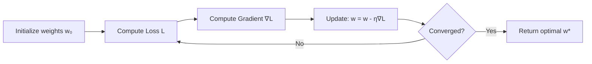
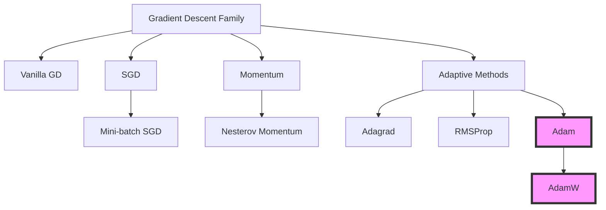
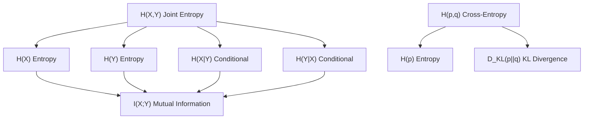
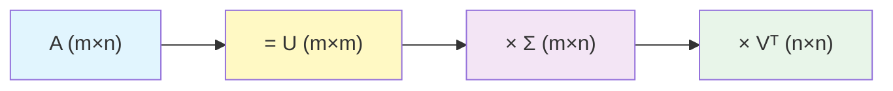

# Module 00: Mathematical Foundations for AI

> **Level**: Beginner → Intermediate  
> **Duration**: 4–6 weeks  
> **Prerequisites**: High school algebra  
> **Goal**: Build the mathematical intuition and toolkit required for every subsequent module

---

## Table of Contents

1. [Why Math Matters for AI](#1-why-math-matters-for-ai)
2. [Linear Algebra](#2-linear-algebra)
3. [Calculus & Optimization](#3-calculus--optimization)
4. [Probability & Statistics](#4-probability--statistics)
5. [Information Theory](#5-information-theory)
6. [Numerical Computation](#6-numerical-computation)
7. [System Design Perspective](#7-system-design-perspective)
8. [Diagrams](#8-diagrams)
9. [Interview Questions](#9-interview-questions)
10. [Further Reading](#10-further-reading)

---

## 1. Why Math Matters for AI

As a software engineer, you understand APIs, databases, and distributed systems. AI is no different — it's a **mathematical API** where:

- **Linear algebra** = the data structures (tensors, matrices)
- **Calculus** = the optimization engine (gradient descent)
- **Probability** = the uncertainty model (Bayesian reasoning)
- **Information theory** = the loss functions (cross-entropy, KL divergence)

Every neural network is a differentiable computation graph. Every training loop is an optimization problem. Understanding the math lets you:

1. **Debug** models (why is loss NaN? why isn't the model converging?)
2. **Design** new architectures (not just use existing ones)
3. **Scale** systems (numerical stability at FP16, batch size effects)
4. **Read papers** (the language of AI research is mathematics)

---

## 2. Linear Algebra

### 2.1 Scalars, Vectors, Matrices, Tensors

**Scalar**: A single number $x \in \mathbb{R}$

**Vector**: An ordered array of numbers $\mathbf{x} \in \mathbb{R}^n$

$$\mathbf{x} = \begin{bmatrix} x_1 \\ x_2 \\ \vdots \\ x_n \end{bmatrix}$$

**Matrix**: A 2D array $\mathbf{A} \in \mathbb{R}^{m \times n}$

$$\mathbf{A} = \begin{bmatrix} a_{11} & a_{12} & \cdots & a_{1n} \\ a_{21} & a_{22} & \cdots & a_{2n} \\ \vdots & \vdots & \ddots & \vdots \\ a_{m1} & a_{m2} & \cdots & a_{mn} \end{bmatrix}$$

**Tensor**: Generalization to $n$-dimensions. In code:

```python
import numpy as np

scalar = 5.0                           # 0-D tensor
vector = np.array([1, 2, 3])           # 1-D tensor (shape: (3,))
matrix = np.array([[1,2],[3,4]])       # 2-D tensor (shape: (2,2))
tensor = np.random.randn(3, 4, 5)     # 3-D tensor (shape: (3,4,5))
```

> **System Design Analogy**: Think of tensors as the fundamental data structure of AI, like how JSON is the data format of REST APIs. Every input, weight, and output in a neural network is a tensor.

### 2.2 Matrix Operations

#### Matrix Multiplication

For $\mathbf{A} \in \mathbb{R}^{m \times n}$ and $\mathbf{B} \in \mathbb{R}^{n \times p}$:

$$(\mathbf{AB})_{ij} = \sum_{k=1}^{n} a_{ik} b_{kj}$$

**Computational complexity**: $O(mnp)$ — this is why GPU parallelism matters.

**Why it matters in AI**: 
- Every layer in a neural network is a matrix multiplication: $\mathbf{y} = \mathbf{Wx} + \mathbf{b}$
- Attention mechanism: $\text{Attention}(\mathbf{Q}, \mathbf{K}, \mathbf{V}) = \text{softmax}\left(\frac{\mathbf{QK}^T}{\sqrt{d_k}}\right)\mathbf{V}$
- The entire forward pass is a chain of matrix multiplications

#### Transpose

$$(\mathbf{A}^T)_{ij} = A_{ji}$$

Key properties:
- $(\mathbf{AB})^T = \mathbf{B}^T \mathbf{A}^T$
- $(\mathbf{A}^T)^T = \mathbf{A}$

#### Hadamard (Element-wise) Product

$$(\mathbf{A} \odot \mathbf{B})_{ij} = a_{ij} \cdot b_{ij}$$

Used in: gating mechanisms (LSTM, GRU), residual connections.

### 2.3 Vector Spaces and Subspaces

A **vector space** $V$ over $\mathbb{R}$ is a set of vectors closed under addition and scalar multiplication.

**Span**: The set of all linear combinations of a set of vectors:
$$\text{span}(\{\mathbf{v}_1, \ldots, \mathbf{v}_k\}) = \left\{ \sum_{i=1}^k \alpha_i \mathbf{v}_i \mid \alpha_i \in \mathbb{R} \right\}$$

**Linear Independence**: Vectors $\{\mathbf{v}_1, \ldots, \mathbf{v}_k\}$ are linearly independent if:
$$\sum_{i=1}^k \alpha_i \mathbf{v}_i = \mathbf{0} \implies \alpha_i = 0 \; \forall i$$

**Basis**: A linearly independent set that spans the entire space.

**Rank**: The dimension of the column space of a matrix.

> **AI Connection**: Embeddings live in high-dimensional vector spaces. Word2Vec, BERT embeddings, etc. are all points in $\mathbb{R}^d$ where $d$ is typically 256–4096.

### 2.4 Norms

Norms measure the "size" of a vector.

**L1 Norm** (Manhattan):
$$\|\mathbf{x}\|_1 = \sum_{i=1}^n |x_i|$$

**L2 Norm** (Euclidean):
$$\|\mathbf{x}\|_2 = \sqrt{\sum_{i=1}^n x_i^2}$$

**Lp Norm** (General):
$$\|\mathbf{x}\|_p = \left(\sum_{i=1}^n |x_i|^p\right)^{1/p}$$

**L∞ Norm** (Max):
$$\|\mathbf{x}\|_\infty = \max_i |x_i|$$

**Frobenius Norm** (for matrices):
$$\|\mathbf{A}\|_F = \sqrt{\sum_{i,j} a_{ij}^2} = \sqrt{\text{tr}(\mathbf{A}^T \mathbf{A})}$$

**AI Applications**:
- **L2 regularization** (weight decay): $\lambda \|\mathbf{w}\|_2^2$
- **L1 regularization** (sparsity): $\lambda \|\mathbf{w}\|_1$
- **Cosine similarity**: $\cos(\theta) = \frac{\mathbf{a} \cdot \mathbf{b}}{\|\mathbf{a}\|_2 \|\mathbf{b}\|_2}$ — used everywhere in embedding search

### 2.5 Eigenvalues and Eigenvectors

For a square matrix $\mathbf{A} \in \mathbb{R}^{n \times n}$, if:

$$\mathbf{A}\mathbf{v} = \lambda \mathbf{v}$$

Then $\mathbf{v}$ is an **eigenvector** and $\lambda$ is the corresponding **eigenvalue**.

**Finding eigenvalues**: Solve $\det(\mathbf{A} - \lambda \mathbf{I}) = 0$ (characteristic polynomial)

**Eigendecomposition**: If $\mathbf{A}$ has $n$ linearly independent eigenvectors:

$$\mathbf{A} = \mathbf{V} \boldsymbol{\Lambda} \mathbf{V}^{-1}$$

where $\mathbf{V}$ = matrix of eigenvectors, $\boldsymbol{\Lambda}$ = diagonal matrix of eigenvalues.

**Why it matters**:
- **PCA** (Principal Component Analysis) finds eigenvectors of the covariance matrix
- **Spectral clustering** uses eigenvectors of the Laplacian
- **PageRank** finds the dominant eigenvector of the web graph
- **Stability analysis**: eigenvalues of the Hessian tell you about convergence

### 2.6 Singular Value Decomposition (SVD)

Any matrix $\mathbf{A} \in \mathbb{R}^{m \times n}$ can be decomposed as:

$$\mathbf{A} = \mathbf{U} \boldsymbol{\Sigma} \mathbf{V}^T$$

where:
- $\mathbf{U} \in \mathbb{R}^{m \times m}$: left singular vectors (orthogonal)
- $\boldsymbol{\Sigma} \in \mathbb{R}^{m \times n}$: diagonal matrix of singular values $\sigma_1 \geq \sigma_2 \geq \cdots \geq 0$
- $\mathbf{V} \in \mathbb{R}^{n \times n}$: right singular vectors (orthogonal)

**Truncated SVD** (rank-$k$ approximation):

$$\mathbf{A}_k = \mathbf{U}_k \boldsymbol{\Sigma}_k \mathbf{V}_k^T$$

This gives the best rank-$k$ approximation (Eckart–Young theorem).

**AI Applications**:
- **Dimensionality reduction**: PCA is SVD of centered data
- **LoRA** (Low-Rank Adaptation): decomposes weight updates as $\Delta W = BA$ where $B \in \mathbb{R}^{d \times r}$, $A \in \mathbb{R}^{r \times d}$, $r \ll d$
- **Latent semantic analysis**: SVD of term-document matrix
- **Matrix completion**: Netflix recommendation system

### 2.7 Positive Definite Matrices

A symmetric matrix $\mathbf{A}$ is **positive definite** if:

$$\mathbf{x}^T \mathbf{A} \mathbf{x} > 0 \quad \forall \mathbf{x} \neq \mathbf{0}$$

Equivalently: all eigenvalues are positive.

**Why it matters**: 
- Loss function Hessians: positive definite ⟹ convex ⟹ unique minimum
- Covariance matrices are positive semi-definite
- Kernel matrices (Gram matrices) must be positive semi-definite

---

## 3. Calculus & Optimization

### 3.1 Derivatives and Gradients

**Derivative** of $f: \mathbb{R} \to \mathbb{R}$:

$$f'(x) = \lim_{h \to 0} \frac{f(x+h) - f(x)}{h}$$

**Gradient** of $f: \mathbb{R}^n \to \mathbb{R}$:

$$\nabla f(\mathbf{x}) = \begin{bmatrix} \frac{\partial f}{\partial x_1} \\ \frac{\partial f}{\partial x_2} \\ \vdots \\ \frac{\partial f}{\partial x_n} \end{bmatrix}$$

The gradient points in the direction of steepest ascent.

**Jacobian** of $\mathbf{f}: \mathbb{R}^n \to \mathbb{R}^m$:

$$\mathbf{J} = \begin{bmatrix} \frac{\partial f_1}{\partial x_1} & \cdots & \frac{\partial f_1}{\partial x_n} \\ \vdots & \ddots & \vdots \\ \frac{\partial f_m}{\partial x_1} & \cdots & \frac{\partial f_m}{\partial x_n} \end{bmatrix} \in \mathbb{R}^{m \times n}$$

**Hessian** of $f: \mathbb{R}^n \to \mathbb{R}$:

$$\mathbf{H} = \begin{bmatrix} \frac{\partial^2 f}{\partial x_1^2} & \frac{\partial^2 f}{\partial x_1 \partial x_2} & \cdots \\ \frac{\partial^2 f}{\partial x_2 \partial x_1} & \frac{\partial^2 f}{\partial x_2^2} & \cdots \\ \vdots & \vdots & \ddots \end{bmatrix} \in \mathbb{R}^{n \times n}$$

### 3.2 Chain Rule (Foundation of Backpropagation)

For composed functions $f(g(x))$:

$$\frac{df}{dx} = \frac{df}{dg} \cdot \frac{dg}{dx}$$

**Multivariate chain rule**: If $z = f(x, y)$ where $x = x(t)$, $y = y(t)$:

$$\frac{dz}{dt} = \frac{\partial f}{\partial x}\frac{dx}{dt} + \frac{\partial f}{\partial y}\frac{dy}{dt}$$

**This is literally backpropagation.** The computational graph of a neural network is just a multivariate chain rule applied recursively.

### 3.3 Gradient Descent

The fundamental optimization algorithm of ML/DL:

$$\mathbf{w}_{t+1} = \mathbf{w}_t - \eta \nabla_\mathbf{w} \mathcal{L}(\mathbf{w}_t)$$

where $\eta$ is the learning rate and $\mathcal{L}$ is the loss function.

#### Variants

**Stochastic Gradient Descent (SGD)**:
$$\mathbf{w}_{t+1} = \mathbf{w}_t - \eta \nabla_\mathbf{w} \mathcal{L}(\mathbf{w}_t; \mathbf{x}_i, y_i)$$

Use one sample (or mini-batch) instead of full dataset.

**SGD with Momentum**:
$$\mathbf{v}_{t+1} = \beta \mathbf{v}_t + (1-\beta) \nabla_\mathbf{w} \mathcal{L}$$
$$\mathbf{w}_{t+1} = \mathbf{w}_t - \eta \mathbf{v}_{t+1}$$

**RMSProp**:
$$\mathbf{s}_{t+1} = \beta \mathbf{s}_t + (1-\beta) (\nabla_\mathbf{w} \mathcal{L})^2$$
$$\mathbf{w}_{t+1} = \mathbf{w}_t - \frac{\eta}{\sqrt{\mathbf{s}_{t+1} + \epsilon}} \nabla_\mathbf{w} \mathcal{L}$$

**Adam** (Adaptive Moment Estimation):

$$\mathbf{m}_t = \beta_1 \mathbf{m}_{t-1} + (1-\beta_1) \mathbf{g}_t$$
$$\mathbf{v}_t = \beta_2 \mathbf{v}_{t-1} + (1-\beta_2) \mathbf{g}_t^2$$
$$\hat{\mathbf{m}}_t = \frac{\mathbf{m}_t}{1-\beta_1^t} \quad \text{(bias correction)}$$
$$\hat{\mathbf{v}}_t = \frac{\mathbf{v}_t}{1-\beta_2^t} \quad \text{(bias correction)}$$
$$\mathbf{w}_t = \mathbf{w}_{t-1} - \frac{\eta}{\sqrt{\hat{\mathbf{v}}_t} + \epsilon} \hat{\mathbf{m}}_t$$

Default hyperparameters: $\beta_1 = 0.9$, $\beta_2 = 0.999$, $\epsilon = 10^{-8}$

**AdamW** (Adam with decoupled weight decay):
$$\mathbf{w}_t = \mathbf{w}_{t-1} - \eta \left(\frac{\hat{\mathbf{m}}_t}{\sqrt{\hat{\mathbf{v}}_t} + \epsilon} + \lambda \mathbf{w}_{t-1}\right)$$

> **Why AdamW over Adam?** In Adam, L2 regularization is coupled with the adaptive learning rate. AdamW decouples them, giving better generalization. This is the **standard optimizer for training transformers**.

### 3.4 Convexity

A function $f$ is **convex** if:
$$f(\lambda \mathbf{x} + (1-\lambda)\mathbf{y}) \leq \lambda f(\mathbf{x}) + (1-\lambda)f(\mathbf{y}) \quad \forall \lambda \in [0,1]$$

**Strictly convex**: unique global minimum. Linear regression loss is convex. Neural network loss is **non-convex** (many local minima).

**Why neural networks still work despite non-convexity**:
1. In high dimensions, most critical points are saddle points, not local minima
2. SGD noise helps escape bad local minima
3. Over-parameterized networks have many "equally good" minima

### 3.5 Lagrange Multipliers and Constrained Optimization

For optimizing $f(\mathbf{x})$ subject to $g(\mathbf{x}) = 0$:

$$\nabla f = \lambda \nabla g$$

**Lagrangian**: $\mathcal{L}(\mathbf{x}, \lambda) = f(\mathbf{x}) - \lambda g(\mathbf{x})$

**KKT conditions** (inequality constraints):

Used in SVMs and constrained optimization in RL.

---

## 4. Probability & Statistics

### 4.1 Probability Fundamentals

**Sample space** $\Omega$: set of all possible outcomes.

**Probability axioms** (Kolmogorov):
1. $P(A) \geq 0$
2. $P(\Omega) = 1$
3. If $A \cap B = \emptyset$: $P(A \cup B) = P(A) + P(B)$

**Conditional probability**:
$$P(A|B) = \frac{P(A \cap B)}{P(B)}$$

### 4.2 Bayes' Theorem

$$P(\theta | \mathcal{D}) = \frac{P(\mathcal{D} | \theta) P(\theta)}{P(\mathcal{D})}$$

| Term | Name | AI Meaning |
|------|------|------------|
| $P(\theta \mid \mathcal{D})$ | Posterior | Updated belief after seeing data |
| $P(\mathcal{D} \mid \theta)$ | Likelihood | How likely is data given model params |
| $P(\theta)$ | Prior | Initial belief about parameters |
| $P(\mathcal{D})$ | Evidence | Normalizing constant |

**AI Applications**:
- Naive Bayes classifier
- Bayesian neural networks
- Bayesian optimization for hyperparameter tuning
- Posterior inference in variational autoencoders

### 4.3 Common Distributions

**Bernoulli**: $P(X=1) = p$, $P(X=0) = 1-p$
$$P(X=x) = p^x (1-p)^{1-x}$$

**Gaussian/Normal**: $X \sim \mathcal{N}(\mu, \sigma^2)$
$$p(x) = \frac{1}{\sigma\sqrt{2\pi}} \exp\left(-\frac{(x-\mu)^2}{2\sigma^2}\right)$$

**Multivariate Gaussian**: $\mathbf{X} \sim \mathcal{N}(\boldsymbol{\mu}, \boldsymbol{\Sigma})$
$$p(\mathbf{x}) = \frac{1}{(2\pi)^{d/2} |\boldsymbol{\Sigma}|^{1/2}} \exp\left(-\frac{1}{2}(\mathbf{x}-\boldsymbol{\mu})^T \boldsymbol{\Sigma}^{-1} (\mathbf{x}-\boldsymbol{\mu})\right)$$

**Categorical**: Generalization of Bernoulli to $k$ categories
$$P(X=i) = p_i, \quad \sum_{i=1}^k p_i = 1$$

**Softmax** converts logits to categorical distribution:
$$p_i = \frac{e^{z_i}}{\sum_{j=1}^k e^{z_j}}$$

### 4.4 Expectation and Variance

**Expectation**: $\mathbb{E}[X] = \sum_x x \cdot P(X=x)$ or $\int x \cdot p(x) dx$

**Variance**: $\text{Var}(X) = \mathbb{E}[(X - \mathbb{E}[X])^2] = \mathbb{E}[X^2] - (\mathbb{E}[X])^2$

**Covariance**: $\text{Cov}(X, Y) = \mathbb{E}[(X-\mu_X)(Y-\mu_Y)]$

**Covariance Matrix**: $\boldsymbol{\Sigma}_{ij} = \text{Cov}(X_i, X_j)$

### 4.5 Maximum Likelihood Estimation (MLE)

Given data $\mathcal{D} = \{x_1, \ldots, x_n\}$ and model $p(x|\theta)$:

$$\hat{\theta}_{MLE} = \arg\max_\theta \prod_{i=1}^n p(x_i | \theta)$$

Taking log (log-likelihood):

$$\hat{\theta}_{MLE} = \arg\max_\theta \sum_{i=1}^n \log p(x_i | \theta)$$

**Connection to loss functions**:
- Minimizing cross-entropy = Maximizing log-likelihood
- Minimizing MSE = MLE under Gaussian noise assumption

### 4.6 Maximum A Posteriori (MAP) Estimation

$$\hat{\theta}_{MAP} = \arg\max_\theta P(\theta | \mathcal{D}) = \arg\max_\theta P(\mathcal{D}|\theta)P(\theta)$$

**Connection to regularization**:
- Gaussian prior $P(\theta) \sim \mathcal{N}(0, \sigma^2)$ → L2 regularization
- Laplace prior $P(\theta) \sim \text{Laplace}(0, b)$ → L1 regularization

---

## 5. Information Theory

### 5.1 Entropy

Measures the average "surprise" or uncertainty:

$$H(X) = -\sum_{x} p(x) \log p(x) = -\mathbb{E}[\log p(X)]$$

For continuous: $H(X) = -\int p(x) \log p(x) dx$ (differential entropy)

**Properties**:
- $H(X) \geq 0$
- Maximum for uniform distribution: $H(X) = \log K$ for $K$ outcomes
- $H(X) = 0$ only if $X$ is deterministic

### 5.2 Cross-Entropy

$$H(p, q) = -\sum_x p(x) \log q(x) = -\mathbb{E}_{p}[\log q(X)]$$

**This is THE loss function for classification**:

$$\mathcal{L}_{CE} = -\sum_{i=1}^C y_i \log \hat{y}_i$$

For binary classification:
$$\mathcal{L}_{BCE} = -[y \log \hat{y} + (1-y) \log(1-\hat{y})]$$

**Derivation of why cross-entropy is the right loss**:

1. We want to find $q$ that best approximates true distribution $p$
2. MLE says maximize $\sum_i \log q(x_i)$
3. This is equivalent to minimizing $-\mathbb{E}_p[\log q(X)] = H(p, q)$
4. Since $H(p)$ is constant, this equals minimizing $D_{KL}(p\|q)$

### 5.3 KL Divergence

$$D_{KL}(p \| q) = \sum_x p(x) \log \frac{p(x)}{q(x)} = H(p, q) - H(p)$$

**Properties**:
- $D_{KL}(p\|q) \geq 0$ (Gibbs' inequality)
- $D_{KL}(p\|q) = 0 \iff p = q$
- **NOT symmetric**: $D_{KL}(p\|q) \neq D_{KL}(q\|p)$

**AI Applications**:
- **VAE loss**: $\mathcal{L}_{VAE} = \mathbb{E}_{q(z|x)}[\log p(x|z)] - D_{KL}(q(z|x) \| p(z))$
- **Knowledge distillation**: minimizing KL divergence between teacher and student logits
- **Policy gradient methods**: KL constraint in TRPO/PPO
- **RLHF**: KL penalty to prevent reward hacking

### 5.4 ELBO (Evidence Lower Bound)

For latent variable models with observed $\mathbf{x}$ and latent $\mathbf{z}$:

$$\log p(\mathbf{x}) = \mathcal{L}(\theta, \phi; \mathbf{x}) + D_{KL}(q_\phi(\mathbf{z}|\mathbf{x}) \| p_\theta(\mathbf{z}|\mathbf{x}))$$

Since $D_{KL} \geq 0$:

$$\log p(\mathbf{x}) \geq \mathcal{L}(\theta, \phi; \mathbf{x}) = \mathbb{E}_{q_\phi(\mathbf{z}|\mathbf{x})}[\log p_\theta(\mathbf{x}|\mathbf{z})] - D_{KL}(q_\phi(\mathbf{z}|\mathbf{x}) \| p(\mathbf{z}))$$

This is the **ELBO** — the objective we maximize when training VAEs.

| Term | Meaning |
|------|---------|
| $\mathbb{E}_{q}[\log p(\mathbf{x}\|\mathbf{z})]$ | Reconstruction quality |
| $D_{KL}(q(\mathbf{z}\|\mathbf{x}) \| p(\mathbf{z}))$ | Regularization (keep latents close to prior) |

### 5.5 Mutual Information

$$I(X; Y) = H(X) - H(X|Y) = H(Y) - H(Y|X)$$

$$I(X; Y) = D_{KL}(p(x,y) \| p(x)p(y))$$

Measures how much knowing one variable tells us about another.

**AI Applications**:
- Feature selection
- InfoGAN
- Contrastive learning (InfoNCE loss)

---

## 6. Numerical Computation

### 6.1 Floating Point Precision

| Format | Bits | Exponent | Mantissa | Range |
|--------|------|----------|----------|-------|
| FP32 | 32 | 8 | 23 | $\pm 3.4 \times 10^{38}$ |
| FP16 | 16 | 5 | 10 | $\pm 6.5 \times 10^{4}$ |
| BF16 | 16 | 8 | 7 | $\pm 3.4 \times 10^{38}$ |
| INT8 | 8 | — | — | $-128$ to $127$ |

**Why this matters for AI**:
- Training in FP32 is slow and memory-intensive
- **Mixed precision training** (FP16 forward, FP32 weight update) gives 2x speedup
- **BF16** has same range as FP32 but less precision — preferred for training
- **INT8/INT4 quantization** for inference reduces memory 4-8x

### 6.2 Numerical Stability

**Log-sum-exp trick** (prevents overflow in softmax):

$$\log \sum_i e^{x_i} = c + \log \sum_i e^{x_i - c}, \quad c = \max_i x_i$$

**Stable softmax**:
$$\text{softmax}(x_i) = \frac{e^{x_i - \max(\mathbf{x})}}{\sum_j e^{x_j - \max(\mathbf{x})}}$$

Without this, $e^{1000}$ = `inf` → NaN loss → training crash.

### 6.3 Automatic Differentiation

Two modes:
- **Forward mode**: efficient when #inputs < #outputs
- **Reverse mode** (backpropagation): efficient when #inputs > #outputs

Neural networks: millions of parameters (inputs), single loss (output) → reverse mode wins.

```python
import torch

x = torch.tensor(3.0, requires_grad=True)
y = x**2 + 2*x + 1
y.backward()
print(x.grad)  # dy/dx = 2x + 2 = 8.0
```

---

## 7. System Design Perspective

### 7.1 Computational Complexity of Matrix Operations

| Operation | Complexity | GPU Parallelism |
|-----------|-----------|-----------------|
| Vector dot product | $O(n)$ | Highly parallel |
| Matrix-Vector multiply | $O(mn)$ | Parallel across rows |
| Matrix-Matrix multiply | $O(mnp)$ | CUDA cores, Tensor cores |
| SVD | $O(\min(mn^2, m^2n))$ | Partially parallel |
| Eigendecomposition | $O(n^3)$ | Limited parallelism |

### 7.2 Memory Layout

**Row-major** (C/NumPy default) vs **Column-major** (Fortran):
- Affects cache locality and hence performance
- PyTorch tensors are row-major (contiguous in last dimension)
- Understanding this explains when you need `.contiguous()` in PyTorch

### 7.3 BLAS and cuBLAS

All matrix ops ultimately call **BLAS** (Basic Linear Algebra Subprograms):
- Level 1: vector-vector ops ($O(n)$)
- Level 2: matrix-vector ops ($O(n^2)$)
- Level 3: matrix-matrix ops ($O(n^3)$) — most parallelizable

**cuBLAS** is NVIDIA's GPU implementation. When you call `torch.mm()`, it routes to cuBLAS.

---

## 8. Diagrams

### Gradient Descent Visualization



### Optimization Algorithms Comparison



### Information Theory Relationships



### SVD Decomposition



---

## 9. Interview Questions

### Conceptual

1. **Why is matrix multiplication the core operation in neural networks?**
   > Every linear layer computes $y = Wx + b$. With batch processing, this becomes a matrix multiplication. GPUs are optimized for this operation.

2. **Explain the relationship between cross-entropy loss and maximum likelihood estimation.**
   > Minimizing cross-entropy $H(p,q) = -\sum p(x)\log q(x)$ is equivalent to maximizing log-likelihood when $p$ is the empirical distribution. The true label distribution is one-hot, so $H(p,q) = -\log q(y_{true})$.

3. **Why do we use the log-sum-exp trick?**
   > Direct computation of $\sum e^{x_i}$ can overflow for large $x_i$. Subtracting $\max(x)$ from all elements keeps values in a safe range while preserving the result.

4. **What's the difference between KL divergence and cross-entropy?**
   > $H(p,q) = H(p) + D_{KL}(p\|q)$. Since $H(p)$ is constant w.r.t. model parameters, minimizing cross-entropy = minimizing KL divergence.

5. **Why is KL divergence asymmetric? What are the implications?**
   > $D_{KL}(p\|q)$: penalizes $q$ for assigning low probability where $p$ is high (mode-covering). $D_{KL}(q\|p)$: penalizes $q$ for assigning high probability where $p$ is low (mode-seeking). VAEs use forward KL; GANs implicitly minimize reverse KL.

6. **Explain how eigenvalues relate to PCA.**
   > PCA finds directions of maximum variance. These are eigenvectors of the covariance matrix. Eigenvalues give the variance explained by each component.

7. **Why does Adam need bias correction?**
   > $m_0 = 0$ and $v_0 = 0$, so early estimates are biased toward zero. Dividing by $(1 - \beta^t)$ corrects this, especially important for first few steps.

8. **What's the connection between L2 regularization and Gaussian priors?**
   > MAP estimation with Gaussian prior $p(\theta) \propto e^{-\lambda\|\theta\|^2}$ gives: $\arg\max \log p(D|\theta) - \lambda\|\theta\|^2$, which is MLE + L2 penalty.

### Coding

9. Implement gradient descent for linear regression from scratch.
10. Implement SVD-based dimensionality reduction.
11. Numerically verify that cross-entropy equals $H(p) + D_{KL}(p\|q)$.

---

## 10. Further Reading

### Textbooks
- **"Mathematics for Machine Learning"** — Deisenroth, Faisal, Ong (free PDF)
- **"Linear Algebra Done Right"** — Sheldon Axler
- **"All of Statistics"** — Larry Wasserman
- **"Convex Optimization"** — Boyd & Vandenberghe (free PDF)
- **"Information Theory, Inference, and Learning Algorithms"** — David MacKay (free PDF)

### Online Courses
- 3Blue1Brown: Essence of Linear Algebra (YouTube)
- Khan Academy: Multivariable Calculus
- Stanford CS229 Math Review
- MIT 18.06: Linear Algebra (Gilbert Strang)

### Papers
- Kingma & Ba. "Adam: A Method for Stochastic Optimization" (2014)
- Loshchilov & Hutter. "Decoupled Weight Decay Regularization" (2017) — AdamW

---

## Notebooks

| # | Notebook | Description |
|---|----------|-------------|
| 1 | [Linear Algebra from Scratch](notebooks/01_linear_algebra_from_scratch.ipynb) | Vectors, matrices, eigenvalues, SVD in NumPy |
| 2 | [Optimization Algorithms](notebooks/02_optimization_algorithms.ipynb) | GD, SGD, Adam implemented and visualized |

---

## Projects

### Mini Project: Gradient Descent Visualizer
Build an interactive visualization of different optimization algorithms on 2D loss surfaces (Rosenbrock, Rastrigin, saddle points).

### Advanced Project: Numerical Linear Algebra Library
Implement a mini linear algebra library with:
- LU decomposition
- QR decomposition  
- Power iteration for eigenvalues
- SVD via power iteration
- Benchmarking against NumPy

See [projects/](projects/) directory.
