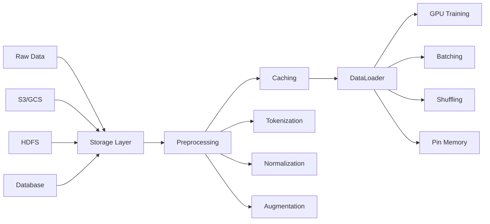
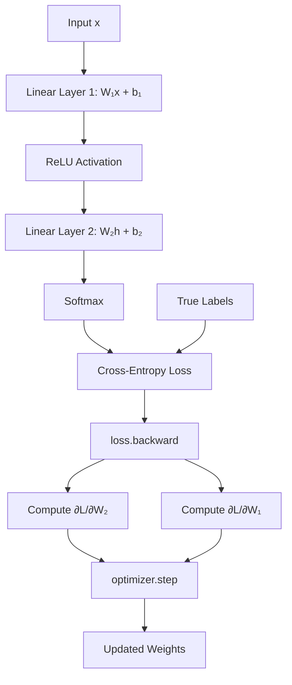
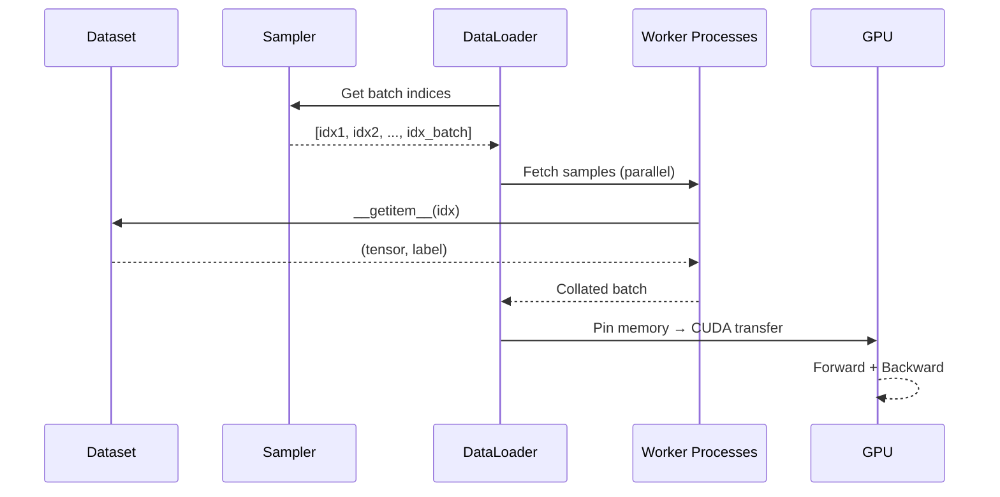

# Module 01: Python for AI

> **Level**: Beginner  
> **Duration**: 2–3 weeks  
> **Prerequisites**: Basic Python (functions, classes, data structures)  
> **Goal**: Master the numerical computing stack required for AI development

---

## Table of Contents

1. [NumPy — The Foundation](#1-numpy--the-foundation)
2. [Pandas — Data Wrangling](#2-pandas--data-wrangling)
3. [Matplotlib & Visualization](#3-matplotlib--visualization)
4. [PyTorch Fundamentals](#4-pytorch-fundamentals)
5. [Performance Patterns](#5-performance-patterns)
6. [System Design Perspective](#6-system-design-perspective)
7. [Diagrams](#7-diagrams)
8. [Interview Questions](#8-interview-questions)
9. [Further Reading](#9-further-reading)

---

## 1. NumPy — The Foundation

NumPy is to AI what the JVM is to Java — everything runs on it.

### 1.1 Why NumPy Over Pure Python

```python
import numpy as np
import time

# Pure Python: element-wise multiplication
n = 1_000_000
a_list = list(range(n))
b_list = list(range(n))

start = time.time()
c_list = [a * b for a, b in zip(a_list, b_list)]
python_time = time.time() - start

# NumPy: vectorized operation
a_np = np.arange(n)
b_np = np.arange(n)

start = time.time()
c_np = a_np * b_np
numpy_time = time.time() - start

print(f"Python: {python_time:.4f}s")
print(f"NumPy:  {numpy_time:.4f}s")
print(f"Speedup: {python_time/numpy_time:.0f}x")
# Typical speedup: 50-100x
```

**Why the speedup?**
1. **Contiguous memory**: NumPy arrays are C-contiguous blocks → cache-friendly
2. **No boxing**: Python objects have ~28 bytes overhead each; NumPy uses raw C types
3. **SIMD vectorization**: CPU processes multiple elements per instruction
4. **BLAS backend**: Matrix ops call optimized C/Fortran libraries

### 1.2 Array Creation and Shapes

```python
# Creation patterns you'll use every day
zeros = np.zeros((3, 4))          # 3x4 matrix of zeros
ones = np.ones((2, 3))            # 2x3 matrix of ones
identity = np.eye(4)              # 4x4 identity matrix
random_normal = np.random.randn(5, 3)  # Standard normal samples
linspace = np.linspace(0, 1, 100)      # 100 evenly spaced points

# Shape manipulation (critical for debugging shape mismatches)
x = np.random.randn(32, 768)     # batch of 32, hidden_dim 768

# Reshape: changes shape without changing data order
x_reshaped = x.reshape(32, 12, 64)  # split hidden_dim into 12 heads × 64 dim_per_head

# Transpose: swaps dimensions
x_transposed = x.T  # (768, 32)

# Expand dims: adds a dimension (for broadcasting)
bias = np.random.randn(768)  # (768,)
bias_expanded = bias[np.newaxis, :]  # (1, 768) — can now broadcast with (32, 768)

# Squeeze: removes dimensions of size 1
x_squeezed = np.random.randn(1, 768, 1).squeeze()  # (768,)
```

### 1.3 Broadcasting Rules

Broadcasting is NumPy's mechanism for performing operations on arrays with different shapes.

**Rules** (applied right-to-left):
1. If dimensions differ in count, prepend 1s to the smaller array's shape
2. Arrays with size 1 in a dimension are stretched to match the other array
3. Incompatible sizes (neither is 1) → error

```python
# Examples
A = np.random.randn(32, 10)   # (32, 10)
b = np.random.randn(10)       # (10,) → treated as (1, 10)
# A + b works: (32, 10) + (1, 10) → (32, 10)

# Common mistake: shape (10,) vs (10, 1)
col = np.random.randn(10, 1)  # column vector
row = np.random.randn(1, 10)  # row vector
outer = col * row              # (10, 1) * (1, 10) → (10, 10) outer product!
```

### 1.4 Vectorization Patterns for AI

```python
# Pattern 1: Batched matrix multiplication
batch_size, seq_len, d_model = 8, 512, 768
Q = np.random.randn(batch_size, seq_len, d_model)
K = np.random.randn(batch_size, seq_len, d_model)
# Attention scores: Q @ K^T for each batch element
scores = np.einsum('bsd,btd->bst', Q, K)  # (8, 512, 512)

# Pattern 2: One-hot encoding (vectorized)
labels = np.array([0, 3, 1, 2])
n_classes = 5
one_hot = np.eye(n_classes)[labels]  # Fancy indexing trick

# Pattern 3: Softmax (numerically stable, vectorized)
def softmax(x, axis=-1):
    x_max = np.max(x, axis=axis, keepdims=True)
    exp_x = np.exp(x - x_max)
    return exp_x / np.sum(exp_x, axis=axis, keepdims=True)
```

---

## 2. Pandas — Data Wrangling

### 2.1 Core Operations for ML

```python
import pandas as pd

# Loading data
df = pd.read_csv('data.csv')

# Quick EDA
df.info()           # dtypes, non-null counts
df.describe()       # statistical summary
df.isnull().sum()   # missing values per column

# Feature engineering
df['log_price'] = np.log1p(df['price'])
df['age_bucket'] = pd.cut(df['age'], bins=[0, 18, 35, 55, 100], labels=['young', 'adult', 'middle', 'senior'])

# Handling categoricals
df_encoded = pd.get_dummies(df, columns=['category'], drop_first=True)

# Train/test split preparation
from sklearn.model_selection import train_test_split
X = df.drop('target', axis=1).values  # Convert to numpy for ML
y = df['target'].values
X_train, X_test, y_train, y_test = train_test_split(X, y, test_size=0.2, random_state=42)
```

### 2.2 Data Pipeline Patterns

```python
# Method chaining (clean, readable pipeline)
processed = (
    df
    .query("age > 18 and age < 100")
    .assign(
        income_log=lambda x: np.log1p(x['income']),
        age_normalized=lambda x: (x['age'] - x['age'].mean()) / x['age'].std()
    )
    .dropna(subset=['target'])
    .reset_index(drop=True)
)
```

---

## 3. Matplotlib & Visualization

### 3.1 Essential Plots for AI

```python
import matplotlib.pyplot as plt
import seaborn as sns

# Training curves (most important plot in ML)
fig, axes = plt.subplots(1, 2, figsize=(14, 5))
axes[0].plot(train_losses, label='Train')
axes[0].plot(val_losses, label='Validation')
axes[0].set_xlabel('Epoch')
axes[0].set_ylabel('Loss')
axes[0].legend()
axes[0].set_title('Training Curves')

# Confusion matrix
from sklearn.metrics import confusion_matrix
cm = confusion_matrix(y_true, y_pred)
sns.heatmap(cm, annot=True, fmt='d', cmap='Blues', ax=axes[1])
axes[1].set_title('Confusion Matrix')
plt.tight_layout()
plt.show()
```

---

## 4. PyTorch Fundamentals

### 4.1 Tensors — NumPy on Steroids

PyTorch tensors are NumPy arrays with two superpowers:
1. **GPU acceleration**: `.to('cuda')` moves computation to GPU
2. **Automatic differentiation**: `.backward()` computes all gradients

```python
import torch

# Creation (same patterns as NumPy)
x = torch.randn(3, 4)          # random normal
x = torch.zeros(3, 4)          # zeros
x = torch.tensor([1, 2, 3])    # from Python list

# NumPy ↔ PyTorch (zero-copy when possible)
np_array = np.array([1, 2, 3])
tensor = torch.from_numpy(np_array)    # shares memory!
back_to_numpy = tensor.numpy()         # shares memory!

# GPU operations
if torch.cuda.is_available():
    x_gpu = x.to('cuda')       # move to GPU
    y_gpu = x_gpu @ x_gpu.T    # computation happens on GPU
    result = y_gpu.cpu()        # move back to CPU
```

### 4.2 Autograd — Automatic Differentiation

```python
# PyTorch builds a computational graph and computes gradients automatically
x = torch.tensor(3.0, requires_grad=True)
y = x**2 + 2*x + 1  # y = x² + 2x + 1

y.backward()          # Compute dy/dx
print(x.grad)         # 2*3 + 2 = 8.0

# Multivariate
w = torch.randn(3, requires_grad=True)
x = torch.randn(3)
loss = (w * x).sum() ** 2

loss.backward()
print(w.grad)  # d(loss)/d(w)
```

### 4.3 nn.Module — Building Blocks

```python
import torch.nn as nn

class SimpleNet(nn.Module):
    """A simple feedforward network.
    
    In system design terms, nn.Module is like a base class for all 
    'microservices' in your neural network pipeline.
    """
    def __init__(self, input_dim, hidden_dim, output_dim):
        super().__init__()
        self.layer1 = nn.Linear(input_dim, hidden_dim)
        self.relu = nn.ReLU()
        self.layer2 = nn.Linear(hidden_dim, output_dim)
    
    def forward(self, x):
        x = self.layer1(x)    # Linear: y = Wx + b
        x = self.relu(x)      # Non-linearity
        x = self.layer2(x)    # Output projection
        return x

# Usage
model = SimpleNet(784, 256, 10)
print(f"Total parameters: {sum(p.numel() for p in model.parameters()):,}")
```

### 4.4 Training Loop Template

```python
# The standard PyTorch training loop
# You'll write this hundreds of times — memorize the pattern

model = SimpleNet(784, 256, 10)
optimizer = torch.optim.AdamW(model.parameters(), lr=1e-3)
criterion = nn.CrossEntropyLoss()

for epoch in range(num_epochs):
    model.train()
    for batch_x, batch_y in train_loader:
        # Forward pass
        predictions = model(batch_x)
        loss = criterion(predictions, batch_y)
        
        # Backward pass
        optimizer.zero_grad()   # Clear old gradients
        loss.backward()         # Compute new gradients
        optimizer.step()        # Update weights
    
    # Validation
    model.eval()
    with torch.no_grad():       # No gradient computation needed
        val_loss = 0
        for batch_x, batch_y in val_loader:
            predictions = model(batch_x)
            val_loss += criterion(predictions, batch_y).item()
    
    print(f"Epoch {epoch}: train_loss={loss:.4f}, val_loss={val_loss/len(val_loader):.4f}")
```

---

## 5. Performance Patterns

### 5.1 Common Bottlenecks

| Bottleneck | Symptom | Fix |
|-----------|---------|-----|
| Python loops over arrays | Slow training | Vectorize with NumPy/PyTorch |
| CPU-GPU data transfer | GPU utilization < 50% | Pin memory, overlap transfer with compute |
| Small batch size | GPU underutilized | Increase batch size, use gradient accumulation |
| Data loading | GPU waiting for data | `num_workers > 0` in DataLoader |
| Memory leak | OOM after few epochs | Don't store tensors with grad history |

### 5.2 Memory-Efficient Patterns

```python
# BAD: Accumulates computation graph
losses = []
for batch in data:
    loss = model(batch)
    losses.append(loss)  # Keeps entire graph in memory!

# GOOD: Detach from graph
losses = []
for batch in data:
    loss = model(batch)
    losses.append(loss.item())  # .item() extracts Python float

# GOOD: Use no_grad for inference
with torch.no_grad():
    embeddings = model.encode(text)  # No graph built = no memory overhead
```

---

## 6. System Design Perspective

### 6.1 Data Pipeline Architecture



### 6.2 Why Tensor Layout Matters

In production, your model serving latency depends on memory access patterns:
- **Row-major** (C-contiguous): sequential access is fast along last dimension
- **Column-major**: sequential access is fast along first dimension
- PyTorch's `.contiguous()` ensures memory layout matches expected pattern

This is why `tensor.transpose()` can create a non-contiguous tensor, and some operations require `.contiguous()` first.

---

## 7. Diagrams

### PyTorch Computational Graph



### Data Loading Pipeline



---

## 8. Interview Questions

1. **What's the difference between `torch.Tensor` and `np.ndarray`?**
   > PyTorch tensors support GPU computation and automatic differentiation. NumPy arrays don't. However, they share memory when converting between them (on CPU).

2. **Why do we call `optimizer.zero_grad()` before `loss.backward()`?**
   > PyTorch accumulates gradients by default (useful for gradient accumulation). Without zeroing, gradients from previous batches would add up incorrectly.

3. **What does `model.eval()` do differently from `model.train()`?**
   > `eval()` disables dropout and switches BatchNorm to use running statistics instead of batch statistics. It does NOT disable gradient computation — that requires `torch.no_grad()`.

4. **What's the difference between `.item()`, `.detach()`, and `.cpu()`?**
   > `.item()` extracts a Python scalar from a 0-d tensor. `.detach()` creates a tensor sharing data but not requiring gradients. `.cpu()` moves tensor to CPU memory.

5. **How does `torch.no_grad()` improve inference performance?**
   > It disables gradient tracking, which means PyTorch doesn't build the computational graph. This saves memory (no intermediate activations stored) and computation.

6. **What is `pin_memory=True` in DataLoader?**
   > Allocates data in page-locked (pinned) memory, enabling faster async CPU-to-GPU transfer via DMA. Always use it when training on CUDA.

---

## 9. Further Reading

- **NumPy Documentation**: numpy.org/doc
- **PyTorch Tutorials**: pytorch.org/tutorials
- **"Effective PyTorch"**: github.com/vahidk/EffectivePyTorch
- **Andrej Karpathy's "Neural Networks: Zero to Hero"**: YouTube playlist

---

## Notebooks

| # | Notebook | Description |
|---|----------|-------------|
| 1 | [NumPy Mastery](notebooks/01_numpy_mastery.ipynb) | Advanced NumPy patterns for AI |
| 2 | [PyTorch Fundamentals](notebooks/02_pytorch_fundamentals.ipynb) | Tensors, autograd, nn.Module |

---

## Projects

### Mini Project: Data Pipeline Builder
Build a configurable data preprocessing pipeline for tabular data with:
- Missing value imputation
- Feature scaling
- Categorical encoding
- Train/test splitting
- Serialization

### Advanced Project: Custom DataLoader
Implement a PyTorch-compatible DataLoader that:
- Supports streaming from large files
- Implements prefetching
- Supports distributed sampling
- Profile and benchmark against PyTorch's built-in DataLoader
