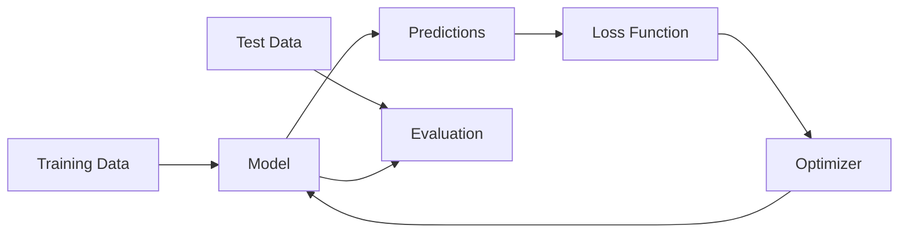

# Module 02: Machine Learning Fundamentals

> **Level**: Beginner → Intermediate  
> **Duration**: 3–4 weeks  
> **Prerequisites**: Module 00 (Math Foundations)  
> **Goal**: Master classical ML algorithms before deep learning

---

## Table of Contents

1. [What is Machine Learning?](#1-what-is-machine-learning)
2. [Supervised Learning](#2-supervised-learning)
3. [Linear Models](#3-linear-models)
4. [Tree-Based Models](#4-tree-based-models)
5. [Support Vector Machines](#5-support-vector-machines)
6. [Ensemble Methods](#6-ensemble-methods)
7. [Unsupervised Learning](#7-unsupervised-learning)
8. [Model Evaluation](#8-model-evaluation)
9. [Feature Engineering](#9-feature-engineering)
10. [Bias-Variance Tradeoff](#10-bias-variance-tradeoff)

---

## 1. What is Machine Learning?

### 1.1 Definition

**Machine Learning**: Algorithms that learn patterns from data without being explicitly programmed.

$$
f: X \rightarrow Y
$$

Where:
- $X$ = Input features (e.g., house size, location)
- $Y$ = Output target (e.g., house price)
- $f$ = Learned function

### 1.2 Types of Learning

| Type | Description | Example |
|------|-------------|---------|
| **Supervised** | Learn from labeled data $(X, Y)$ | Spam classification, price prediction |
| **Unsupervised** | Find patterns in unlabeled data $X$ | Customer segmentation, anomaly detection |
| **Semi-supervised** | Mix of labeled + unlabeled | Web search ranking |
| **Reinforcement** | Learn from rewards/penalties | Game playing, robotics |

### 1.3 ML vs Traditional Programming

**Traditional Programming**:
```
Rules + Data → Output
```

**Machine Learning**:
```
Data + Output → Rules (Model)
```

---

## 2. Supervised Learning

### 2.1 Problem Types

**Regression**: Predict continuous values
```python
# Examples
house_price = f(size, bedrooms, location)
stock_price = f(historical_prices, volume, news)
temperature = f(location, time, weather_features)
```

**Classification**: Predict discrete classes
```python
# Binary classification
is_spam = f(email_text, sender, subject)  # {0, 1}

# Multi-class classification
digit = f(pixel_values)  # {0, 1, 2, ..., 9}

# Multi-label classification
tags = f(article_text)  # {politics, economy, sports}
```

### 2.2 Training Process



**General workflow**:
```python
# 1. Load data
X_train, y_train, X_test, y_test = load_data()

# 2. Initialize model
model = Model(hyperparameters)

# 3. Train
model.fit(X_train, y_train)

# 4. Evaluate
predictions = model.predict(X_test)
accuracy = evaluate(predictions, y_test)
```

---

## 3. Linear Models

### 3.1 Linear Regression

**Model**:
$$
\hat{y} = w_0 + w_1 x_1 + w_2 x_2 + \cdots + w_n x_n = \mathbf{w}^T \mathbf{x}
$$

**Matrix form**:
$$
\hat{\mathbf{y}} = \mathbf{X} \mathbf{w}
$$

**Loss function** (Mean Squared Error):
$$
L(\mathbf{w}) = \frac{1}{m} \sum_{i=1}^{m} (y^{(i)} - \hat{y}^{(i)})^2 = \frac{1}{m} \|\mathbf{y} - \mathbf{X}\mathbf{w}\|^2
$$

**Analytical solution** (Ordinary Least Squares):
$$
\mathbf{w}^* = (\mathbf{X}^T \mathbf{X})^{-1} \mathbf{X}^T \mathbf{y}
$$

**From scratch**:
```python
import numpy as np

class LinearRegression:
    def __init__(self):
        self.weights = None
        self.bias = None
    
    def fit(self, X, y):
        """Fit using Normal Equation"""
        # Add bias term
        X_b = np.c_[np.ones((X.shape[0], 1)), X]
        
        # Solve: w = (X^T X)^-1 X^T y
        self.weights = np.linalg.inv(X_b.T @ X_b) @ X_b.T @ y
        self.bias = self.weights[0]
        self.weights = self.weights[1:]
    
    def predict(self, X):
        return X @ self.weights + self.bias

# Usage
X = np.array([[1], [2], [3], [4]])
y = np.array([2, 4, 6, 8])

model = LinearRegression()
model.fit(X, y)
print(model.predict([[5]]))  # 10
```

### 3.2 Gradient Descent for Linear Regression

**Update rule**:
$$
w_j := w_j - \alpha \frac{\partial L}{\partial w_j}
$$

**Gradient**:
$$
\frac{\partial L}{\partial w_j} = \frac{2}{m} \sum_{i=1}^{m} (\hat{y}^{(i)} - y^{(i)}) x_j^{(i)}
$$

**Vectorized**:
$$
\nabla L(\mathbf{w}) = \frac{2}{m} \mathbf{X}^T (\mathbf{X}\mathbf{w} - \mathbf{y})
$$

```python
def fit_gradient_descent(X, y, lr=0.01, epochs=1000):
    m, n = X.shape
    w = np.zeros(n)
    
    for epoch in range(epochs):
        # Predictions
        y_pred = X @ w
        
        # Gradient
        gradient = (2/m) * X.T @ (y_pred - y)
        
        # Update
        w -= lr * gradient
        
        # Loss
        loss = np.mean((y_pred - y) ** 2)
        if epoch % 100 == 0:
            print(f"Epoch {epoch}, Loss: {loss:.4f}")
    
    return w
```

### 3.3 Regularization

**Ridge Regression (L2)**:
$$
L(\mathbf{w}) = \frac{1}{m} \|\mathbf{y} - \mathbf{X}\mathbf{w}\|^2 + \lambda \|\mathbf{w}\|^2
$$

**Analytical solution**:
$$
\mathbf{w}^* = (\mathbf{X}^T \mathbf{X} + \lambda \mathbf{I})^{-1} \mathbf{X}^T \mathbf{y}
$$

**Lasso Regression (L1)**:
$$
L(\mathbf{w}) = \frac{1}{m} \|\mathbf{y} - \mathbf{X}\mathbf{w}\|^2 + \lambda \|\mathbf{w}\|_1
$$

**Effect**:
- **Ridge**: Shrinks weights towards zero (weight decay)
- **Lasso**: Drives some weights to exactly zero (feature selection)

### 3.4 Logistic Regression

**Model** (for binary classification):
$$
\hat{y} = \sigma(\mathbf{w}^T \mathbf{x}) = \frac{1}{1 + e^{-\mathbf{w}^T \mathbf{x}}}
$$

**Interpretation**: $\hat{y} = P(y=1 | \mathbf{x})$

**Loss function** (Binary Cross-Entropy):
$$
L(\mathbf{w}) = -\frac{1}{m} \sum_{i=1}^{m} \left[ y^{(i)} \log(\hat{y}^{(i)}) + (1 - y^{(i)}) \log(1 - \hat{y}^{(i)}) \right]
$$

**Gradient**:
$$
\frac{\partial L}{\partial w_j} = \frac{1}{m} \sum_{i=1}^{m} (\hat{y}^{(i)} - y^{(i)}) x_j^{(i)}
$$

**Implementation**:
```python
class LogisticRegression:
    def __init__(self, lr=0.01, epochs=1000):
        self.lr = lr
        self.epochs = epochs
        self.weights = None
        self.bias = None
    
    def sigmoid(self, z):
        return 1 / (1 + np.exp(-z))
    
    def fit(self, X, y):
        m, n = X.shape
        self.weights = np.zeros(n)
        self.bias = 0
        
        for epoch in range(self.epochs):
            # Forward pass
            z = X @ self.weights + self.bias
            y_pred = self.sigmoid(z)
            
            # Gradients
            dw = (1/m) * X.T @ (y_pred - y)
            db = (1/m) * np.sum(y_pred - y)
            
            # Update
            self.weights -= self.lr * dw
            self.bias -= self.lr * db
    
    def predict_proba(self, X):
        z = X @ self.weights + self.bias
        return self.sigmoid(z)
    
    def predict(self, X, threshold=0.5):
        return (self.predict_proba(X) >= threshold).astype(int)
```

**Multi-class**: Softmax regression
$$
P(y=k | \mathbf{x}) = \frac{e^{\mathbf{w}_k^T \mathbf{x}}}{\sum_{j=1}^{K} e^{\mathbf{w}_j^T \mathbf{x}}}
$$

---

## 4. Tree-Based Models

### 4.1 Decision Trees

**Splitting criterion** (for classification):

**Gini Impurity**:
$$
\text{Gini}(S) = 1 - \sum_{k=1}^{K} p_k^2
$$

**Entropy** (Information Gain):
$$
H(S) = -\sum_{k=1}^{K} p_k \log_2(p_k)
$$

**For regression**: Use variance reduction.

**Algorithm** (CART - Classification and Regression Trees):
```
1. Start with all data at root
2. For each feature:
   - Try all split points
   - Calculate Gini/Entropy after split
3. Choose split that maximizes information gain
4. Recursively split child nodes
5. Stop when:
   - Max depth reached
   - Min samples per leaf
   - No information gain
```

**From scratch**:
```python
class Node:
    def __init__(self, feature=None, threshold=None, left=None, right=None, value=None):
        self.feature = feature      # Feature to split on
        self.threshold = threshold  # Threshold value
        self.left = left           # Left child
        self.right = right         # Right child
        self.value = value         # Leaf prediction

class DecisionTree:
    def __init__(self, max_depth=10, min_samples_split=2):
        self.max_depth = max_depth
        self.min_samples_split = min_samples_split
        self.root = None
    
    def gini(self, y):
        """Calculate Gini impurity"""
        proportions = np.bincount(y) / len(y)
        return 1 - np.sum(proportions ** 2)
    
    def split(self, X, y, feature, threshold):
        """Split dataset"""
        left_mask = X[:, feature] <= threshold
        right_mask = ~left_mask
        return (X[left_mask], y[left_mask]), (X[right_mask], y[right_mask])
    
    def best_split(self, X, y):
        """Find best split"""
        best_gain = -1
        best_feature = None
        best_threshold = None
        
        parent_gini = self.gini(y)
        m, n = X.shape
        
        for feature in range(n):
            thresholds = np.unique(X[:, feature])
            
            for threshold in thresholds:
                (X_left, y_left), (X_right, y_right) = self.split(X, y, feature, threshold)
                
                if len(y_left) == 0 or len(y_right) == 0:
                    continue
                
                # Weighted Gini
                n_left, n_right = len(y_left), len(y_right)
                child_gini = (n_left/m) * self.gini(y_left) + (n_right/m) * self.gini(y_right)
                
                # Information gain
                gain = parent_gini - child_gini
                
                if gain > best_gain:
                    best_gain = gain
                    best_feature = feature
                    best_threshold = threshold
        
        return best_feature, best_threshold
    
    def build_tree(self, X, y, depth=0):
        """Recursively build tree"""
        m, n = X.shape
        n_classes = len(np.unique(y))
        
        # Stopping criteria
        if depth >= self.max_depth or m < self.min_samples_split or n_classes == 1:
            leaf_value = np.argmax(np.bincount(y))
            return Node(value=leaf_value)
        
        # Find best split
        feature, threshold = self.best_split(X, y)
        
        if feature is None:
            leaf_value = np.argmax(np.bincount(y))
            return Node(value=leaf_value)
        
        # Split and recurse
        (X_left, y_left), (X_right, y_right) = self.split(X, y, feature, threshold)
        
        left = self.build_tree(X_left, y_left, depth + 1)
        right = self.build_tree(X_right, y_right, depth + 1)
        
        return Node(feature=feature, threshold=threshold, left=left, right=right)
    
    def fit(self, X, y):
        self.root = self.build_tree(X, y)
    
    def predict_sample(self, x, node):
        """Predict single sample"""
        if node.value is not None:
            return node.value
        
        if x[node.feature] <= node.threshold:
            return self.predict_sample(x, node.left)
        else:
            return self.predict_sample(x, node.right)
    
    def predict(self, X):
        return np.array([self.predict_sample(x, self.root) for x in X])
```

### 4.2 Overfitting in Trees

**Problem**: Deep trees memorize training data.

**Solutions**:
1. **Pre-pruning**: Stop growing early
   - `max_depth`
   - `min_samples_split`
   - `min_samples_leaf`
   - `max_features`

2. **Post-pruning**: Grow full tree, then prune
   - Cost complexity pruning
   - Reduced error pruning

---

## 5. Support Vector Machines

### 5.1 Hard Margin SVM

**Goal**: Find hyperplane that maximizes margin.

**Hyperplane**: $\mathbf{w}^T \mathbf{x} + b = 0$

**Decision function**: $f(\mathbf{x}) = \text{sign}(\mathbf{w}^T \mathbf{x} + b)$

**Margin**: $\frac{2}{\|\mathbf{w}\|}$

**Optimization**:
$$
\begin{align}
\min_{\mathbf{w}, b} \quad & \frac{1}{2} \|\mathbf{w}\|^2 \\
\text{s.t.} \quad & y^{(i)} (\mathbf{w}^T \mathbf{x}^{(i)} + b) \geq 1, \quad i = 1, \ldots, m
\end{align}
$$

### 5.2 Soft Margin SVM

Allow some misclassification with slack variables $\xi_i$:

$$
\begin{align}
\min_{\mathbf{w}, b, \xi} \quad & \frac{1}{2} \|\mathbf{w}\|^2 + C \sum_{i=1}^{m} \xi_i \\
\text{s.t.} \quad & y^{(i)} (\mathbf{w}^T \mathbf{x}^{(i)} + b) \geq 1 - \xi_i \\
& \xi_i \geq 0
\end{align}
$$

**$C$ hyperparameter**:
- Large $C$: Hard margin (low bias, high variance)
- Small $C$: Soft margin (high bias, low variance)

### 5.3 Kernel Trick

**Idea**: Map data to higher dimension where it's linearly separable.

$$
\phi: \mathbb{R}^n \rightarrow \mathbb{R}^m \quad (m \gg n)
$$

**Kernel function**:
$$
K(\mathbf{x}, \mathbf{x}') = \phi(\mathbf{x})^T \phi(\mathbf{x}')
$$

**Common kernels**:

| Kernel | Formula |
|--------|---------|
| Linear | $K(\mathbf{x}, \mathbf{x}') = \mathbf{x}^T \mathbf{x}'$ |
| Polynomial | $K(\mathbf{x}, \mathbf{x}') = (\mathbf{x}^T \mathbf{x}' + c)^d$ |
| RBF (Gaussian) | $K(\mathbf{x}, \mathbf{x}') = \exp\left(-\frac{\|\mathbf{x} - \mathbf{x}'\|^2}{2\sigma^2}\right)$ |
| Sigmoid | $K(\mathbf{x}, \mathbf{x}') = \tanh(\alpha \mathbf{x}^T \mathbf{x}' + c)$ |

**Usage**:
```python
from sklearn.svm import SVC

# RBF kernel
svm = SVC(kernel='rbf', C=1.0, gamma='auto')
svm.fit(X_train, y_train)
```

---

## 6. Ensemble Methods

### 6.1 Bagging (Bootstrap Aggregating)

**Idea**: Train multiple models on random subsets, average predictions.

**Algorithm**:
```
For b = 1 to B:
    1. Sample m data points with replacement
    2. Train model h_b on sample
    
Prediction: y_hat = average(h_1(x), ..., h_B(x))
```

**Reduces variance** without increasing bias.

### 6.2 Random Forest

**Bagging + Random feature subsets**:

```
For each tree:
    1. Bootstrap sample of data
    2. At each split, sample sqrt(n) features
    3. Choose best split among sampled features
    
Prediction: majority vote (classification) or average (regression)
```

**Hyperparameters**:
- `n_estimators`: Number of trees
- `max_depth`: Tree depth
- `max_features`: Features to sample per split
- `min_samples_split`: Min samples to split node

```python
from sklearn.ensemble import RandomForestClassifier

rf = RandomForestClassifier(
    n_estimators=100,
    max_depth=10,
    max_features='sqrt',
    random_state=42
)
rf.fit(X_train, y_train)

# Feature importance
importances = rf.feature_importances_
```

### 6.3 Gradient Boosting

**Idea**: Train models sequentially, each correcting previous errors.

**Algorithm**:
```
1. Initialize: f_0(x) = y_mean
2. For m = 1 to M:
   a. Compute residuals: r_i = y_i - f_{m-1}(x_i)
   b. Train model h_m to predict residuals
   c. Update: f_m(x) = f_{m-1}(x) + η * h_m(x)
3. Final prediction: f_M(x)
```

**Mathematical formulation**:
$$
f_m(\mathbf{x}) = f_{m-1}(\mathbf{x}) + \eta \cdot h_m(\mathbf{x})
$$

Where $h_m$ minimizes:
$$
\sum_{i=1}^{m} L(y^{(i)}, f_{m-1}(\mathbf{x}^{(i)}) + h_m(\mathbf{x}^{(i)}))
$$

**From scratch** (simple version):
```python
class GradientBoosting:
    def __init__(self, n_estimators=100, learning_rate=0.1, max_depth=3):
        self.n_estimators = n_estimators
        self.lr = learning_rate
        self.max_depth = max_depth
        self.trees = []
    
    def fit(self, X, y):
        # Initialize with mean
        self.base_prediction = np.mean(y)
        predictions = np.full(len(y), self.base_prediction)
        
        for _ in range(self.n_estimators):
            # Compute residuals
            residuals = y - predictions
            
            # Train tree on residuals
            tree = DecisionTreeRegressor(max_depth=self.max_depth)
            tree.fit(X, residuals)
            
            # Update predictions
            update = self.lr * tree.predict(X)
            predictions += update
            
            self.trees.append(tree)
    
    def predict(self, X):
        predictions = np.full(len(X), self.base_prediction)
        for tree in self.trees:
            predictions += self.lr * tree.predict(X)
        return predictions
```

### 6.4 XGBoost

**Improvements over basic gradient boosting**:

1. **Regularized objective**:
$$
\mathcal{L} = \sum_{i=1}^{m} L(y_i, \hat{y}_i) + \sum_{k=1}^{K} \Omega(f_k)
$$

Where:
$$
\Omega(f) = \gamma T + \frac{1}{2} \lambda \|\mathbf{w}\|^2
$$

2. **Second-order Taylor approximation** of loss
3. **Column subsampling** (like random forest)
4. **Efficient tree building** with histogram-based splits
5. **Built-in cross-validation**

```python
import xgboost as xgb

# Classification
model = xgb.XGBClassifier(
    n_estimators=100,
    learning_rate=0.1,
    max_depth=6,
    subsample=0.8,
    colsample_bytree=0.8,
    reg_alpha=0.1,  # L1
    reg_lambda=1.0  # L2
)
model.fit(X_train, y_train)
```

### 6.5 Comparison

| Model | Parallelizable | Interpretability | Speed | Accuracy |
|-------|---------------|------------------|-------|----------|
| Decision Tree | No | High | Fast | Medium |
| Random Forest | Yes | Medium | Medium | High |
| Gradient Boosting | No | Low | Slow | Very High |
| XGBoost | Partially | Low | Fast | Very High |

---

## 7. Unsupervised Learning

### 7.1 K-Means Clustering

**Goal**: Partition data into $K$ clusters.

**Algorithm**:
```
1. Initialize K centroids randomly
2. Repeat until convergence:
   a. Assign each point to nearest centroid
   b. Update centroids to mean of assigned points
```

**Objective** (minimize within-cluster variance):
$$
J = \sum_{k=1}^{K} \sum_{\mathbf{x} \in C_k} \|\mathbf{x} - \boldsymbol{\mu}_k\|^2
$$

**Implementation**:
```python
class KMeans:
    def __init__(self, n_clusters=3, max_iters=100):
        self.n_clusters = n_clusters
        self.max_iters = max_iters
        self.centroids = None
    
    def fit(self, X):
        # Initialize centroids randomly
        idx = np.random.choice(len(X), self.n_clusters, replace=False)
        self.centroids = X[idx]
        
        for _ in range(self.max_iters):
            # Assign to nearest centroid
            distances = np.linalg.norm(X[:, np.newaxis] - self.centroids, axis=2)
            labels = np.argmin(distances, axis=1)
            
            # Update centroids
            new_centroids = np.array([X[labels == k].mean(axis=0) 
                                     for k in range(self.n_clusters)])
            
            # Check convergence
            if np.allclose(self.centroids, new_centroids):
                break
            
            self.centroids = new_centroids
        
        return labels
    
    def predict(self, X):
        distances = np.linalg.norm(X[:, np.newaxis] - self.centroids, axis=2)
        return np.argmin(distances, axis=1)
```

**Choosing K**: Elbow method (plot inertia vs K)

### 7.2 Principal Component Analysis (PCA)

**Goal**: Find directions of maximum variance.

**Steps**:
1. Center data: $\mathbf{X}_{\text{centered}} = \mathbf{X} - \bar{\mathbf{x}}$
2. Compute covariance matrix: $\mathbf{C} = \frac{1}{m} \mathbf{X}^T \mathbf{X}$
3. Compute eigenvectors/eigenvalues of $\mathbf{C}$
4. Project: $\mathbf{Z} = \mathbf{X} \mathbf{W}$ (top $k$ eigenvectors)

**Variance explained**:
$$
\frac{\sum_{i=1}^{k} \lambda_i}{\sum_{i=1}^{n} \lambda_i}
$$

```python
class PCA:
    def __init__(self, n_components=2):
        self.n_components = n_components
        self.components = None
        self.mean = None
    
    def fit(self, X):
        # Center data
        self.mean = np.mean(X, axis=0)
        X_centered = X - self.mean
        
        # Covariance matrix
        cov = np.cov(X_centered.T)
        
        # Eigenvectors and eigenvalues
        eigenvalues, eigenvectors = np.linalg.eig(cov)
        
        # Sort by eigenvalue
        idx = eigenvalues.argsort()[::-1]
        eigenvalues = eigenvalues[idx]
        eigenvectors = eigenvectors[:, idx]
        
        # Store top k components
        self.components = eigenvectors[:, :self.n_components]
        self.explained_variance = eigenvalues[:self.n_components]
    
    def transform(self, X):
        X_centered = X - self.mean
        return X_centered @ self.components
    
    def inverse_transform(self, Z):
        return Z @ self.components.T + self.mean
```

---

## 8. Model Evaluation

### 8.1 Classification Metrics

**Confusion Matrix**:
```
                Predicted
              Pos    Neg
Actual Pos    TP     FN
       Neg    FP     TN
```

**Metrics**:
$$
\text{Accuracy} = \frac{TP + TN}{TP + TN + FP + FN}
$$

$$
\text{Precision} = \frac{TP}{TP + FP}
$$

$$
\text{Recall} = \frac{TP}{TP + FN}
$$

$$
\text{F1-Score} = 2 \cdot \frac{\text{Precision} \times \text{Recall}}{\text{Precision} + \text{Recall}}
$$

**ROC-AUC**: Area under ROC curve (TPR vs FPR)

### 8.2 Regression Metrics

**Mean Absolute Error (MAE)**:
$$
\text{MAE} = \frac{1}{m} \sum_{i=1}^{m} |y^{(i)} - \hat{y}^{(i)}|
$$

**Mean Squared Error (MSE)**:
$$
\text{MSE} = \frac{1}{m} \sum_{i=1}^{m} (y^{(i)} - \hat{y}^{(i)})^2
$$

**Root Mean Squared Error (RMSE)**:
$$
\text{RMSE} = \sqrt{\text{MSE}}
$$

**R² Score**:
$$
R^2 = 1 - \frac{\sum_{i=1}^{m} (y^{(i)} - \hat{y}^{(i)})^2}{\sum_{i=1}^{m} (y^{(i)} - \bar{y})^2}
$$

### 8.3 Cross-Validation

**K-Fold CV**:
```python
from sklearn.model_selection import cross_val_score

scores = cross_val_score(model, X, y, cv=5, scoring='accuracy')
print(f"Accuracy: {scores.mean():.3f} (+/- {scores.std():.3f})")
```

**Stratified K-Fold**: Preserve class distribution in each fold.

---

## 9. Feature Engineering

### 9.1 Feature Scaling

**Standardization** (Z-score normalization):
$$
x' = \frac{x - \mu}{\sigma}
$$

**Min-Max Normalization**:
$$
x' = \frac{x - x_{\min}}{x_{\max} - x_{\min}}
$$

```python
from sklearn.preprocessing import StandardScaler, MinMaxScaler

# Standardization
scaler = StandardScaler()
X_scaled = scaler.fit_transform(X_train)

# Min-Max
scaler = MinMaxScaler()
X_scaled = scaler.fit_transform(X_train)
```

### 9.2 Encoding Categorical Features

**One-Hot Encoding**:
```python
# Before: ["red", "green", "blue"]
# After:  [[1,0,0], [0,1,0], [0,0,1]]

from sklearn.preprocessing import OneHotEncoder

encoder = OneHotEncoder(sparse=False)
X_encoded = encoder.fit_transform(X_categorical)
```

**Label Encoding**: For ordinal features (e.g., low/medium/high → 0/1/2)

### 9.3 Feature Selection

**Correlation-based**:
```python
correlation_matrix = df.corr()
high_corr_features = correlation_matrix[abs(correlation_matrix['target']) > 0.5].index
```

**Recursive Feature Elimination (RFE)**:
```python
from sklearn.feature_selection import RFE

rfe = RFE(estimator=model, n_features_to_select=10)
rfe.fit(X_train, y_train)
selected_features = X_train.columns[rfe.support_]
```

**Feature Importance** (from tree-based models):
```python
importances = model.feature_importances_
indices = np.argsort(importances)[::-1]
```

---

## 10. Bias-Variance Tradeoff

### 10.1 Theory

**Total Error**:
$$
\mathbb{E}[(y - \hat{f}(x))^2] = \text{Bias}^2 + \text{Variance} + \text{Irreducible Error}
$$

**Bias**: Error from wrong assumptions
$$
\text{Bias}[\hat{f}(x)] = \mathbb{E}[\hat{f}(x)] - f(x)
$$

**Variance**: Error from sensitivity to training data
$$
\text{Var}[\hat{f}(x)] = \mathbb{E}[(\hat{f}(x) - \mathbb{E}[\hat{f}(x)])^2]
$$

### 10.2 Model Complexity

```
Low complexity (underfitting):
    High bias, Low variance
    
High complexity (overfitting):
    Low bias, High variance
    
Sweet spot:
    Balanced bias-variance
```

### 10.3 Solutions

| Problem | Solution |
|---------|----------|
| High Bias (Underfitting) | More complex model, more features, reduce regularization |
| High Variance (Overfitting) | More data, regularization, simpler model, early stopping |

---

## Notebooks

| # | Notebook | Description |
|---|----------|-------------|
| 1 | [Linear Regression from Scratch](notebooks/01_linear_regression.ipynb) | OLS + Gradient Descent |
| 2 | [Logistic Regression & Classification](notebooks/02_logistic_regression.ipynb) | Binary & multi-class |
| 3 | [Decision Trees](notebooks/03_decision_trees.ipynb) | Build tree from scratch |
| 4 | [Ensemble Methods](notebooks/04_ensemble_methods.ipynb) | Random Forest, XGBoost |
| 5 | [Clustering & PCA](notebooks/05_unsupervised.ipynb) | K-Means, PCA visualization |

---

## Projects

### Mini Project: House Price Prediction
- Linear regression with feature engineering
- Try Ridge/Lasso regularization
- Cross-validation
- Compare with Random Forest

### Advanced Project: Credit Risk Modeling
- Binary classification (loan default)
- Feature engineering (categorical encoding, scaling)
- Try Logistic Regression, Random Forest, XGBoost
- Calibrated probability predictions
- Model interpretability (SHAP values)

---

## Interview Questions

1. Explain the bias-variance tradeoff with examples.
2. When would you use L1 vs L2 regularization?
3. How does a decision tree split on a feature?
4. Explain how gradient boosting works step-by-step.
5. Why does PCA reduce dimensionality? What information is lost?
6. Compare Random Forest vs XGBoost. When to use each?
7. How do you handle imbalanced datasets?
8. Explain ROC curve and when AUC is better than accuracy.
9. How does the kernel trick work in SVM?
10. What's the difference between bagging and boosting?
