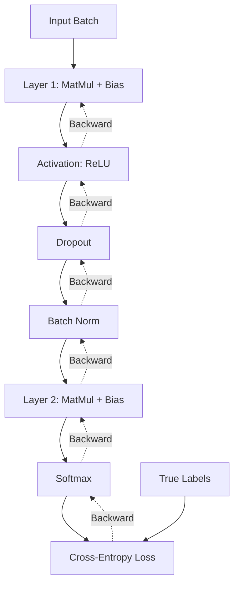
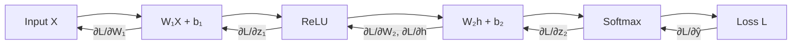

# Module 03: Deep Learning — Neural Networks from First Principles

> **Level**: Intermediate  
> **Duration**: 6–8 weeks  
> **Prerequisites**: Modules 00 (Math), 01 (Python), 02 (ML Basics)  
> **Goal**: Master neural networks—from single neurons to modern architectures

---

## Table of Contents

1. [The Neuron: Biological Inspiration to Mathematical Model](#1-the-neuron)
2. [Perceptron Algorithm](#2-perceptron-algorithm)
3. [Multilayer Perceptron (MLP)](#3-multilayer-perceptron-mlp)
4. [Activation Functions](#4-activation-functions)
5. [Backpropagation — The Core Algorithm](#5-backpropagation)
6. [Weight Initialization](#6-weight-initialization)
7. [Regularization Techniques](#7-regularization-techniques)
8. [Batch Normalization](#8-batch-normalization)
9. [Gradient Problems & Solutions](#9-gradient-problems--solutions)
10. [Optimizers Deep Dive](#10-optimizers-deep-dive)
11. [System Design for Training](#11-system-design-for-training)
12. [Diagrams](#12-diagrams)
13. [Interview Questions](#13-interview-questions)

---

## 1. The Neuron

### 1.1 Biological Neuron

A biological neuron:
- Receives signals through **dendrites**
- Processes them in the **cell body**
- Fires an output through the **axon** if threshold exceeded

### 1.2 Artificial Neuron (Perceptron)

Mathematical abstraction:

$$z = \mathbf{w}^T \mathbf{x} + b = \sum_{i=1}^n w_i x_i + b$$

$$y = f(z)$$

where:
- $\mathbf{x} = [x_1, x_2, \ldots, x_n]$: input features
- $\mathbf{w} = [w_1, w_2, \ldots, w_n]$: weights (learned)
- $b$: bias term (learned)
- $f$: activation function (introduces non-linearity)

**As a system design analogy**: A neuron is like a microservice that:
1. Takes weighted inputs (requests with priorities)
2. Aggregates them (load balancer)
3. Applies non-linear transformation (business logic)
4. Outputs a response

---

## 2. Perceptron Algorithm

### 2.1 Single Perceptron for Binary Classification

```python
def perceptron(x, y, epochs=100, lr=0.1):
    """
    Binary classification using perceptron learning rule.
    
    Update rule: if misclassified,
        w ← w + η · y · x
        b ← b + η · y
    """
    w = np.zeros(x.shape[1])
    b = 0
    
    for epoch in range(epochs):
        errors = 0
        for xi, yi in zip(x, y):
            prediction = 1 if (np.dot(w, xi) + b) > 0 else -1
            if prediction != yi:
                w += lr * yi * xi
                b += lr * yi
                errors += 1
        if errors == 0:
            break
    
    return w, b
```

**Limitation**: Can only learn linearly separable functions.

$$\text{XOR}(0,0) = 0, \quad \text{XOR}(0,1) = 1$$
$$\text{XOR}(1,0) = 1, \quad \text{XOR}(1,1) = 0$$

There is NO single line that can separate XOR! This limitation led to the **AI winter of the 1970s**, solved only when **multilayer networks** emerged.

---

## 3. Multilayer Perceptron (MLP)

### 3.1 Architecture

```
Input Layer (n features)
    ↓
Hidden Layer 1 (h₁ neurons)
    ↓
Hidden Layer 2 (h₂ neurons)
    ↓
...
    ↓
Output Layer (k classes)
```

**Mathematical formulation** (2-layer example):

$$\mathbf{h} = f_1(\mathbf{W}_1 \mathbf{x} + \mathbf{b}_1)$$
$$\mathbf{y} = f_2(\mathbf{W}_2 \mathbf{h} + \mathbf{b}_2)$$

where $f_1, f_2$ are activation functions.

### 3.2 Universal Approximation Theorem

**Statement**: A feedforward network with:
- 1 hidden layer with sufficient neurons
- Non-polynomial activation function
- Linear output layer

...can approximate **any continuous function** on a compact subset of $\mathbb{R}^n$ to arbitrary accuracy.

**Implication**: Neural networks are universal function approximators.

**Caveats**:
1. "Sufficient neurons" might be exponentially large
2. Theorem doesn't tell you HOW to find the weights
3. Deep networks (many layers, fewer neurons per layer) often work better in practice

---

## 4. Activation Functions

Without activation functions, deep networks collapse to a single linear transformation:

$$f(\mathbf{x}) = \mathbf{W}_L \cdots \mathbf{W}_2 (\mathbf{W}_1 \mathbf{x}) = (\mathbf{W}_L \cdots \mathbf{W}_2 \mathbf{W}_1) \mathbf{x} = \mathbf{W}_{\text{eff}} \mathbf{x}$$

### 4.1 Sigmoid

$$\sigma(z) = \frac{1}{1 + e^{-z}}$$

$$\frac{d\sigma}{dz} = \sigma(z)(1 - \sigma(z))$$

**Pros**: Smooth, bounded output (0, 1)  
**Cons**: Saturates (vanishing gradients), not zero-centered, expensive $\exp$

**Usage**: Output layer for binary classification (after, it's called logistic regression)

### 4.2 Tanh

$$\tanh(z) = \frac{e^z - e^{-z}}{e^z + e^{-z}}$$

$$\frac{d\tanh}{dz} = 1 - \tanh^2(z)$$

**Pros**: Zero-centered, stronger gradients than sigmoid  
**Cons**: Still saturates

**Usage**: RNN/LSTM hidden states (historically)

### 4.3 ReLU (Rectified Linear Unit)

$$\text{ReLU}(z) = \max(0, z)$$

$$\frac{d\text{ReLU}}{dz} = \begin{cases} 1 & \text{if } z > 0 \\ 0 & \text{if } z \leq 0 \end{cases}$$

**Pros**:
- No saturation for positive values
- Computationally cheap
- Sparse activation (many zeros)
- Empirically works very well

**Cons**: "Dying ReLU" — if neuron output becomes negative, gradient is 0 forever

**Usage**: Default activation for hidden layers in most architectures

### 4.4 Variants of ReLU

**Leaky ReLU**:
$$\text{LeakyReLU}(z) = \max(\alpha z, z), \quad \alpha \approx 0.01$$

Fixes dying ReLU problem.

**PReLU** (Parametric ReLU):
$$\text{PReLU}(z) = \max(\alpha z, z)$$

where $\alpha$ is learned.

**GELU** (Gaussian Error Linear Unit):
$$\text{GELU}(z) = z \cdot \Phi(z) \approx 0.5 z \left(1 + \tanh\left[\sqrt{2/\pi}(z + 0.044715 z^3)\right]\right)$$

where $\Phi$ is the CDF of standard normal.

**Usage**: GELU is the standard for transformers (BERT, GPT, etc.)

### 4.5 Softmax (Output Layer)

$$\text{softmax}(z_i) = \frac{e^{z_i}}{\sum_{j=1}^K e^{z_j}}$$

Converts logits to probability distribution.

---

## 5. Backpropagation — The Core Algorithm

Backpropagation is just **the chain rule applied recursively** to compute gradients in a computational graph.

### 5.1 Forward Pass

For a 2-layer network:

$$\mathbf{z}_1 = \mathbf{W}_1 \mathbf{x} + \mathbf{b}_1$$
$$\mathbf{a}_1 = \text{ReLU}(\mathbf{z}_1)$$
$$\mathbf{z}_2 = \mathbf{W}_2 \mathbf{a}_1 + \mathbf{b}_2$$
$$\mathbf{\hat{y}} = \text{softmax}(\mathbf{z}_2)$$
$$\mathcal{L} = -\log(\hat{y}_{\text{true class}})$$

### 5.2 Backward Pass

We want: $\frac{\partial \mathcal{L}}{\partial \mathbf{W}_1}, \frac{\partial \mathcal{L}}{\partial \mathbf{b}_1}, \frac{\partial \mathcal{L}}{\partial \mathbf{W}_2}, \frac{\partial \mathcal{L}}{\partial \mathbf{b}_2}$

**Step 1**: Output gradient (cross-entropy + softmax has a beautiful simplification)

$$\frac{\partial \mathcal{L}}{\partial \mathbf{z}_2} = \mathbf{\hat{y}} - \mathbf{y}_{\text{one-hot}}$$

**Step 2**: Gradients for layer 2

$$\frac{\partial \mathcal{L}}{\partial \mathbf{W}_2} = \frac{\partial \mathcal{L}}{\partial \mathbf{z}_2} \mathbf{a}_1^T$$

$$\frac{\partial \mathcal{L}}{\partial \mathbf{b}_2} = \frac{\partial \mathcal{L}}{\partial \mathbf{z}_2}$$

**Step 3**: Propagate to layer 1

$$\frac{\partial \mathcal{L}}{\partial \mathbf{a}_1} = \mathbf{W}_2^T \frac{\partial \mathcal{L}}{\partial \mathbf{z}_2}$$

$$\frac{\partial \mathcal{L}}{\partial \mathbf{z}_1} = \frac{\partial \mathcal{L}}{\partial \mathbf{a}_1} \odot \text{ReLU}'(\mathbf{z}_1)$$

where $\odot$ is element-wise product, and $\text{ReLU}'(z) = \mathbb{1}_{z > 0}$.

**Step 4**: Gradients for layer 1

$$\frac{\partial \mathcal{L}}{\partial \mathbf{W}_1} = \frac{\partial \mathcal{L}}{\partial \mathbf{z}_1} \mathbf{x}^T$$

$$\frac{\partial \mathcal{L}}{\partial \mathbf{b}_1} = \frac{\partial \mathcal{L}}{\partial \mathbf{z}_1}$$

### 5.3 Matrix Form for Batch Processing

For batch size $B$:

$$\mathbf{X} \in \mathbb{R}^{B \times n}, \quad \mathbf{W}_1 \in \mathbb{R}^{n \times h}, \quad \mathbf{Z}_1 = \mathbf{X} \mathbf{W}_1 + \mathbf{b}_1$$

Gradients:

$$\frac{\partial \mathcal{L}}{\partial \mathbf{W}_1} = \frac{1}{B} \mathbf{X}^T \frac{\partial \mathcal{L}}{\partial \mathbf{Z}_1}$$

**System design insight**: Batching converts many small vector operations into a single large matrix operation, which is **vastly** more efficient on GPUs.

---

## 6. Weight Initialization

Random init is NOT trivial. Poor initialization → training failure.

### 6.1 Why Zero Init Fails

If all weights are zero:
- All neurons compute the same output
- All gradients are identical
- Network never breaks symmetry → learns nothing

### 6.2 Small Random Values

$$W_{ij} \sim \mathcal{N}(0, 0.01)$$

**Problem**: In deep networks, activations vanish/explode exponentially with depth.

### 6.3 Xavier/Glorot Initialization

For layers with inputs $n_{\text{in}}$ and outputs $n_{\text{out}}$:

$$W \sim \mathcal{N}\left(0, \sqrt{\frac{2}{n_{\text{in}} + n_{\text{out}}}}\right)$$

**Intuition**: Keeps variance of activations roughly constant across layers.

**Usage**: For tanh/sigmoid activations.

### 6.4 He Initialization

$$W \sim \mathcal{N}\left(0, \sqrt{\frac{2}{n_{\text{in}}}}\right)$$

**Derivation**: Accounts for ReLU killing half the neurons (output is 0 for negative inputs).

**Usage**: Standard for ReLU/Leaky ReLU networks.

---

## 7. Regularization Techniques

Neural networks easily overfit (high capacity). Regularization is critical.

### 7.1 L2 Regularization (Weight Decay)

$$\mathcal{L}_{\text{total}} = \mathcal{L}_{\text{data}} + \frac{\lambda}{2} \|\mathbf{W}\|_2^2$$

$$\nabla_W \mathcal{L}_{\text{total}} = \nabla_W \mathcal{L}_{\text{data}} + \lambda \mathbf{W}$$

**Effect**: Penalizes large weights → smoother function.

**Implementation**: In AdamW, weight decay is applied directly to weights, not to gradients.

### 7.2 Dropout

During training, randomly set activations to 0 with probability $p$ (typically 0.5):

$$\mathbf{a}_i \leftarrow \begin{cases} 0 & \text{with probability } p \\ \frac{\mathbf{a}_i}{1-p} & \text{otherwise} \end{cases}$$

The $\frac{1}{1-p}$ scaling ensures expected value is unchanged.

**Intuition**: Forces network to learn redundant representations. Each forward pass trains a different "subnetwork."

**At inference**: Use all neurons (no dropout). The scaling during training compensates.

**PyTorch**:
```python
self.dropout = nn.Dropout(p=0.5)
x = self.dropout(x)  # Only active when model.train()
```

### 7.3 Early Stopping

Monitor validation loss. Stop when it stops improving.

**Why it works**: As training progresses, model first learns general patterns (low train + val loss), then overfits to training data (low train loss, high val loss). Early stopping captures the sweet spot.

### 7.4 Data Augmentation

Create more training data by applying transformations:
- Images: rotation, flipping, cropping, color jittering
- Text: synonym replacement, back-translation
- Audio: pitch shifting, time stretching

---

## 8. Batch Normalization

One of the most important innovations in deep learning.

### 8.1 Internal Covariate Shift Problem

As network trains, distribution of layer inputs changes (because previous layers' weights change). This slows down training.

### 8.2 Batch Normalization Algorithm

For a layer with inputs $\mathbf{x} = [x_1, \ldots, x_B]$ (batch size $B$):

1. **Compute batch statistics**:
   $$\mu_B = \frac{1}{B} \sum_{i=1}^B x_i$$
   $$\sigma_B^2 = \frac{1}{B} \sum_{i=1}^B (x_i - \mu_B)^2$$

2. **Normalize**:
   $$\hat{x}_i = \frac{x_i - \mu_B}{\sqrt{\sigma_B^2 + \epsilon}}$$

3. **Scale and shift** (learnable parameters):
   $$y_i = \gamma \hat{x}_i + \beta$$

**At inference**: Use running averages of $\mu$ and $\sigma^2$ computed during training.

### 8.3 Benefits

1. **Allows higher learning rates**: Normalization prevents activations from exploding
2. **Reduces dependence on initialization**: Network is more robust
3. **Acts as regularization**: Batch statistics add noise (similar to dropout)
4. **Faster convergence**: Internal distributions are more stable

### 8.4 Layer Normalization (for Transformers)

Batch Norm normalizes across batch dimension. **Layer Norm** normalizes across feature dimension:

$$\text{LayerNorm}(\mathbf{x}) = \gamma \frac{\mathbf{x} - \mu}{\sigma + \epsilon} + \beta$$

where $\mu, \sigma$ are computed over the feature dimension (per sample).

**Why for transformers?**: Variable sequence lengths make batch normalization awkward. Layer norm works per-token.

---

## 9. Gradient Problems & Solutions

### 9.1 Vanishing Gradients

**Problem**: Gradients become exponentially small in deep networks.

For a network with $L$ layers:

$$\frac{\partial \mathcal{L}}{\partial \mathbf{W}_1} = \frac{\partial \mathcal{L}}{\partial \mathbf{z}_L} \prod_{l=2}^L \mathbf{W}_l^T \text{diag}(f'(\mathbf{z}_l))$$

If $|\mathbf{W}_l| < 1$ and $|f'(z)| < 1$, the product shrinks exponentially.

**For sigmoid**: $\sigma'(z) \leq 0.25$, so after 10 layers, gradient is scaled by $0.25^{10} \approx 10^{-6}$.

**Solutions**:
1. ReLU activation (gradient is 1 for $z > 0$)
2. Batch/Layer Normalization
3. Residual connections (skip connections)
4. Better optimizers (Adam)

### 9.2 Exploding Gradients

Opposite problem: gradients become exponentially large.

**Symptom**: NaN loss, weights explode to infinity.

**Solutions**:
1. **Gradient clipping**: Cap gradient norm
   ```python
   torch.nn.utils.clip_grad_norm_(model.parameters(), max_norm=1.0)
   ```
2. Proper initialization
3. Lower learning rate

---

## 10. Optimizers Deep Dive

See Module 00 for mathematical derivations. Here's when to use each:

| Optimizer | Use Case | Typical Hyperparameters |
|-----------|----------|-------------------------|
| **SGD** | Convex problems, when you have good lr schedule | lr=0.1, momentum=0.9 |
| **Adam** | Default for most tasks | lr=1e-3, β₁=0.9, β₂=0.999 |
| **AdamW** | **Training LLMs** | lr=3e-4, β₁=0.9, β₂=0.999, weight_decay=0.01 |
| **Adafactor** | Memory-efficient (LLM training) | Adaptive |

---

## 11. System Design for Training

### 11.1 Computational Graph



### 11.2 Memory Hierarchy

| Level | Size | Latency | Bandwidth |
|-------|------|---------|-----------|
| CUDA Registers | ~256 KB | 1 cycle | ~20 TB/s |
| L1 Cache | ~1 MB | ~10 cycles | ~10 TB/s |
| L2 Cache | ~40 MB | ~100 cycles | ~5 TB/s |
| HBM (GPU RAM) | 80 GB (H100) | ~300 cycles | ~3 TB/s |
| PCIe (CPU↔GPU) | — | ~μs | ~64 GB/s |
| NVLink (GPU↔GPU) | — | ~μs | ~900 GB/s |

**Implication**: Keep data in GPU memory. Minimize CPU-GPU transfers.

---

## 12. Diagrams

### Backpropagation Flow



---

## 13. Interview Questions

1. **Explain backpropagation in simple terms.**
   > It's the chain rule applied recursively. Compute loss at output, then work backwards computing how each parameter contributed to the error.

2. **Why do we need non-linear activations?**
   > Without them, stacking layers is pointless—composing linear functions gives another linear function. Non-linearity enables universal approximation.

3. **What causes vanishing gradients? How do we fix it?**
   > Repeated multiplication of small numbers (<1) causes gradients to decay exponentially. Solutions: ReLU, residual connections, batch norm.

4. **Explain the difference between Batch Norm and Layer Norm.**
   > Batch Norm normalizes across batch dimension (per feature). Layer Norm normalizes across feature dimension (per sample). LN is better for transformers (variable-length sequences).

5. **Why is AdamW preferred over Adam for LLMs?**
   > Adam couples L2 regularization with adaptive learning rates, which reduces regularization's effectiveness. AdamW decouples weight decay, applying it directly to weights.

---

## Notebooks

| # | Notebook | Description |
|---|----------|-------------|
| 1 | [MLP from Scratch](notebooks/01_mlp_from_scratch.ipynb) | Build and train MLP using only NumPy |
| 2 | [Backpropagation Visualization](notebooks/02_backprop_visualization.ipynb) | Step-by-step backprop with computational graphs |
| 3 | [PyTorch Deep Learning](notebooks/03_pytorch_deep_learning.ipynb) | Modern DL patterns in PyTorch |

---

## Projects

### Mini Project: MNIST Digit Classifier
Build a 3-layer MLP from scratch (NumPy) to classify MNIST digits. Then implement the same in PyTorch and compare.

### Advanced Project: Neural Network Framework
Implement a mini deep learning framework with:
- Auto-differentiation (build computational graph)
- Common layers (Linear, Conv2D, ReLU, Softmax)
- Optimizers (SGD, Adam)
- Training loop utilities
