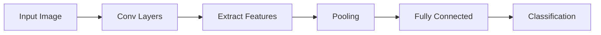
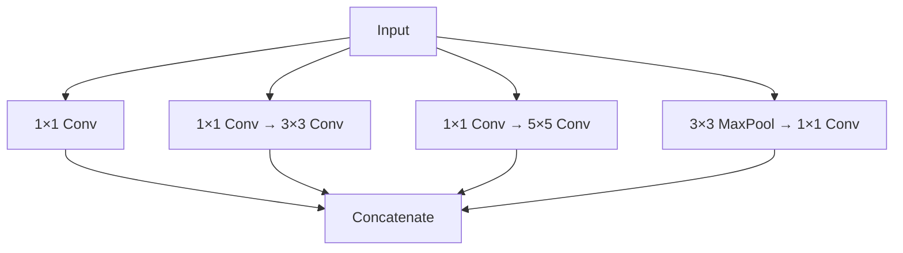

# Module 04: Convolutional Neural Networks (CNNs)

> **Level**: Intermediate  
> **Duration**: 3–4 weeks  
> **Prerequisites**: Modules 03 (Deep Learning)  
> **Goal**: Master computer vision with CNNs

---

## Table of Contents

1. [From Fully Connected to Convolutional](#1-from-fully-connected-to-convolutional)
2. [Convolution Operation](#2-convolution-operation)
3. [CNN Architecture Components](#3-cnn-architecture-components)
4. [Classic CNN Architectures](#4-classic-cnn-architectures)
5. [Modern CNN Architectures](#5-modern-cnn-architectures)
6. [Transfer Learning](#6-transfer-learning)
7. [Object Detection](#7-object-detection)
8. [Image Segmentation](#8-image-segmentation)
9. [CNN Visualization](#9-cnn-visualization)
10. [Practical Tips](#10-practical-tips)

---

## 1. From Fully Connected to Convolutional

### 1.1 Problems with Fully Connected Networks for Images

**Example**: 224×224 RGB image

**Fully connected**:
- Input size: $224 \times 224 \times 3 = 150,528$ neurons
- Hidden layer (1000 neurons): $150,528 \times 1000 = 150M$ parameters!
- **Problems**:
  - Too many parameters (overfitting)
  - Loses spatial structure
  - Not translation invariant

### 1.2 Key Principles of CNNs

1. **Local connectivity**: Neurons connect to small regions
2. **Parameter sharing**: Same weights applied across image
3. **Translation invariance**: Detect features anywhere



---

## 2. Convolution Operation

### 2.1 Mathematical Definition

**2D Convolution**:
$$
(I * K)(i, j) = \sum_{m} \sum_{n} I(i-m, j-n) \cdot K(m, n)
$$

Where:
- $I$ = Input image
- $K$ = Kernel (filter)
- $(i, j)$ = Output position

**In practice** (cross-correlation):
$$
(I * K)(i, j) = \sum_{m} \sum_{n} I(i+m, j+n) \cdot K(m, n)
$$

### 2.2 Example: 3×3 Convolution

**Input**:
```
[[1, 2, 3, 0],
 [0, 1, 2, 3],
 [3, 0, 1, 2],
 [2, 3, 0, 1]]
```

**Kernel** (edge detector):
```
[[-1, -1, -1],
 [ 0,  0,  0],
 [ 1,  1,  1]]
```

**Output** (top-left):
```
(-1)*1 + (-1)*2 + (-1)*3 +
  0*0  +   0*1  +   0*2  +
  1*3  +   1*0  +   1*1  = -3
```

### 2.3 Implementation from Scratch

```python
import numpy as np

def conv2d(input, kernel, stride=1, padding=0):
    """
    2D convolution
    
    Args:
        input: (H, W) or (C, H, W)
        kernel: (K, K) or (C_out, C_in, K, K)
        stride: Step size
        padding: Zero padding
    """
    if len(input.shape) == 2:
        input = input[np.newaxis, :]  # Add channel dim
        kernel = kernel[np.newaxis, np.newaxis, :]
    
    C_in, H, W = input.shape
    C_out, _, K, _ = kernel.shape
    
    # Add padding
    if padding > 0:
        input = np.pad(input, ((0, 0), (padding, padding), (padding, padding)))
    
    # Output size
    H_out = (H + 2*padding - K) // stride + 1
    W_out = (W + 2*padding - K) // stride + 1
    
    output = np.zeros((C_out, H_out, W_out))
    
    for c_out in range(C_out):
        for i in range(H_out):
            for j in range(W_out):
                h_start = i * stride
                w_start = j * stride
                
                # Extract receptive field
                receptive_field = input[:, h_start:h_start+K, w_start:w_start+K]
                
                # Convolve
                output[c_out, i, j] = np.sum(receptive_field * kernel[c_out])
    
    return output
```

### 2.4 Output Size Formula

$$
H_{\text{out}} = \left\lfloor \frac{H_{\text{in}} + 2P - K}{S} \right\rfloor + 1
$$

Where:
- $H_{\text{in}}$ = Input height
- $P$ = Padding
- $K$ = Kernel size
- $S$ = Stride

**Example**: $H=32, P=1, K=3, S=1$
$$
H_{\text{out}} = \frac{32 + 2 - 3}{1} + 1 = 32
$$

### 2.5 Common Kernels

**Edge detection** (vertical):
```
[[-1, 0, 1],
 [-1, 0, 1],
 [-1, 0, 1]]
```

**Sobel filter** (horizontal):
```
[[-1, -2, -1],
 [ 0,  0,  0],
 [ 1,  2,  1]]
```

**Blur** (Gaussian):
```
[[1, 2, 1],
 [2, 4, 2],
 [1, 2, 1]] / 16
```

**Sharpen**:
```
[[ 0, -1,  0],
 [-1,  5, -1],
 [ 0, -1,  0]]
```

---

## 3. CNN Architecture Components

### 3.1 Convolutional Layer

**Parameters**:
- **Input**: $(N, C_{\text{in}}, H, W)$
- **Output**: $(N, C_{\text{out}}, H', W')$
- **Weights**: $(C_{\text{out}}, C_{\text{in}}, K, K)$
- **Bias**: $(C_{\text{out}})$

**Number of parameters**:
$$
\text{Params} = C_{\text{out}} \times (C_{\text{in}} \times K \times K + 1)
$$

**PyTorch**:
```python
import torch.nn as nn

conv = nn.Conv2d(
    in_channels=3,      # RGB
    out_channels=64,    # 64 filters
    kernel_size=3,
    stride=1,
    padding=1
)

# Number of parameters
params = 64 * (3 * 3 * 3 + 1) = 1,792
```

### 3.2 Pooling Layers

**Max Pooling**:
$$
\text{MaxPool}(R) = \max_{(i,j) \in R} x_{i,j}
$$

**Average Pooling**:
$$
\text{AvgPool}(R) = \frac{1}{|R|} \sum_{(i,j) \in R} x_{i,j}
$$

**Benefits**:
- Reduce spatial dimensions
- Translation invariance
- Reduce overfitting
- No learnable parameters

```python
# Max pooling 2×2
pool = nn.MaxPool2d(kernel_size=2, stride=2)

# Input: (1, 64, 32, 32)
# Output: (1, 64, 16, 16)
```

### 3.3 Padding Strategies

**Valid** (no padding):
- Output shrinks with each layer

**Same** (preserve size):
$$
P = \frac{K - 1}{2}
$$

For $K=3$: $P=1$  
For $K=5$: $P=2$

**PyTorch**:
```python
# Manual padding
conv = nn.Conv2d(3, 64, kernel_size=3, padding=1)  # Same

# Or use padding='same' (PyTorch 1.9+)
conv = nn.Conv2d(3, 64, kernel_size=3, padding='same')
```

### 3.4 Stride

**Impact on output size**:
- Stride=1: Dense sampling
- Stride=2: Downsampling (like pooling)

**Modern approach**: Use stride=2 instead of pooling for downsampling.

### 3.5 Batch Normalization

**Normalize activations**:
$$
\hat{x} = \frac{x - \mu_B}{\sqrt{\sigma_B^2 + \epsilon}}
$$

$$
y = \gamma \hat{x} + \beta
$$

Where $\gamma, \beta$ are learnable.

**Benefits**:
- Faster training
- Higher learning rates
- Reduces internal covariate shift

```python
conv = nn.Conv2d(3, 64, 3, padding=1)
bn = nn.BatchNorm2d(64)
relu = nn.ReLU()

# Forward
x = conv(x)
x = bn(x)
x = relu(x)
```

### 3.6 Dropout

**Randomly drop activations** during training:
$$
y = \frac{1}{1-p} \cdot \text{mask}(x)
$$

**Common values**: $p=0.5$ for fully connected, $p=0.2$ for conv layers.

```python
dropout = nn.Dropout2d(p=0.2)
```

---

## 4. Classic CNN Architectures

### 4.1 LeNet-5 (1998)

**First successful CNN** (handwritten digits).

```
Input (32×32) → Conv5×5 (6) → MaxPool → Conv5×5 (16) → MaxPool → FC(120) → FC(84) → FC(10)
```

**PyTorch**:
```python
class LeNet5(nn.Module):
    def __init__(self):
        super().__init__()
        self.conv1 = nn.Conv2d(1, 6, 5)
        self.conv2 = nn.Conv2d(6, 16, 5)
        self.fc1 = nn.Linear(16 * 5 * 5, 120)
        self.fc2 = nn.Linear(120, 84)
        self.fc3 = nn.Linear(84, 10)
    
    def forward(self, x):
        x = F.max_pool2d(F.relu(self.conv1(x)), 2)
        x = F.max_pool2d(F.relu(self.conv2(x)), 2)
        x = x.view(-1, 16 * 5 * 5)
        x = F.relu(self.fc1(x))
        x = F.relu(self.fc2(x))
        x = self.fc3(x)
        return x
```

### 4.2 AlexNet (2012)

**ImageNet winner**, sparked deep learning revolution.

**Architecture**:
```
Input (227×227×3)
↓
Conv11×11 (96, stride=4) → ReLU → MaxPool → LRN
↓
Conv5×5 (256) → ReLU → MaxPool → LRN
↓
Conv3×3 (384) → ReLU
↓
Conv3×3 (384) → ReLU
↓
Conv3×3 (256) → ReLU → MaxPool
↓
FC(4096) → ReLU → Dropout
↓
FC(4096) → ReLU → Dropout
↓
FC(1000) → Softmax
```

**Innovations**:
- ReLU activation (faster than tanh)
- Dropout for regularization
- Data augmentation
- GPU training

**Parameters**: ~60M

### 4.3 VGGNet (2014)

**Key insight**: Deep networks with small filters (3×3).

**VGG16**:
```
Conv3×3 (64) × 2 → MaxPool
Conv3×3 (128) × 2 → MaxPool
Conv3×3 (256) × 3 → MaxPool
Conv3×3 (512) × 3 → MaxPool
Conv3×3 (512) × 3 → MaxPool
FC(4096) → FC(4096) → FC(1000)
```

**Key principles**:
- Only 3×3 convolutions
- Double channels after each pool
- Very deep (16-19 layers)

**Parameters**: 138M (VGG16)

```python
class VGG16(nn.Module):
    def __init__(self, num_classes=1000):
        super().__init__()
        self.features = nn.Sequential(
            # Block 1
            nn.Conv2d(3, 64, 3, padding=1),
            nn.ReLU(inplace=True),
            nn.Conv2d(64, 64, 3, padding=1),
            nn.ReLU(inplace=True),
            nn.MaxPool2d(2, 2),
            
            # Block 2
            nn.Conv2d(64, 128, 3, padding=1),
            nn.ReLU(inplace=True),
            nn.Conv2d(128, 128, 3, padding=1),
            nn.ReLU(inplace=True),
            nn.MaxPool2d(2, 2),
            
            # ... (3 more blocks)
        )
        
        self.classifier = nn.Sequential(
            nn.Linear(512 * 7 * 7, 4096),
            nn.ReLU(inplace=True),
            nn.Dropout(),
            nn.Linear(4096, 4096),
            nn.ReLU(inplace=True),
            nn.Dropout(),
            nn.Linear(4096, num_classes)
        )
```

### 4.4 GoogLeNet / Inception (2014)

**Inception module**: Multiple filter sizes in parallel.



**1×1 convolutions**: Reduce dimensionality.

$$
\text{Input: } 28 \times 28 \times 192 \rightarrow \text{1×1 Conv (64 filters)} \rightarrow 28 \times 28 \times 64
$$

**Parameters**: 7M (much less than VGG!)

### 4.5 ResNet (2015)

**Residual connections**: Enable very deep networks.

**Residual block**:
$$
\mathbf{y} = F(\mathbf{x}) + \mathbf{x}
$$

```python
class ResidualBlock(nn.Module):
    def __init__(self, channels):
        super().__init__()
        self.conv1 = nn.Conv2d(channels, channels, 3, padding=1)
        self.bn1 = nn.BatchNorm2d(channels)
        self.conv2 = nn.Conv2d(channels, channels, 3, padding=1)
        self.bn2 = nn.BatchNorm2d(channels)
    
    def forward(self, x):
        residual = x
        out = F.relu(self.bn1(self.conv1(x)))
        out = self.bn2(self.conv2(out))
        out += residual  # Skip connection
        out = F.relu(out)
        return out
```

**Why it works**:
- Easier to learn identity mapping
- Gradient flows directly through skip connections
- Enables 100+ layer networks

**ResNet-50**:
```
Conv7×7 (64, stride=2)
↓
MaxPool
↓
Residual blocks (64) × 3
↓
Residual blocks (128) × 4
↓
Residual blocks (256) × 6
↓
Residual blocks (512) × 3
↓
Global AvgPool → FC(1000)
```

**Parameters**: 25M

---

## 5. Modern CNN Architectures

### 5.1 MobileNet (2017)

**Depthwise Separable Convolutions**: Split standard conv into two steps.

**Standard conv**: $K \times K \times C_{\text{in}} \times C_{\text{out}}$ params

**Depthwise separable**:
1. **Depthwise**: One filter per input channel ($K \times K \times C_{\text{in}}$)
2. **Pointwise**: 1×1 conv to combine ($1 \times 1 \times C_{\text{in}} \times C_{\text{out}}$)

**Reduction**:
$$
\frac{K^2 C_{\text{in}} C_{\text{out}}}{K^2 C_{\text{in}} + C_{\text{in}} C_{\text{out}}} = \frac{1}{C_{\text{out}}} + \frac{1}{K^2}
$$

For $K=3, C_{\text{out}}=256$: **~9× fewer parameters**!

```python
class DepthwiseSeparable(nn.Module):
    def __init__(self, in_channels, out_channels):
        super().__init__()
        # Depthwise
        self.depthwise = nn.Conv2d(
            in_channels, in_channels,
            kernel_size=3, padding=1,
            groups=in_channels  # Key: groups=in_channels
        )
        # Pointwise
        self.pointwise = nn.Conv2d(in_channels, out_channels, kernel_size=1)
    
    def forward(self, x):
        x = self.depthwise(x)
        x = self.pointwise(x)
        return x
```

### 5.2 EfficientNet (2019)

**Compound scaling**: Scale depth, width, and resolution together.

$$
\text{depth: } d = \alpha^\phi
$$
$$
\text{width: } w = \beta^\phi
$$
$$
\text{resolution: } r = \gamma^\phi
$$

Subject to: $\alpha \cdot \beta^2 \cdot \gamma^2 \approx 2$

**EfficientNet-B7**: 66M params, 84.4% ImageNet top-1 (SOTA at the time).

### 5.3 Vision Transformer (ViT) (2020)

**Treats image as sequence of patches**.

```
Image (224×224) → Patches (16×16) → Linear projection → Transformer
```

**Patch embedding**:
$$
\mathbf{z}_0 = [\mathbf{x}_{\text{cls}}; \mathbf{x}_p^1 \mathbf{E}; \ldots; \mathbf{x}_p^N \mathbf{E}] + \mathbf{E}_{\text{pos}}
$$

**Performance**: Beats CNNs with enough data (300M+ images).

```python
class VisionTransformer(nn.Module):
    def __init__(self, image_size=224, patch_size=16, num_classes=1000):
        super().__init__()
        self.patch_embed = nn.Conv2d(3, 768, kernel_size=patch_size, stride=patch_size)
        self.cls_token = nn.Parameter(torch.zeros(1, 1, 768))
        self.pos_embed = nn.Parameter(torch.zeros(1, 197, 768))  # 196 patches + 1 cls
        self.transformer = nn.TransformerEncoder(...)
        self.head = nn.Linear(768, num_classes)
    
    def forward(self, x):
        # Patch embedding
        x = self.patch_embed(x).flatten(2).transpose(1, 2)
        
        # Add cls token
        cls_tokens = self.cls_token.expand(x.shape[0], -1, -1)
        x = torch.cat([cls_tokens, x], dim=1)
        
        # Add positional encoding
        x = x + self.pos_embed
        
        # Transformer
        x = self.transformer(x)
        
        # Classification
        return self.head(x[:, 0])
```

---

## 6. Transfer Learning

### 6.1 Why Transfer Learning?

**Problem**: Limited labeled data (e.g., 1000 medical images).

**Solution**: Use model pretrained on ImageNet (1.4M images).

**Intuition**:
- Early layers: Generic features (edges, textures)
- Later layers: Task-specific features

### 6.2 Strategies

**1. Feature Extraction** (freeze backbone):
```python
# Load pretrained ResNet
model = torchvision.models.resnet50(pretrained=True)

# Freeze all layers
for param in model.parameters():
    param.requires_grad = False

# Replace final layer
model.fc = nn.Linear(2048, num_classes)

# Only train final layer
optimizer = optim.Adam(model.fc.parameters(), lr=0.001)
```

**2. Fine-Tuning** (unfreeze some layers):
```python
# Unfreeze last block
for param in model.layer4.parameters():
    param.requires_grad = True

# Lower learning rate for pretrained layers
optimizer = optim.Adam([
    {'params': model.layer4.parameters(), 'lr': 1e-4},
    {'params': model.fc.parameters(), 'lr': 1e-3}
])
```

**3. Full Fine-Tuning** (unfreeze all):
```python
for param in model.parameters():
    param.requires_grad = True

# Use very low learning rate
optimizer = optim.Adam(model.parameters(), lr=1e-5)
```

### 6.3 When to Use Which

| Scenario | Strategy | Learning Rate |
|----------|----------|---------------|
| Small dataset, similar task | Feature extraction | High (1e-3) |
| Small dataset, different task | Fine-tune last block | Medium (1e-4) |
| Large dataset, similar task | Fine-tune all | Low (1e-5) |
| Large dataset, different task | Train from scratch | High (1e-2) |

---

## 7. Object Detection

### 7.1 Task Definition

**Input**: Image  
**Output**: Bounding boxes + class labels

**Bounding box**: $(x, y, w, h)$ or $(x_1, y_1, x_2, y_2)$

### 7.2 R-CNN Family

**R-CNN (2014)**:
1. Generate region proposals (~2000)
2. Warp each to fixed size
3. CNN feature extraction
4. SVM classification

**Problem**: Very slow (47s per image).

**Fast R-CNN (2015)**:
- Run CNN once on full image
- Project proposals to feature map
- RoI pooling

**Faster R-CNN (2015)**:
- **Region Proposal Network (RPN)**: Learn proposals with CNN
- End-to-end trainable

### 7.3 YOLO (You Only Look Once)

**Key idea**: Single-stage detector (no region proposals).

**Algorithm**:
1. Divide image into $S \times S$ grid
2. Each cell predicts $B$ bounding boxes
3. Each box: $(x, y, w, h, \text{confidence})$
4. Each cell: class probabilities

**Loss**:
$$
\mathcal{L} = \lambda_{\text{coord}} \mathcal{L}_{\text{box}} + \mathcal{L}_{\text{obj}} + \lambda_{\text{noobj}} \mathcal{L}_{\text{noobj}} + \mathcal{L}_{\text{cls}}
$$

**Speed**: 45 FPS (real-time!)

**YOLOv8** (2023): SOTA accuracy + speed.

```python
from ultralytics import YOLO

model = YOLO('yolov8n.pt')
results = model('image.jpg')

for r in results:
    boxes = r.boxes
    for box in boxes:
        x1, y1, x2, y2 = box.xyxy[0]
        confidence = box.conf[0]
        class_id = box.cls[0]
```

### 7.4 Metrics

**IoU** (Intersection over Union):
$$
\text{IoU} = \frac{\text{Area of Overlap}}{\text{Area of Union}}
$$

**mAP** (mean Average Precision):
- Compute AP for each class, average

---

## 8. Image Segmentation

### 8.1 Types

**Semantic Segmentation**: Label each pixel with class  
**Instance Segmentation**: Separate object instances  
**Panoptic Segmentation**: Semantic + Instance

### 8.2 U-Net (2015)

**Architecture**: Encoder-decoder with skip connections.

```
Encoder (downsampling):
Conv → Conv → MaxPool → ... → Bottleneck

Decoder (upsampling):
Bottleneck → UpConv + Skip → Conv → Conv → ...
```

```python
class UNet(nn.Module):
    def __init__(self):
        super().__init__()
        # Encoder
        self.enc1 = self.conv_block(3, 64)
        self.enc2 = self.conv_block(64, 128)
        self.enc3 = self.conv_block(128, 256)
        
        # Bottleneck
        self.bottleneck = self.conv_block(256, 512)
        
        # Decoder
        self.dec3 = nn.ConvTranspose2d(512, 256, 2, stride=2)
        self.dec2 = nn.ConvTranspose2d(256, 128, 2, stride=2)
        self.dec1 = nn.ConvTranspose2d(128, 64, 2, stride=2)
        
        self.out = nn.Conv2d(64, num_classes, 1)
    
    def forward(self, x):
        # Encoder
        e1 = self.enc1(x)
        e2 = self.enc2(F.max_pool2d(e1, 2))
        e3 = self.enc3(F.max_pool2d(e2, 2))
        
        # Bottleneck
        b = self.bottleneck(F.max_pool2d(e3, 2))
        
        # Decoder with skip connections
        d3 = self.dec3(b)
        d3 = torch.cat([d3, e3], dim=1)
        d3 = self.conv_block(512, 256)(d3)
        
        # ... (similar for d2, d1)
        
        return self.out(d1)
```

### 8.3 Mask R-CNN (2017)

**Faster R-CNN + Segmentation head**.

**Pipeline**:
1. RPN: Propose regions
2. RoIAlign: Extract features
3. Box head: Classify + refine box
4. Mask head: Predict segmentation mask

---

## 9. CNN Visualization

### 9.1 Activation Maximization

**Find input that maximizes specific neuron**:
$$
\mathbf{x}^* = \arg\max_{\mathbf{x}} a_i(\mathbf{x}) - \lambda \|\mathbf{x}\|^2
$$

```python
def visualize_filter(model, layer, filter_idx):
    # Random input
    x = torch.randn(1, 3, 224, 224, requires_grad=True)
    
    for _ in range(100):
        # Forward
        activation = model.get_activation(layer, x)
        loss = -activation[0, filter_idx].mean()
        
        # Backward
        loss.backward()
        
        # Update input
        with torch.no_grad():
            x += 0.1 * x.grad
            x.grad.zero_()
    
    return x
```

### 9.2 Grad-CAM (2016)

**Class Activation Mapping**: Highlight important regions.

$$
L_{\text{Grad-CAM}} = \text{ReLU}\left(\sum_k \alpha_k A^k\right)
$$

Where:
$$
\alpha_k = \frac{1}{Z} \sum_i \sum_j \frac{\partial y^c}{\partial A_{ij}^k}
$$

```python
from pytorch_grad_cam import GradCAM

model = torchvision.models.resnet50(pretrained=True)
cam = GradCAM(model=model, target_layers=[model.layer4[-1]])

grayscale_cam = cam(input_tensor, targets=[ClassifierOutputTarget(281)])
```

---

## 10. Practical Tips

### 10.1 Data Augmentation

```python
from torchvision import transforms

train_transform = transforms.Compose([
    transforms.RandomResizedCrop(224),
    transforms.RandomHorizontalFlip(),
    transforms.ColorJitter(brightness=0.2, contrast=0.2),
    transforms.RandomRotation(15),
    transforms.ToTensor(),
    transforms.Normalize([0.485, 0.456, 0.406], [0.229, 0.224, 0.225])
])
```

### 10.2 Training Recipe

**Learning rate schedule**:
```python
scheduler = optim.lr_scheduler.CosineAnnealingLR(optimizer, T_max=epochs)
```

**Mixed precision**:
```python
from torch.cuda.amp import autocast, GradScaler

scaler = GradScaler()

for batch in dataloader:
    optimizer.zero_grad()
    
    with autocast():
        loss = model(batch)
    
    scaler.scale(loss).backward()
    scaler.step(optimizer)
    scaler.update()
```

**Gradient clipping**:
```python
torch.nn.utils.clip_grad_norm_(model.parameters(), max_norm=1.0)
```

---

## Notebooks

| # | Notebook | Description |
|---|----------|-------------|
| 1 | [Convolution from Scratch](notebooks/01_convolution_basics.ipynb) | Implement conv2d, visualize filters |
| 2 | [Image Classification (CIFAR-10)](notebooks/02_image_classification.ipynb) | Train ResNet, transfer learning |
| 3 | [Object Detection with YOLO](notebooks/03_object_detection.ipynb) | Detect objects in images |
| 4 | [Image Segmentation with U-Net](notebooks/04_segmentation.ipynb) | Semantic segmentation |
| 5 | [CNN Visualization](notebooks/05_visualization.ipynb) | Grad-CAM, filter visualization |

---

## Projects

### Mini Project: Dog vs Cat Classifier
- Binary classification
- Transfer learning with ResNet
- Data augmentation
- Deploy with Gradio

### Advanced Project: Custom Object Detector
- Fine-tune YOLOv8 on custom dataset
- Data annotation with LabelImg
- Evaluate mAP
- Build real-time webcam detector

---

## Interview Questions

1. Explain how convolution reduces parameters compared to fully connected layers.
2. What's the difference between padding='same' vs 'valid'?
3. Walk through a residual block and explain why it helps.
4. Compare one-stage (YOLO) vs two-stage (Faster R-CNN) object detection.
5. Explain depthwise separable convolution and why it's efficient.
6. What's the receptive field of a neuron after 3 conv3×3 layers?
7. How does Batch Normalization speed up training?
8. Explain the U-Net architecture for segmentation.
9. What's the difference between semantic and instance segmentation?
10. How does transfer learning work? When should you freeze layers?
