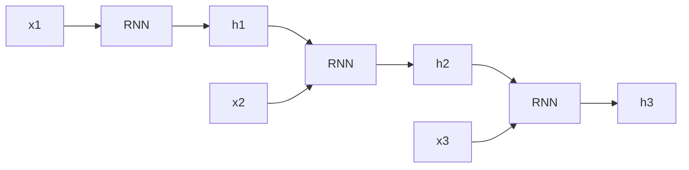

# Module 05: RNN, LSTM, and GRU

> **Level**: Intermediate  
> **Duration**: 3–4 weeks  
> **Prerequisites**: Module 03 (Deep Learning)  
> **Goal**: Master sequence modeling with recurrent architectures

---

## Table of Contents

1. [Sequence Modeling Fundamentals](#1-sequence-modeling-fundamentals)
2. [Vanilla RNN](#2-vanilla-rnn)
3. [Backpropagation Through Time (BPTT)](#3-backpropagation-through-time-bptt)
4. [Vanishing & Exploding Gradients](#4-vanishing--exploding-gradients)
5. [Long Short-Term Memory (LSTM)](#5-long-short-term-memory-lstm)
6. [Gated Recurrent Unit (GRU)](#6-gated-recurrent-unit-gru)
7. [Bidirectional RNNs](#7-bidirectional-rnns)
8. [Sequence-to-Sequence Models](#8-sequence-to-sequence-models)
9. [Practical Applications](#9-practical-applications)
10. [Modern Alternatives](#10-modern-alternatives)

---

## 1. Sequence Modeling Fundamentals

### 1.1 What are Sequences?

**Definition**: Data where order matters.

**Examples**:
- **Text**: "I love AI" ≠ "AI love I"
- **Time series**: Stock prices, weather
- **Audio**: Speech, music
- **Video**: Sequence of frames

### 1.2 Why Not Feedforward Networks?

**Problems**:
1. **Fixed input size**: Cannot handle variable-length sequences
2. **No memory**: Cannot use information from previous timesteps
3. **No parameter sharing**: Same pattern at different positions needs separate weights

### 1.3 Recurrent Neural Networks

**Key idea**: Use hidden state to maintain memory.

$$
h_t = f(h_{t-1}, x_t)
$$



**Parameter sharing**: Same weights $W$ used at each timestep.

---

## 2. Vanilla RNN

### 2.1 Architecture

**Hidden state update**:
$$
h_t = \tanh(W_{hh} h_{t-1} + W_{xh} x_t + b_h)
$$

**Output**:
$$
y_t = W_{hy} h_t + b_y
$$

**Dimensions**:
- $x_t \in \mathbb{R}^{d}$ (input)
- $h_t \in \mathbb{R}^{h}$ (hidden state)
- $y_t \in \mathbb{R}^{o}$ (output)
- $W_{xh} \in \mathbb{R}^{h \times d}$
- $W_{hh} \in \mathbb{R}^{h \times h}$
- $W_{hy} \in \mathbb{R}^{o \times h}$

### 2.2 Implementation from Scratch

```python
import numpy as np

class VanillaRNN:
    def __init__(self, input_size, hidden_size, output_size):
        self.hidden_size = hidden_size
        
        # Initialize weights (Xavier)
        self.Wxh = np.random.randn(hidden_size, input_size) * 0.01
        self.Whh = np.random.randn(hidden_size, hidden_size) * 0.01
        self.Why = np.random.randn(output_size, hidden_size) * 0.01
        
        self.bh = np.zeros((hidden_size, 1))
        self.by = np.zeros((output_size, 1))
    
    def forward(self, inputs):
        """
        inputs: list of input vectors (each shape (d, 1))
        returns: outputs, hidden states
        """
        h = np.zeros((self.hidden_size, 1))
        outputs = []
        hidden_states = [h]
        
        for x_t in inputs:
            # Update hidden state
            h = np.tanh(self.Wxh @ x_t + self.Whh @ h + self.bh)
            hidden_states.append(h)
            
            # Compute output
            y = self.Why @ h + self.by
            outputs.append(y)
        
        return outputs, hidden_states
    
    def predict(self, inputs):
        outputs, _ = self.forward(inputs)
        return outputs
```

### 2.3 PyTorch Implementation

```python
import torch
import torch.nn as nn

class SimpleRNN(nn.Module):
    def __init__(self, input_size, hidden_size, output_size):
        super().__init__()
        self.hidden_size = hidden_size
        
        self.rnn = nn.RNN(
            input_size=input_size,
            hidden_size=hidden_size,
            batch_first=True
        )
        self.fc = nn.Linear(hidden_size, output_size)
    
    def forward(self, x):
        # x: (batch, seq_len, input_size)
        
        # RNN output
        # out: (batch, seq_len, hidden_size)
        # h_n: (1, batch, hidden_size)
        out, h_n = self.rnn(x)
        
        # Use final hidden state for classification
        out = self.fc(h_n.squeeze(0))
        
        return out
```

### 2.4 Types of RNN Architectures

**One-to-One**: Standard feedforward (not really RNN)

**One-to-Many**: Image captioning
```
Image → RNN → "A" → RNN → "dog" → RNN → "running"
```

**Many-to-One**: Sentiment classification
```
"I" → RNN → "love" → RNN → "this" → RNN → [Classification]
```

**Many-to-Many (synchronized)**: POS tagging
```
"I"     → RNN → "Pronoun"
"love"  → RNN → "Verb"
"AI"    → RNN → "Noun"
```

**Many-to-Many (seq2seq)**: Translation
```
"I love AI" → Encoder → Decoder → "J'aime l'IA"
```

---

## 3. Backpropagation Through Time (BPTT)

### 3.1 Forward Pass

For each timestep $t = 1, \ldots, T$:
$$
h_t = \tanh(W_{xh} x_t + W_{hh} h_{t-1} + b_h)
$$
$$
y_t = W_{hy} h_t + b_y
$$

**Loss**:
$$
\mathcal{L} = \sum_{t=1}^{T} \mathcal{L}_t(y_t, \hat{y}_t)
$$

### 3.2 Backward Pass

**Gradient at output**:
$$
\frac{\partial \mathcal{L}}{\partial y_t} = \frac{\partial \mathcal{L}_t}{\partial y_t}
$$

**Gradient w.r.t. hidden state**:
$$
\frac{\partial \mathcal{L}}{\partial h_t} = \frac{\partial \mathcal{L}}{\partial y_t} \frac{\partial y_t}{\partial h_t} + \frac{\partial \mathcal{L}}{\partial h_{t+1}} \frac{\partial h_{t+1}}{\partial h_t}
$$

**Chain rule through time**:
$$
\frac{\partial h_t}{\partial h_k} = \prod_{i=k+1}^{t} \frac{\partial h_i}{\partial h_{i-1}} = \prod_{i=k+1}^{t} W_{hh}^T \cdot \text{diag}(\tanh'(z_i))
$$

### 3.3 Truncated BPTT

**Problem**: Full BPTT is expensive for long sequences.

**Solution**: Only backpropagate $k$ steps.

```python
def truncated_bptt(model, data, seq_len=10, bptt_len=5):
    h = None
    for i in range(0, len(data) - seq_len, bptt_len):
        # Get batch
        x = data[i:i+seq_len]
        targets = data[i+1:i+seq_len+1]
        
        # Forward pass
        if h is not None:
            h = h.detach()  # Detach to truncate gradients
        
        outputs, h = model(x, h)
        loss = criterion(outputs, targets)
        
        # Backward pass (only last bptt_len steps)
        loss.backward()
        optimizer.step()
```

---

## 4. Vanishing & Exploding Gradients

### 4.1 The Problem

**Gradient**:
$$
\frac{\partial \mathcal{L}}{\partial h_k} = \frac{\partial \mathcal{L}}{\partial h_t} \prod_{i=k+1}^{t} W_{hh}^T \cdot \text{diag}(\tanh'(z_i))
$$

**Vanishing gradients**: If $|W_{hh}| < 1$ or $|\tanh'| \to 0$:
$$
\left|\prod_{i=k+1}^{t} W_{hh}\right| \to 0 \quad \text{as } (t - k) \to \infty
$$

**Exploding gradients**: If $|W_{hh}| > 1$:
$$
\left|\prod_{i=k+1}^{t} W_{hh}\right| \to \infty
$$

### 4.2 Why This Matters

**Vanishing**:
- Cannot learn long-term dependencies
- Early layers don't get trained

**Exploding**:
- Unstable training
- NaN values

### 4.3 Solutions

**1. Gradient Clipping** (for exploding):
```python
torch.nn.utils.clip_grad_norm_(model.parameters(), max_norm=5.0)
```

**2. Better Activation Functions**:
- ReLU instead of tanh (but introduces other issues)

**3. Better Initialization**:
- Xavier/He initialization

**4. Gated Architectures** (LSTMs, GRUs):
- Learn what to remember and forget

---

## 5. Long Short-Term Memory (LSTM)

### 5.1 Architecture

**Key idea**: Add cell state $C_t$ that flows through time with minimal modification.

**Gates**:
1. **Forget gate**: What to forget from $C_{t-1}$
2. **Input gate**: What new info to add to $C_t$
3. **Output gate**: What to output from $C_t$

### 5.2 Equations

**Forget gate**:
$$
f_t = \sigma(W_f \cdot [h_{t-1}, x_t] + b_f)
$$

**Input gate**:
$$
i_t = \sigma(W_i \cdot [h_{t-1}, x_t] + b_i)
$$

**Candidate values**:
$$
\tilde{C}_t = \tanh(W_C \cdot [h_{t-1}, x_t] + b_C)
$$

**Update cell state**:
$$
C_t = f_t \odot C_{t-1} + i_t \odot \tilde{C}_t
$$

**Output gate**:
$$
o_t = \sigma(W_o \cdot [h_{t-1}, x_t] + b_o)
$$

**Hidden state**:
$$
h_t = o_t \odot \tanh(C_t)
$$

### 5.3 Intuition

**Cell state $C_t$**: Conveyor belt carrying information
- **Forget gate**: Remove irrelevant info
- **Input gate**: Add new relevant info
- **Output gate**: Filter what to expose

**Example** (language modeling):
```
"The cat, which was sitting on the mat, [...]"

Cell state tracks subject ("cat") through long distance
forget gate: Forget previous subject when new one appears
Input gate: Add "cat" as new subject  
Output gate: Expose "cat" for verb agreement
```

### 5.4 Implementation

```python
class LSTMCell(nn.Module):
    def __init__(self, input_size, hidden_size):
        super().__init__()
        self.hidden_size = hidden_size
        
        # Gates: forget, input, output, cell
        self.W = nn.Linear(input_size + hidden_size, 4 * hidden_size)
    
    def forward(self, x, state):
        h_prev, c_prev = state
        
        # Concatenate input and previous hidden
        combined = torch.cat([x, h_prev], dim=1)
        
        # All gates in one matrix multiply
        gates = self.W(combined)
        
        # Split into 4 gates
        f, i, o, g = gates.chunk(4, dim=1)
        
        # Apply activations
        f = torch.sigmoid(f)  # Forget gate
        i = torch.sigmoid(i)  # Input gate
        o = torch.sigmoid(o)  # Output gate
        g = torch.tanh(g)     # Cell candidate
        
        # Update cell and hidden state
        c = f * c_prev + i * g
        h = o * torch.tanh(c)
        
        return h, (h, c)

class LSTM(nn.Module):
    def __init__(self, input_size, hidden_size, num_layers=1):
        super().__init__()
        self.lstm = nn.LSTM(
            input_size=input_size,
            hidden_size=hidden_size,
            num_layers=num_layers,
            batch_first=True
        )
        
    def forward(self, x):
        # x: (batch, seq_len, input_size)
        output, (h_n, c_n) = self.lstm(x)
        return output, (h_n, c_n)
```

### 5.5 Why LSTMs Work

**Gradient flow**:
$$
\frac{\partial C_t}{\partial C_{t-1}} = f_t
$$

**No repeated matrix multiplication**! Gradient flows additively:
$$
\frac{\partial \mathcal{L}}{\partial C_k} = \frac{\partial \mathcal{L}}{\partial C_t} \prod_{i=k+1}^{t} f_i
$$

Since $f_i \in [0, 1]$, gradients don't explode (but can still vanish if $f_i \to 0$).

---

## 6. Gated Recurrent Unit (GRU)

### 6.1 Motivation

**LSTM has 4 gates** → expensive  
**GRU simplifies to 2 gates** → faster, fewer parameters

### 6.2 Equations

**Update gate** (combines forget + input):
$$
z_t = \sigma(W_z \cdot [h_{t-1}, x_t])
$$

**Reset gate**:
$$
r_t = \sigma(W_r \cdot [h_{t-1}, x_t])
$$

**Candidate hidden state**:
$$
\tilde{h}_t = \tanh(W \cdot [r_t \odot h_{t-1}, x_t])
$$

**Final hidden state**:
$$
h_t = (1 - z_t) \odot h_{t-1} + z_t \odot \tilde{h}_t
$$

### 6.3 Key Differences from LSTM

| Feature | LSTM | GRU |
|---------|------|-----|
| **Gates** | 4 (forget, input, output, cell) | 2 (update, reset) |
| **Cell state** | Separate $C_t$ and $h_t$ | Only $h_t$ |
| **Parameters** | More | ~25% fewer |
| **Speed** | Slower | Faster |
| **Performance** | Slightly better on some tasks | Comparable |

### 6.4 Implementation

```python
class GRUCell(nn.Module):
    def __init__(self, input_size, hidden_size):
        super().__init__()
        self.hidden_size = hidden_size
        
        # Reset and update gates
        self.W_z = nn.Linear(input_size + hidden_size, hidden_size)
        self.W_r = nn.Linear(input_size + hidden_size, hidden_size)
        
        # Candidate hidden state
        self.W_h = nn.Linear(input_size + hidden_size, hidden_size)
    
    def forward(self, x, h_prev):
        combined = torch.cat([x, h_prev], dim=1)
        
        # Update gate
        z = torch.sigmoid(self.W_z(combined))
        
        # Reset gate
        r = torch.sigmoid(self.W_r(combined))
        
        # Candidate hidden state
        combined_reset = torch.cat([x, r * h_prev], dim=1)
        h_candidate = torch.tanh(self.W_h(combined_reset))
        
        # Final hidden state
        h = (1 - z) * h_prev + z * h_candidate
        
        return h
```

### 6.5 When to Use LSTM vs GRU

**LSTM**:
- Longer sequences
- More complex patterns
- Have computational budget

**GRU**:
- Shorter sequences
- Need faster training
- Limited data

**In practice**: Try both, see what works!

---

## 7. Bidirectional RNNs

### 7.1 Motivation

**Problem**: Unidirectional RNNs only see past context.

**Example**: "I am _____ because I passed the test"
- Need to see "passed the test" to fill "happy"

### 7.2 Architecture

**Forward RNN**:
$$
\overrightarrow{h}_t = f(\overrightarrow{h}_{t-1}, x_t)
$$

**Backward RNN**:
$$
\overleftarrow{h}_t = f(\overleftarrow{h}_{t+1}, x_t)
$$

**Combined**:
$$
h_t = [\overrightarrow{h}_t; \overleftarrow{h}_t]
$$

```python
class BiLSTM(nn.Module):
    def __init__(self, input_size, hidden_size):
        super().__init__()
        self.lstm = nn.LSTM(
            input_size=input_size,
            hidden_size=hidden_size,
            bidirectional=True,
            batch_first=True
        )
        # Output size is 2 * hidden_size
    
    def forward(self, x):
        output, (h_n, c_n) = self.lstm(x)
        # output: (batch, seq_len, 2 * hidden_size)
        return output
```

### 7.3 Use Cases

**Good for**:
- Text classification (have full sentence)
- Named Entity Recognition
- POS tagging

**Not good for**:
- Language generation (can't see future!)
- Real-time prediction

---

## 8. Sequence-to-Sequence Models

### 8.1 Architecture

**Encoder**: Compress input sequence into context vector
```
x1 → LSTM → x2 → LSTM → x3 → LSTM → context (c)
```

**Decoder**: Generate output sequence from context
```
c → LSTM → y1 → LSTM → y2 → LSTM → y3
```

### 8.2 Implementation

```python
class Seq2Seq(nn.Module):
    def __init__(self, input_vocab_size, output_vocab_size, hidden_size):
        super().__init__()
        
        # Encoder
        self.encoder_embedding = nn.Embedding(input_vocab_size, hidden_size)
        self.encoder = nn.LSTM(hidden_size, hidden_size, batch_first=True)
        
        # Decoder
        self.decoder_embedding = nn.Embedding(output_vocab_size, hidden_size)
        self.decoder = nn.LSTM(hidden_size, hidden_size, batch_first=True)
        self.fc = nn.Linear(hidden_size, output_vocab_size)
    
    def forward(self, src, tgt):
        # Encode
        src_emb = self.encoder_embedding(src)
        _, (h, c) = self.encoder(src_emb)
        
        # Decode
        tgt_emb = self.decoder_embedding(tgt)
        output, _ = self.decoder(tgt_emb, (h, c))
        
        # Project to vocabulary
        output = self.fc(output)
        return output
    
    def generate(self, src, max_len=50, start_token=1):
        """Greedy decoding"""
        self.eval()
        with torch.no_grad():
            # Encode
            src_emb = self.encoder_embedding(src)
            _, (h, c) = self.encoder(src_emb)
            
            # Start with <SOS> token
            input_token = torch.tensor([[start_token]])
            generated = []
            
            for _ in range(max_len):
                # Decode one step
                emb = self.decoder_embedding(input_token)
                output, (h, c) = self.decoder(emb, (h, c))
                
                # Get predicted token
                logits = self.fc(output)
                predicted = logits.argmax(dim=-1)
                
                generated.append(predicted.item())
                
                # Check for <EOS>
                if predicted.item() == 2:  # Assume 2 is <EOS>
                    break
                
                # Use predicted token as next input
                input_token = predicted
            
            return generated
```

### 8.3 Teacher Forcing

**Problem**: During training, model's mistakes compound.

**Solution**: Use ground truth as input (instead of model's prediction).

```python
# With teacher forcing
for t in range(target_len):
    output, hidden = decoder(target[t], hidden)
    
# Without teacher forcing
for t in range(target_len):
    output, hidden = decoder(prev_output, hidden)
    prev_output = output.argmax()
```

**Scheduled sampling**: Start with teacher forcing, gradually use model's predictions.

---

## 9. Practical Applications

### 9.1 Sentiment Analysis

```python
class SentimentRNN(nn.Module):
    def __init__(self, vocab_size, embedding_dim, hidden_dim):
        super().__init__()
        self.embedding = nn.Embedding(vocab_size, embedding_dim)
        self.lstm = nn.LSTM(embedding_dim, hidden_dim, batch_first=True)
        self.fc = nn.Linear(hidden_dim, 1)
        self.sigmoid = nn.Sigmoid()
    
    def forward(self, x):
        # x: (batch, seq_len)
        embedded = self.embedding(x)
        _, (h_n, _) = self.lstm(embedded)
        out = self.fc(h_n.squeeze(0))
        return self.sigmoid(out)
```

### 9.2 Language Modeling

**Task**: Predict next word given previous words.

$$
P(w_t | w_1, \ldots, w_{t-1})
$$

```python
class LanguageModel(nn.Module):
    def __init__(self, vocab_size, embedding_dim, hidden_dim):
        super().__init__()
        self.embedding = nn.Embedding(vocab_size, embedding_dim)
        self.lstm = nn.LSTM(embedding_dim, hidden_dim, batch_first=True)
        self.fc = nn.Linear(hidden_dim, vocab_size)
    
    def forward(self, x):
        embedded = self.embedding(x)
        output, _ = self.lstm(embedded)
        logits = self.fc(output)
        return logits
```

### 9.3 Named Entity Recognition (NER)

**Tag each word**: PER (person), LOC (location), ORG (organization), O (other)

```python
class NER_BiLSTM(nn.Module):
    def __init__(self, vocab_size, embedding_dim, hidden_dim, num_tags):
        super().__init__()
        self.embedding = nn.Embedding(vocab_size, embedding_dim)
        self.lstm = nn.LSTM(
            embedding_dim, hidden_dim,
            bidirectional=True,
            batch_first=True
        )
        self.fc = nn.Linear(hidden_dim * 2, num_tags)
    
    def forward(self, x):
        # x: (batch, seq_len)
        embedded = self.embedding(x)
        output, _ = self.lstm(embedded)  # (batch, seq_len, 2*hidden)
        tags = self.fc(output)  # (batch, seq_len, num_tags)
        return tags
```

---

## 10. Modern Alternatives

### 10.1 Why Transformers Replaced RNNs

**RNN problems**:
1. **Sequential**: Cannot parallelize across time
2. **Long-term dependencies**: Still struggle despite LSTM/GRU
3. **Slow training**: Must process step-by-step

**Transformers**:
1. **Parallel**: Process entire sequence at once
2. **Attention**: Direct connections between any positions
3. **Fast**: Matrix operations are GPU-friendly

### 10.2 When to Still Use RNNs

**RNNs are good for**:
- **Streaming data**: Process online, don't need full sequence
- **Small data**: Transformers need more data
- **Edge devices**: Fewer parameters than Transformers

**Examples**:
- Real-time speech recognition
- IoT sensor data
- Mobile apps

### 10.3 Hybrid Approaches

**Convolutional + RNN**:
```
CNN (local features) → RNN (temporal dependencies)
```

**RNN + Attention**:
- Seq2seq with attention mechanism (Module 06)

---

## Notebooks

| # | Notebook | Description |
|---|----------|-------------|
| 1 | [Vanilla RNN from Scratch](notebooks/01_vanilla_rnn.ipynb) | Implement character-level RNN |
| 2 | [LSTM for Sentiment Analysis](notebooks/02_lstm_sentiment.ipynb) | Classify movie reviews |
| 3 | [GRU vs LSTM Comparison](notebooks/03_gru_vs_lstm.ipynb) | Compare on time series |
| 4 | [Seq2Seq Translation](notebooks/04_seq2seq.ipynb) | English → French |
| 5 | [Named Entity Recognition](notebooks/05_ner_bilstm.ipynb) | BiLSTM + CRF for NER |

---

## Projects

### Mini Project: Text Generation
- Character-level LSTM
- Train on Shakespeare
- Generate new text
- Temperature sampling

### Advanced Project: Neural Machine Translation
- Seq2seq with attention
- Train on parallel corpus
- Beam search decoding
- BLEU score evaluation
- Compare with Transformer

---

## Interview Questions

1. Explain vanishing gradients in RNNs and how LSTM solves it.
2. Walk through the LSTM equations and explain each gate.
3. What's the difference between GRU and LSTM?
4. When would you use a bidirectional RNN vs unidirectional?
5. Explain teacher forcing in seq2seq models.
6. How does BPTT differ from standard backpropagation?
7. Why do Transformers outperform RNNs for most tasks?
8. What's the computational complexity of processing a sequence of length $n$ with RNN vs Transformer?
9. Explain gradient clipping and when you'd use it.
10. How would you handle variable-length sequences in a batch?
