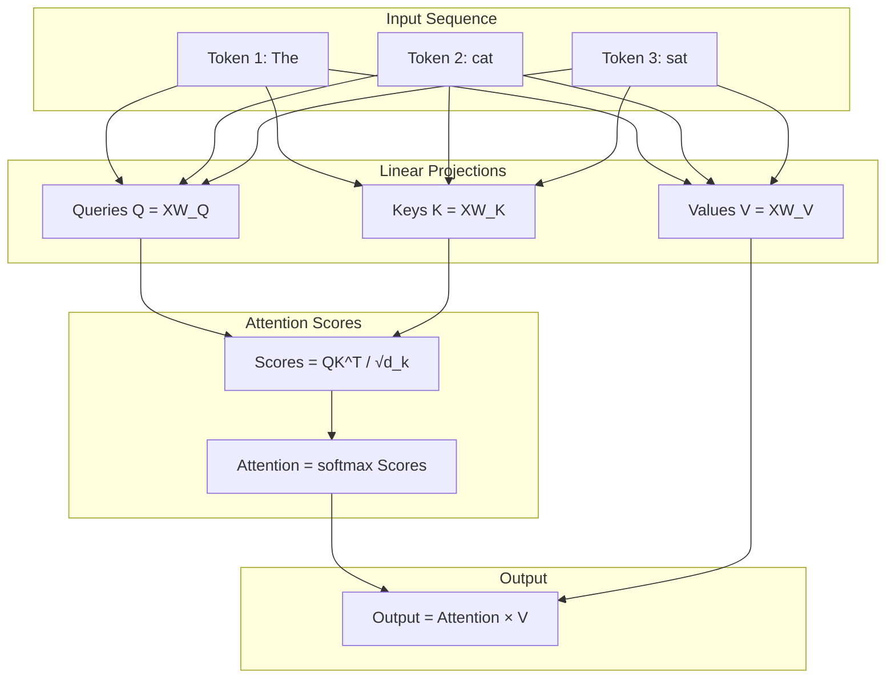
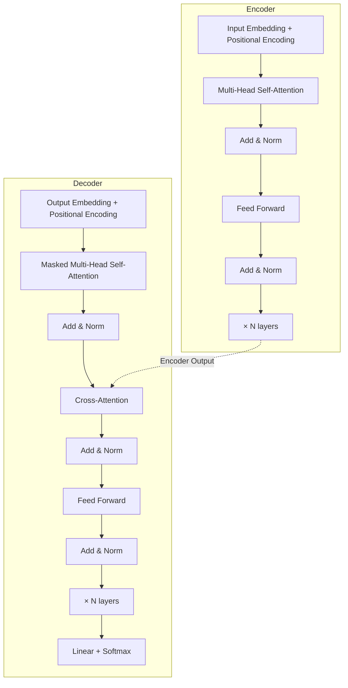

# Module 07: Transformers — Attention Is All You Need

> **Level**: Advanced  
> **Duration**: 6–8 weeks  
> **Prerequisites**: Modules 00-06 (especially RNN/LSTM, Attention)  
> **Goal**: Master the architecture that revolutionized AI

---

## Table of Contents

1. [The Transformer Revolution](#1-the-transformer-revolution)
2. [Self-Attention Mechanism — Full Mathematical Derivation](#2-self-attention-mechanism)
3. [Multi-Head Attention](#3-multi-head-attention)
4. [Positional Encoding](#4-positional-encoding)
5. [Transformer Encoder](#5-transformer-encoder)
6. [Transformer Decoder](#6-transformer-decoder)
7. [Training Objectives](#7-training-objectives)
8. [Masking Strategies](#8-masking-strategies)
9. [Encoder-Only (BERT) vs Decoder-Only (GPT)](#9-architectures)
10. [Computational Complexity & Efficiency](#10-computational-complexity)
11. [System Design for Transformers](#11-system-design)
12. [Diagrams](#12-diagrams)
13. [Interview Questions](#13-interview-questions)

---

## 1. The Transformer Revolution

### 1.1 Pre-Transformer Era (Before 2017)

**RNN/LSTM problems**:
1. **Sequential computation**: Can't parallelize across sequence (must process token-by-token)
2. **Long-range dependencies**: Information from token 1 must flow through 100 hidden states to reach token 100
3. **Gradient flow**: Vanishing gradients still an issue despite LSTM/GRU

**Attention mechanisms**: Used as add-ons to RNNs (Bahdanau 2014, Luong 2015)

### 1.2 The Paradigm Shift

**"Attention Is All You Need"** (Vaswani et al., 2017):
- Remove recurrence entirely
- Use only attention mechanisms
- Parallelize across sequence length
- Result: 10x training speedup, better performance

### 1.3 Impact

Post-2017, transformers dominated:
- **NLP**: BERT (2018), GPT-2 (2019), GPT-3 (2020), GPT-4 (2023)
- **Vision**: ViT (2020), CLIP (2021), Stable Diffusion (2022)
- **Multimodal**: GPT-4V, Gemini
- **Biology**: AlphaFold 2 (2020)
- **Code**: Codex, GitHub Copilot

---

## 2. Self-Attention Mechanism — Full Mathematical Derivation

### 2.1 Intuition

Given a sequence of tokens, each token should "attend" to all other tokens to gather context.

**Example**: "The animal didn't cross the street because it was too tired."

For the word "it", attention should focus on "animal" (not "street").

### 2.2 Queries, Keys, Values

For each token embedding $\mathbf{x}_i \in \mathbb{R}^{d_{\text{model}}}$:

$$\mathbf{q}_i = \mathbf{W}_Q \mathbf{x}_i \quad \in \mathbb{R}^{d_k}$$
$$\mathbf{k}_i = \mathbf{W}_K \mathbf{x}_i \quad \in \mathbb{R}^{d_k}$$
$$\mathbf{v}_i = \mathbf{W}_V \mathbf{x}_i \quad \in \mathbb{R}^{d_v}$$

where $\mathbf{W}_Q, \mathbf{W}_K \in \mathbb{R}^{d_k \times d_{\text{model}}}$ and $\mathbf{W}_V \in \mathbb{R}^{d_v \times d_{\text{model}}}$ are learned.

**Analogy**: Think of a database lookup:
- **Query** (Q): "What am I looking for?"
- **Key** (K): "What do I represent?"
- **Value** (V): "What information do I contain?"

### 2.3 Attention Scores

Compute similarity between query $i$ and all keys:

$$\text{score}(i, j) = \frac{\mathbf{q}_i^T \mathbf{k}_j}{\sqrt{d_k}}$$

**Why divide by $\sqrt{d_k}$?**

If $\mathbf{q}, \mathbf{k}$ have mean 0 and variance 1, their dot product has variance $d_k$:

$$\text{Var}(\mathbf{q}^T \mathbf{k}) = \sum_{i=1}^{d_k} \text{Var}(q_i k_i) = d_k$$

Dividing by $\sqrt{d_k}$ normalizes variance to 1, preventing softmax from saturating.

### 2.4 Attention Weights

$$\alpha_{ij} = \frac{\exp(\text{score}(i,j))}{\sum_{k=1}^n \exp(\text{score}(i,k))} = \text{softmax}(\text{score}(i, :))_j$$

$\alpha_{ij}$ = how much token $i$ attends to token $j$.

### 2.5 Weighted Sum (Output)

$$\mathbf{z}_i = \sum_{j=1}^n \alpha_{ij} \mathbf{v}_j$$

Token $i$'s output is a weighted average of ALL tokens' values.

### 2.6 Matrix Form (for Efficiency)

For sequence length $n$:

$$\mathbf{Q} = \mathbf{XW}_Q \quad \in \mathbb{R}^{n \times d_k}$$
$$\mathbf{K} = \mathbf{XW}_K \quad \in \mathbb{R}^{n \times d_k}$$
$$\mathbf{V} = \mathbf{XW}_V \quad \in \mathbb{R}^{n \times d_v}$$

Attention:

$$\text{Attention}(\mathbf{Q}, \mathbf{K}, \mathbf{V}) = \text{softmax}\left(\frac{\mathbf{QK}^T}{\sqrt{d_k}}\right)\mathbf{V}$$

Shape analysis:
- $\mathbf{QK}^T$: $(n \times d_k)(d_k \times n) = n \times n$ — attention matrix
- Softmax applied row-wise: each row sums to 1
- Result $\times \mathbf{V}$: $(n \times n)(n \times d_v) = n \times d_v$

**Computational cost**: $O(n^2 d_k)$ — **quadratic in sequence length**. This is the bottleneck.

---

## 3. Multi-Head Attention

### 3.1 Motivation

Single attention head captures one type of relationship. Multiple heads capture different patterns:
- Head 1: syntactic relationships (subject-verb)
- Head 2: semantic similarity (synonyms)
- Head 3: positional proximity

### 3.2 Mathematical Formulation

For $h$ heads, split $d_{\text{model}}$ into $h$ parts: $d_k = d_v = d_{\text{model}} / h$

$$\text{head}_i = \text{Attention}(\mathbf{QW}_i^Q, \mathbf{KW}_i^K, \mathbf{VW}_i^V)$$

where $\mathbf{W}_i^Q, \mathbf{W}_i^K \in \mathbb{R}^{d_{\text{model}} \times d_k}$ and $\mathbf{W}_i^V \in \mathbb{R}^{d_{\text{model}} \times d_v}$.

Concatenate heads:

$$\text{MultiHead}(\mathbf{Q}, \mathbf{K}, \mathbf{V}) = \text{Concat}(\text{head}_1, \ldots, \text{head}_h)\mathbf{W}^O$$

where $\mathbf{W}^O \in \mathbb{R}^{hd_v \times d_{\text{model}}}$.

### 3.3 Standard Hyperparameters

| Model | $d_{\text{model}}$ | Heads ($h$) | $d_k = d_v$ |
|-------|-----------|------|-------|
| BERT-base | 768 | 12 | 64 |
| GPT-3 | 12288 | 96 | 128 |
| LLaMA-2-70B | 8192 | 64 | 128 |

**Pattern**: $d_k \approx 64$ or $128$ is typical.

---

## 4. Positional Encoding

### 4.1 The Problem

Attention is **permutation-invariant**:

$$\text{Attention}(\text{permute}(\mathbf{X})) = \text{permute}(\text{Attention}(\mathbf{X}))$$

Without positional info, the model can't distinguish:
- "The cat chased the mouse" vs "The mouse chased the cat"

### 4.2 Sinusoidal Positional Encoding (Original Transformer)

$$\text{PE}(pos, 2i) = \sin\left(\frac{pos}{10000^{2i/d_{\text{model}}}}\right)$$

$$\text{PE}(pos, 2i+1) = \cos\left(\frac{pos}{10000^{2i/d_{\text{model}}}}\right)$$

**Why sinusoidal?**
1. Bounded values (no exploding embeddings)
2. Fixed function (no learning needed)
3. Allows extrapolation to longer sequences
4. Linear relationships: $\text{PE}(pos + k)$ can be expressed as linear function of $\text{PE}(pos)$

### 4.3 Learned Positional Embeddings (BERT, GPT)

$$\mathbf{PE} \in \mathbb{R}^{n_{\max} \times d_{\text{model}}}$$

Each position has a learned embedding. Works better empirically.

**Limitation**: Can't generalize beyond $n_{\max}$ (max trained length).

### 4.4 Relative Positional Encodings (T5, XLNet)

Encode relative distances rather than absolute positions:

$$\text{score}(i, j) = \mathbf{q}_i^T \mathbf{k}_j + \mathbf{q}_i^T \mathbf{r}_{i-j}$$

where $\mathbf{r}_{i-j}$ encodes relative distance.

### 4.5 RoPE (Rotary Position Embedding) — Modern Standard

Used by: LLaMA, PaLM, GPT-NeoX

Rotate query/key vectors by position-dependent angles:

$$\mathbf{q}_m = \mathbf{R}_m \mathbf{W}_Q \mathbf{x}_m$$
$$\mathbf{k}_n = \mathbf{R}_n \mathbf{W}_K \mathbf{x}_n$$

where $\mathbf{R}_m$ is a rotation matrix depending on position $m$.

**Key property**: $\mathbf{q}_m^T \mathbf{k}_n$ depends only on $(m - n)$ (relative position)!

---

## 5. Transformer Encoder

### 5.1 Encoder Block Architecture

```
Input → Positional Encoding
    ↓
Multi-Head Self-Attention
    ↓
Add & Layer Norm (Residual Connection)
    ↓
Feed-Forward Network (2-layer MLP)
    ↓
Add & Layer Norm (Residual Connection)
    ↓
Output
```

### 5.2 Feed-Forward Network

$$\text{FFN}(x) = \max(0, x\mathbf{W}_1 + \mathbf{b}_1)\mathbf{W}_2 + \mathbf{b}_2$$

Typically: $\mathbf{W}_1 \in \mathbb{R}^{d_{\text{model}} \times 4d_{\text{model}}}$ (expands), $\mathbf{W}_2 \in \mathbb{R}^{4d_{\text{model}} \times d_{\text{model}}}$ (contracts).

**Why 4x expansion?** Empirically works well. Think of it as increasing model capacity.

### 5.3 Layer Normalization

$$\text{LayerNorm}(\mathbf{x}) = \gamma \frac{\mathbf{x} - \mu}{\sqrt{\sigma^2 + \epsilon}} + \beta$$

Applied per-token (across features).

### 5.4 Residual Connections

$$\mathbf{x}_{l+1} = \mathbf{x}_l + \text{SubLayer}(\mathbf{x}_l)$$

**Why critical?**
1. Gradient flow: Direct path from any layer to output
2. Identity mapping: Model can learn to pass info unchanged
3. Enables training very deep networks (GPT-3: 96 layers)

### 5.5 Complete Encoder Block (PyTorch-style)

```python
class EncoderBlock(nn.Module):
    def __init__(self, d_model, num_heads, d_ff, dropout=0.1):
        super().__init__()
        self.attention = MultiHeadAttention(d_model, num_heads)
        self.norm1 = nn.LayerNorm(d_model)
        self.ffn = nn.Sequential(
            nn.Linear(d_model, d_ff),
            nn.ReLU(),
            nn.Linear(d_ff, d_model)
        )
        self.norm2 = nn.LayerNorm(d_model)
        self.dropout = nn.Dropout(dropout)
    
    def forward(self, x, mask=None):
        # Multi-head attention + residual + norm
        attn_output = self.attention(x, x, x, mask)
        x = self.norm1(x + self.dropout(attn_output))
        
        # FFN + residual + norm
        ffn_output = self.ffn(x)
        x = self.norm2(x + self.dropout(ffn_output))
        
        return x
```

---

## 6. Transformer Decoder

### 6.1 Decoder Block Architecture

```
Input → Positional Encoding
    ↓
Masked Multi-Head Self-Attention (causal)
    ↓
Add & Layer Norm
    ↓
Cross-Attention (attend to encoder output)
    ↓
Add & Layer Norm
    ↓
Feed-Forward Network
    ↓
Add & Layer Norm
    ↓
Output
```

### 6.2 Masked Self-Attention (Causal Masking)

Prevent token at position $i$ from attending to future tokens ($j > i$):

$$\text{mask}_{ij} = \begin{cases} 0 & \text{if } j \leq i \\ -\infty & \text{if } j > i \end{cases}$$

Applied before softmax:

$$\text{Attention}(\mathbf{Q}, \mathbf{K}, \mathbf{V}) = \text{softmax}\left(\frac{\mathbf{QK}^T}{\sqrt{d_k}} + \text{Mask}\right)\mathbf{V}$$

$\exp(-\infty) = 0$ → future tokens get zero attention weight.

### 6.3 Cross-Attention

Decoder attends to encoder output:

$$\mathbf{Q} = \text{DecoderHiddenStates} \cdot \mathbf{W}_Q$$
$$\mathbf{K}, \mathbf{V} = \text{EncoderOutput} \cdot \mathbf{W}_K, \text{EncoderOutput} \cdot \mathbf{W}_V$$

**Use case**: Machine translation, image captioning.

---

## 7. Training Objectives

### 7.1 Machine Translation (Original Transformer)

**Input**: Source sentence (encoder)  
**Output**: Target sentence (decoder)

**Loss**: Cross-entropy over vocabulary:

$$\mathcal{L} = -\sum_{t=1}^T \log P(y_t | y_{<t}, \mathbf{x})$$

Teacher forcing during training: feed gold target tokens as decoder input.

### 7.2 Masked Language Modeling (BERT)

Randomly mask 15% of tokens, predict them:

$$\mathcal{L}_{\text{MLM}} = -\mathbb{E}_{\mathbf{x}} \sum_{i \in \text{masked}} \log P(x_i | \mathbf{x}_{\setminus i})$$

**Masking strategy**:
- 80% → [MASK] token
- 10% → random token
- 10% → unchanged (but still predicted)

### 7.3 Causal Language Modeling (GPT)

Predict next token:

$$\mathcal{L}_{\text{CLM}} = -\sum_{t=1}^T \log P(x_t | x_{<t})$$

**Key difference from BERT**: Unidirectional (only left context), autoregressive generation.

---

## 8. Masking Strategies

### 8.1 Padding Mask

For variable-length sequences, mask padding tokens:

```python
# Example: batch of 3 sequences, padded to length 5
sequences = [
    [101, 2054, 2003, 102, 0],    # length 4, padded with 0
    [101, 2023, 102, 0, 0],        # length 3, padded with 0
    [101, 2129, 2024, 2017, 102],  # length 5, no padding
]
mask = sequences != 0  # True where valid, False where padding
```

### 8.2 Causal Mask (Autoregressive Models)

Lower-triangular mask:

```python
def create_causal_mask(seq_len):
    return torch.tril(torch.ones(seq_len, seq_len))
```

### 8.3 Combined Mask

For decoder with padding:

```python
mask = padding_mask & causal_mask
```

---

## 9. Architectures

### 9.1 Encoder-Only (BERT)

- **Bidirectional**: Each token sees full context (left + right)
- **Use case**: Classification, NER, QA (extractive)
- **Training**: Masked LM + Next Sentence Prediction

### 9.2 Decoder-Only (GPT)

- **Unidirectional**: Each token sees only left context
- **Use case**: Text generation, completion, few-shot learning
- **Training**: Causal LM (next-token prediction)

### 9.3 Encoder-Decoder (T5, BART)

- **Encoder**: Bidirectional (like BERT)
- **Decoder**: Unidirectional with cross-attention
- **Use case**: Seq2seq tasks (translation, summarization)
- **Training**: Various (T5 uses text-to-text for all tasks)

### 9.4 Which to Use?

| Task | Architecture |
|------|-------------|
| Text generation | Decoder-only (GPT) |
| Classification | Encoder-only (BERT) |
| Summarization | Encoder-decoder (T5/BART) or decoder-only (modern trend) |
| Translation | Encoder-decoder (NLLB) |
| Chat / Instruction following | Decoder-only + RLHF (ChatGPT) |

**Modern trend**: Decoder-only models (GPT-style) scale better and are more general-purpose.

---

## 10. Computational Complexity

### 10.1 Complexity Analysis

| Component | Complexity | Bottleneck |
|-----------|-----------|------------|
| Self-Attention | $O(n^2 d)$ | Sequence length squared |
| FFN | $O(n d^2)$ | Hidden dim squared |
| Total per layer | $O(n^2 d + n d^2)$ | |

For $n < d$: FFN dominates. For $n > d$: Attention dominates.

**GPT-3 example**: $n = 2048$, $d = 12288$ → attention dominates.

### 10.2 Long-Sequence Problem

For $n = 1M$ tokens, attention matrix is $10^{12}$ elements → 4 TB at FP32!

**Solutions**:
1. **Sparse attention** (Longformer, BigBird): Attend to local + global tokens
2. **Linformer**: Low-rank approximation of attention
3. **Flash Attention**: Reordering computation to minimize memory I/O
4. **Sliding window** (Mistral): Fixed-size attention window

---

## 11. System Design

### 11.1 KV Cache (Inference Optimization)

During autoregressive generation, keys and values don't change for past tokens.

**Without caching**: Recompute K, V for all tokens at each step → $O(n^2)$

**With caching**: Store K, V for past tokens → $O(n)$ per new token

```python
class DecoderWithCache:
    def forward(self, x, cache=None):
        Q = self.W_Q(x)
        K = self.W_K(x)
        V = self.W_V(x)
        
        if cache is not None:
            K = torch.cat([cache['K'], K], dim=1)
            V = torch.cat([cache['V'], V], dim=1)
        
        output = attention(Q, K, V)
        return output, {'K': K, 'V': V}
```

**Memory cost**: For batch size $B$, $L$ layers, seq len $n$:

$$\text{KV cache size} = 2 \cdot B \cdot L \cdot n \cdot d_{\text{model}} \cdot \text{bytes per element}$$

For GPT-3 (96 layers, 12288 dim, FP16): ~24 MB per token per sample!

### 11.2 Distributed Training

For models too large for 1 GPU:

1. **Data Parallelism**: Split batch across GPUs
2. **Model Parallelism**: Split layers across GPUs
3. **Pipeline Parallelism**: Different GPUs compute different stages
4. **Tensor Parallelism**: Split individual weight matrices

**GPT-3**: 175B params × 2 bytes (FP16) = 350 GB → requires 5+ A100 GPUs just for weights!

---

## 12. Diagrams

### Self-Attention Visualization



### Transformer Architecture



---

## 13. Interview Questions

1. **Why does attention use QKV instead of just pairwise similarity?**
   > QKV gives the model flexibility. Q and K determine relevance (which tokens to attend to), while V carries the actual content (what information to aggregate). This separation allows learning different types of relationships.

2. **Why scale attention scores by √d_k?**
   > For high-dimensional vectors, dot products have high variance (~d_k). This pushes softmax into saturated regions (all weight on one token). Scaling keeps variance ~1, giving smoother attention distributions.

3. **What's the computational bottleneck in transformers?**
   > Self-attention: O(n² d) where n is sequence length. For long sequences, this dominates. Solutions: sparse attention, linear attention, or sliding windows.

4. **Explain masked attention in GPT.**
   > GPT uses causal masking: token i can only attend to tokens ≤ i. This is enforced by adding -∞ to attention scores for future positions, making their softmax weight 0. Enables autoregressive generation.

5. **Why do transformers need positional encoding?**
   > Attention is permutation-invariant—shuffling input gives same output. Without position info, "dog bites man" = "man bites dog". Positional encodings inject sequence order.

6. **BERT vs GPT: key differences?**
   > BERT: encoder-only, bidirectional (MLM training), best for understanding tasks. GPT: decoder-only, unidirectional (CLM training), best for generation. BERT sees full context; GPT only sees left context.

7. **What is the KV cache and why does it matter for inference?**
   > During generation, past tokens' keys and values don't change. Caching them avoids recomputation, reducing O(n²) to O(n) per token. Critical for fast inference, but memory-intensive (can be 100s of GB for large models).

---

## Notebooks

| # | Notebook | Description |
|---|----------|-------------|
| 1 | [Attention from Scratch](notebooks/01_attention_from_scratch.ipynb) | Implement self-attention, visualize attention maps |
| 2 | [Transformer from Scratch](notebooks/02_transformer_from_scratch.ipynb) | Build full encoder-decoder transformer in NumPy |
| 3 | [PyTorch Transformer](notebooks/03_pytorch_transformer.ipynb) | Implement using nn.TransformerEncoder/Decoder |

---

## Projects

### Mini Project: Sentiment Classifier with BERT
Fine-tune BERT on IMDb sentiment classification. Analyze attention patterns.

### Advanced Project: GPT-style Language Model
Train a small GPT-2 (12-layer, 768-dim) on WikiText-103 from scratch. Implement:
- KV caching for fast generation
- Top-k, top-p sampling
- Beam search
- Benchmark inference speed
