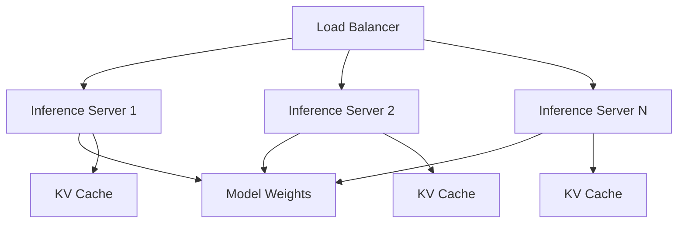

# Module 08: Large Language Models (LLMs)

> **Level**: Advanced  
> **Duration**: 6–8 weeks  
> **Prerequisites**: Module 07 (Transformers)  
> **Goal**: Understand modern LLMs from architecture to deployment

---

## Table of Contents

1. [The LLM Landscape](#1-the-llm-landscape)
2. [GPT Architecture Deep Dive](#2-gpt-architecture)
3. [BERT Architecture Deep Dive](#3-bert-architecture)
4. [Scaling Laws](#4-scaling-laws)
5. [Tokenization](#5-tokenization)
6. [Pretraining](#6-pretraining)
7. [Instruction Tuning](#7-instruction-tuning)
8. [RLHF (Reinforcement Learning from Human Feedback)](#8-rlhf)
9. [Alignment](#9-alignment)
10. [Quantization](#10-quantization)
11. [LoRA & Efficient Fine-Tuning](#11-lora)
12. [Prompt Engineering](#12-prompt-engineering)
13. [In-Context Learning](#13-in-context-learning)
14. [Emergent Abilities](#14-emergent-abilities)
15. [System Design for Inference](#15-system-design-for-inference)

---

## 1. The LLM Landscape

### 1.1 Timeline

| Year | Model | Params | Organization | Key Innovation |
|------|-------|--------|--------------|----------------|
| 2018 | GPT | 117M | OpenAI | Generative pretraining + fine-tuning |
| 2018 | BERT | 340M | Google | Bidirectional, MLM, SOTA on many tasks |
| 2019 | GPT-2 | 1.5B | OpenAI | "Too dangerous to release" (later released) |
| 2020 | GPT-3 | 175B | OpenAI | Few-shot learning, in-context learning |
| 2021 | Switch-C | 1.6T | Google | Mixture of Experts |
| 2022 | Chinchilla | 70B | DeepMind | Compute-optimal training (20x more data) |
| 2022 | LLaMA | 7-65B | Meta | Open weights, efficient at small scale |
| 2023 | GPT-4 | ~1.8T (rumored) | OpenAI | Multimodal, RLHF, mixture-of-experts |
| 2023 | LLaMA-2 | 7-70B | Meta | Commercially usable, RLHF |
| 2023 | Mistral 7B | 7B | Mistral | Beats LLaMA-2-13B, sliding window attn |
| 2024 | Gemini 1.5 | ? | Google | 1M+ context window |

### 1.2 Model Families

**Decoder-only (GPT-style)**:
- GPT, GPT-2, GPT-3, GPT-4
- LLaMA, LLaMA-2, Code LLaMA
- Mistral, Mixtral
- PaLM, Gemini

**Encoder-only (BERT-style)**:
- BERT, RoBERTa, DeBERTa
- ALBERT (parameter-efficient)

**Encoder-decoder**:
- T5, BART, mT5
- FLAN-T5

**Modern trend**: Decoder-only dominates due to scaling and versatility.

---

## 2. GPT Architecture

### 2.1 Core Design

GPT = **Generative Pre-trained Transformer** (decoder-only)

**Architecture**:
```
Token Embedding + Positional Embedding
    ↓
[Decoder Block] × N
    ↓
Layer Norm
    ↓
Linear (project to vocab)
    ↓
Softmax → Probability Distribution over Next Token
```

**Decoder Block**:
```
Masked Multi-Head Self-Attention
    ↓
Add & Layer Norm
    ↓
Feed-Forward Network (4× expansion)
    ↓
Add & Layer Norm
```

### 2.2 GPT-3 Specifics

| Hyperparameter | GPT-3 Small | GPT-3 Large | GPT-3 175B |
|----------------|-------------|-------------|------------|
| Layers ($n_{\text{layer}}$) | 12 | 24 | 96 |
| Hidden Size ($d_{\text{model}}$) | 768 | 1536 | 12288 |
| Attention Heads | 12 | 16 | 96 |
| Head Size ($d_k$) | 64 | 96 | 128 |
| Context Window ($n_{\text{ctx}}$) | 2048 | 2048 | 2048 |
| Batch Size | 0.5M tokens | 0.5M tokens | 3.2M tokens |
| Learning Rate | Variable | Variable | 0.6 × 10⁻⁴ |
| Parameters | 125M | 1.3B | 175B |

**Compute**: GPT-3-175B trained on ~300B tokens using ~3640 petaflop-days (A100 equivalent: ~1000 GPU-years).

### 2.3 Architectural Improvements (GPT-3 → Modern LLMs)

| Component | GPT-3 | Modern (LLaMA-2, etc.) |
|-----------|-------|------------------------|
| Positional Encoding | Learned | RoPE (Rotary) |
| Normalization | Post-LayerNorm | Pre-LayerNorm (more stable) |
| Activation | GELU | SwiGLU (better for FFN) |
| Attention | Standard | Grouped-Query Attention (GQA) |

**SwiGLU** (used in LLaMA):
$$\text{SwiGLU}(x, W, V) = \text{Swish}(xW) \odot (xV)$$

where $\text{Swish}(x) = x \cdot \sigma(\beta x)$.

**Grouped-Query Attention**: Share key/value heads across multiple query heads → reduces KV cache memory.

---

## 3. BERT Architecture

### 3.1 Core Design

BERT = **Bidirectional Encoder Representations from Transformers**

**Key difference from GPT**: Encoder-only, sees full context (left + right).

**Architecture**:
```
Token Embedding + Segment Embedding + Position Embedding
    ↓
[Encoder Block] × N
    ↓
[CLS] token representation → Classification Head
```

### 3.2 Training Objectives

**Masked Language Modeling (MLM)**:
1. Randomly mask 15% of tokens
2. Predict masked tokens given full context

**Next Sentence Prediction (NSP)**:
Given two sentences A and B, predict if B follows A.

**RoBERTa** (BERT improved) showed NSP is not helpful → removed it.

### 3.3 BERT Variants

| Model | Params | Key Change |
|-------|--------|------------|
| BERT-base | 110M | Original |
| BERT-large | 340M | 24 layers, 1024 hidden |
| RoBERTa | 355M | Remove NSP, train longer, larger batches |
| ALBERT | 12M | Parameter sharing across layers |
| DeBERTa | 390M | Disentangled attention (content + position separate) |

---

## 4. Scaling Laws

### 4.1 Kaplan et al. (2020) — OpenAI Scaling Laws

Loss scales as a power law:

$$L(N) \propto N^{-\alpha}$$

where:
- $N$ = model parameters
- $\alpha \approx 0.076$ (empirically)

**Key findings**:
1. **Performance improves predictably with scale** (model size, data, compute)
2. **Model size dominates**: Larger models are more sample-efficient
3. **Scaling is smooth**: No phase transitions

### 4.2 Chinchilla Scaling Laws (2022) — DeepMind

**Original wisdom** (GPT-3): For compute budget $C$, use large model with fewer tokens.

**Chinchilla result**: GPT-3 was **undertrained**. Optimal is:

$$N^* \propto C^{0.5}, \quad D^* \propto C^{0.5}$$

For compute $C$:
- Model size $N$ and data size $D$ should scale equally
- GPT-3 (175B params, 300B tokens) → should have used 70B params + 1.4T tokens

**Chinchilla** (70B params, 1.4T tokens): Outperforms GPT-3 while using 4× less compute for inference.

### 4.3 Implications for Training

| Compute Budget | Old Approach (GPT-3) | Chinchilla Approach |
|----------------|----------------------|---------------------|
| 10²³ FLOPs | 175B params, 300B tokens | 70B params, 1.4T tokens |
| 10²⁴ FLOPs | 500B params, 300B tokens | 200B params, 2T tokens |

**Takeaway**: Most LLMs before 2022 were data-starved.

---

## 5. Tokenization

### 5.1 Why Tokenization?

Neural networks operate on fixed vocabularies. Can't have one embedding per unique word (vocabulary would be infinite).

**Solutions**:
1. **Word-level**: Vocabulary = most common words → OOV problem
2. **Character-level**: No OOV, but sequences are very long
3. **Subword-level** ✓: Balance between word and character

### 5.2 Byte-Pair Encoding (BPE)

**Algorithm**:
1. Start with vocabulary = all bytes/characters
2. Find most frequent pair of tokens
3. Merge into new token
4. Repeat until vocab size = target

**Example**:
```
"low" "lower" "newest" "widest"

Iteration 1: "lo" + "w" → "low"
Iteration 2: "low" + "e" → "lowe"
Iteration 3: "e" + "s" → "es"
...
```

**Pros**: Handles OOV gracefully (fall back to character-level), efficient

**Used by**: GPT-2, GPT-3, GPT-4, RoBERTa

### 5.3 WordPiece (BERT Tokenizer)

Similar to BPE, but chooses merges based on **likelihood** (not frequency).

**Example**:
```
Input: "unhappiness"
Tokens: ["un", "##happi", "##ness"]
```

"##" denotes subword continuation.

### 5.4 SentencePiece (LLaMA, T5)

Treats input as raw bytes, no pre-tokenization. Language-agnostic.

**Advantages**:
- Works for any language (including no spaces, e.g., Chinese/Japanese)
- Reversible: tokens → text without ambiguity

### 5.5 Tokenization Statistics

| Model | Tokenizer | Vocab Size | Compression Ratio (English) |
|-------|-----------|------------|----------------------------|
| GPT-2 | BPE | 50,257 | ~4 chars/token |
| BERT | WordPiece | 30,522 | ~4 chars/token |
| LLaMA | SentencePiece | 32,000 | ~3.5 chars/token |
| GPT-4 | BPE (improved) | ~100,000 | ~4.5 chars/token |

**Impact on cost**: Fewer tokens = less compute, less memory, faster inference.

---

## 6. Pretraining

### 6.1 Pretraining Objective

**Causal Language Modeling** (GPT-style):

$$\mathcal{L} = -\sum_{t=1}^T \log P(x_t | x_1, \ldots, x_{t-1}; \theta)$$

**Masked Language Modeling** (BERT-style):

$$\mathcal{L} = -\sum_{i \in \mathcal{M}} \log P(x_i | \mathbf{x}_{\setminus i}; \theta)$$

### 6.2 Pretraining Datasets

| Dataset | Size | Source |
|---------|------|--------|
| BookCorpus | 4.5 GB | 11k books |
| English Wikipedia | 13 GB | Wikipedia dump |
| CommonCrawl | ~45 TB (raw) → ~750 GB (filtered) | Web scrapes |
| The Pile | 825 GB | Mix of 22 datasets |
| RedPajama | 1.2 TB | Open replication of LLaMA data |
| FineWeb | 15 TB | High-quality CommonCrawl |

**GPT-3**: ~570 GB (45% CommonCrawl, 23% WebText2, 16% Books, 10% Wikipedia, 6% code)

**LLaMA**: ~1.4 TB

### 6.3 Data Filtering

Raw web data is noisy. Filtering pipeline:
1. **Language detection**: Keep only target language
2. **Deduplication**: Remove exact/near duplicates
3. **Quality filtering**: Train classifier to predict "good" text
4. **Toxicity filtering**: Remove offensive content
5. **PII removal**: Remove emails, phone numbers, etc.

**Quality classifier** (example from CCNet):
- Train fastText classifier on Wikipedia (positive) vs. random web (negative)
- Score all CommonCrawl docs, keep top percentiles

---

## 7. Instruction Tuning

### 7.1 The Problem with Pure Pretraining

Pretrained GPT-3 completes text, but doesn't follow instructions:

**User**: "Translate to French: Hello"  
**GPT-3** (pretrained): "Translate to German: Hello..."  ← completes the pattern, doesn't translate

### 7.2 Instruction Tuning (Supervised Fine-Tuning)

Fine-tune on (instruction, response) pairs:

$$\mathcal{L}_{\text{SFT}} = -\log P(\text{response} | \text{instruction})$$

**Example dataset** (FLAN, Alpaca):
```json
{
  "instruction": "Translate to French: Hello",
  "response": "Bonjour"
}
```

**FLAN-T5**: T5 fine-tuned on 1836 tasks with instructions → generalizes to new tasks

**LLaMA-2-Chat**: LLaMA-2 + instruction tuning on ~100k human-labeled examples

### 7.3 Self-Instruct (Alpaca Pattern)

Use a strong model (GPT-4) to generate synthetic instruction data:

1. Provide seed instructions
2. Prompt GPT-4 to generate similar instructions + responses
3. Fine-tune base model on synthetic data

**Stanford Alpaca**: LLaMA-7B + 52k GPT-3.5-generated examples → near-ChatGPT quality

---

## 8. RLHF (Reinforcement Learning from Human Feedback)

### 8.1 The Alignment Problem

Instruction tuning helps, but model can still:
- Generate toxic content
- Be unhelpful
- Hallucinate confidently

**Goal**: Align model outputs with human preferences.

### 8.2 RLHF Pipeline

**Step 1: Supervised Fine-Tuning (SFT)**

Train on high-quality instruction-response pairs → $\pi_{\text{SFT}}$

**Step 2: Reward Model Training**

1. Sample prompts, generate multiple responses from $\pi_{\text{SFT}}$
2. Humans rank responses: $y_w \succ y_l$ (preferred vs. not)
3. Train reward model $r_\phi(x, y)$ to predict preference:

$$\mathcal{L}_{\text{RM}} = -\mathbb{E}_{(x, y_w, y_l)} \left[\log \sigma(r_\phi(x, y_w) - r_\phi(x, y_l))\right]$$

**Step 3: RL Fine-Tuning (PPO)**

Optimize policy to maximize reward:

$$\mathcal{L}_{\text{RL}} = \mathbb{E}_{x, y \sim \pi_\theta} [r_\phi(x, y)] - \beta \cdot D_{\text{KL}}(\pi_\theta \| \pi_{\text{SFT}})$$

The KL penalty prevents the model from drifting too far from the SFT initialization (prevents reward hacking).

**PPO** (Proximal Policy Optimization) is the standard RL algorithm.

### 8.3 Design Challenges

1. **Reward hacking**: Model exploits quirks of reward model
   - Solution: KL penalty, adversarial red-teaming
2. **Reward model quality**: Limited by human labels
   - Solution: Constitutional AI (model self-critiques)
3. **Compute cost**: RL is expensive (need 4 models in memory)
   - Solution: RLHF alternatives (DPO, see below)

---

## 9. Alignment

### 9.1 Direct Preference Optimization (DPO)

**Problem with RLHF**: Requires training separate reward model + RL loop (complex, unstable).

**DPO insight**: Derive policy gradient directly from preference data!

$$\mathcal{L}_{\text{DPO}} = -\mathbb{E}_{(x, y_w, y_l)} \left[\log \sigma\left(\beta \log \frac{\pi_\theta(y_w|x)}{\pi_{\text{ref}}(y_w|x)} - \beta \log \frac{\pi_\theta(y_l|x)}{\pi_{\text{ref}}(y_l|x)}\right)\right]$$

**Advantages**:
- No reward model needed
- No RL (standard supervised learning)
- More stable training
- Used by Zephyr-7B (beats LLaMA-2-Chat-70B!)

### 9.2 Constitutional AI (Anthropic)

Model critiques its own outputs:

1. Generate response
2. Ask model: "Is this response harmful? Rewrite it to be harmless."
3. Use rewritten responses as training data

**Reduces need for human RLHF labels**.

---

## 10. Quantization

### 10.1 Precision Formats

| Format | Bits | Range | Typical Use |
|--------|------|-------|-------------|
| FP32 | 32 | ±3.4×10³⁸ | Training (legacy) |
| BF16 | 16 | ±3.4×10³⁸ | Training (modern) |
| FP16 | 16 | ±65504 | Training (with loss scaling) |
| INT8 | 8 | -128 to 127 | Inference (post-training quant) |
| INT4 | 4 | -8 to 7 | Inference (extreme compression) |

### 10.2 Quantization-Aware Training (QAT)

Train model with quantized weights:

$$w_{\text{quant}} = \text{round}\left(\frac{w}{s}\right) \cdot s$$

where $s$ is the scale factor.

**Straight-Through Estimator** (STE): Gradient flows through $\text{round}$ as if it's identity.

### 10.3 Post-Training Quantization (PTQ)

Quantize after training. Simpler but lower accuracy.

**GPTQ** (GPT Quantization):
- Layer-by-layer quantization
- Minimize reconstruction error per layer
- INT4 weights, FP16 activations
- Result: ~3× memory reduction, ~2× speedup, <1% accuracy drop

**LLaMA-2-70B**: 140 GB (FP16) → ~35 GB (INT4) → fits on single A100!

### 10.4 GGML / GGUF (llama.cpp)

Open-source quantization for CPU inference:
- K-quant: mix of 2/3/4/5/6 bit per layer
- Enables LLaMA-70B on MacBook Pro (64GB RAM)

---

## 11. LoRA & Efficient Fine-Tuning

### 11.1 The Problem

Fine-tuning GPT-3 (175B params):
- Requires 175B × 4 bytes = 700 GB just for weights (FP32)
- With optimizer states (Adam): 700 GB × 3 = 2.1 TB!
- Out of reach for most researchers

### 11.2 LoRA (Low-Rank Adaptation)

Instead of updating $W \in \mathbb{R}^{d \times d}$, freeze $W$ and add low-rank update:

$$W' = W + \Delta W = W + BA$$

where $B \in \mathbb{R}^{d \times r}$, $A \in \mathbb{R}^{r \times d}$, and $r \ll d$.

**Parameters**: $2dr$ instead of $d^2$

For $d = 4096$, $r = 16$: $2 \times 4096 \times 16 = 131k$ params vs. $4096^2 = 16.8M$ (128× reduction!)

### 11.3 LoRA Hyperparameters

| Param | Typical Value | Purpose |
|-------|---------------|---------|
| Rank ($r$) | 4, 8, 16, 32 | Higher = more capacity, more params |
| Alpha ($\alpha$) | 16, 32 | Scaling factor: $\Delta W = \frac{\alpha}{r} BA$ |
| Target modules | Q, V (attention) | Which weights to adapt |

**LLaMA-2-7B + LoRA (r=16)**:
- Base model: 7B params (frozen)
- Trainable: ~4M params (0.06% of model)
- Memory: ~16 GB (vs. ~200 GB for full fine-tuning)

### 11.4 QLoRA (Quantized LoRA)

Combine quantization + LoRA:
1. Load base model in INT4
2. Add LoRA adapters in FP16
3. Train only LoRA weights

**Result**: Fine-tune LLaMA-65B on a single 48GB GPU!

**QLoRA innovations**:
- 4-bit NormalFloat (NF4): optimal for normally-distributed weights
- Double quantization: quantize the quantization constants
- Paged optimizers: offload optimizer states to CPU when needed

---

## 12. Prompt Engineering

### 12.1 Zero-Shot Prompting

```
Task: Classify sentiment.
Text: "The movie was amazing!"
Sentiment:
```

### 12.2 Few-Shot Prompting (In-Context Learning)

```
Task: Classify sentiment.

Text: "I loved it!" → Positive
Text: "It was terrible." → Negative
Text: "The movie was amazing!" → 
```

**GPT-3's superpower**: Emergent few-shot learning without gradient updates!

### 12.3 Chain-of-Thought (CoT)

```
Q: Roger has 5 tennis balls. He buys 2 more cans of tennis balls.
   Each can has 3 tennis balls. How many tennis balls does he have now?

A: Roger started with 5 balls. 2 cans × 3 balls/can = 6 balls.
   5 + 6 = 11. The answer is 11.
```

Encourages step-by-step reasoning → dramatically improves performance on reasoning tasks.

### 12.4 ReAct (Reasoning + Acting)

```
Question: Who was the 35th president's vice president?

Thought: I need to find who the 35th president was.
Action: Search[35th president of the United States]
Observation: John F. Kennedy

Thought: Now I need to find JFK's vice president.
Action: Search[John F. Kennedy vice president]
Observation: Lyndon B. Johnson

Answer: Lyndon B. Johnson
```

Combines reasoning with tool use.

---

## 13. In-Context Learning

### 13.1 The Mystery

**Observation**: GPT-3 learns new tasks from examples in context, without weight updates.

**How?**: Not fully understood! Hypotheses:
1. Model contains "task vectors" learned during pretraining
2. Attention implements gradient descent in-context
3. Model learns a general learning algorithm

**Meta-learning interpretation**: Pretraining is meta-training over "learning new tasks from prompts."

### 13.2 Scaling and ICL

In-context learning ability **emerges** at scale:
- GPT-2 (1.5B): Minimal ICL
- GPT-3 (175B): Strong ICL
- PaLM (540B): Even stronger

**Hypothesis**: Larger models have more "meta-knowledge" to apply.

---

## 14. Emergent Abilities

Abilities that appear suddenly at scale (not in smaller models):

| Ability | First Observed | Model Size |
|---------|----------------|------------|
| Multi-step reasoning | GPT-3 | ~13B |
| Instruction following | FLAN-T5 | ~11B |
| Chain-of-thought reasoning | PaLM | ~60B |
| In-context learning (complex tasks) | GPT-3 | ~100B |

**Debate**: Are these truly emergent, or smooth but measured coarsely?

---

## 15. System Design for Inference

### 15.1 Inference Pipeline


### 15.2 Batched Inference

**Problem**: LLM inference is memory-bound, not compute-bound. GPU sits idle waiting for memory.

**Solution**: Batch multiple requests → higher GPU utilization.

**Continuous Batching** (vLLM):
- Dynamic batching: add new requests as others finish
- PagedAttention: Manage KV cache like OS virtual memory
- Result: 20-30× higher throughput

### 15.3 Model Serving Architecture



**Key components**:
- **Load balancer**: Distribute requests (consider sequence length!)
- **Model parallelism**: Split model across GPUs if too large
- **KV cache management**: Most memory-intensive component

---

## Notebooks

| # | Notebook | Description |
|---|----------|-------------|
| 1 | [GPT from Scratch](notebooks/01_gpt_from_scratch.ipynb) | Implement GPT-2 architecture, train on small corpus |
| 2 | [Tokenization Deep Dive](notebooks/02_tokenization.ipynb) | Implement BPE, compare tokenizers |
| 3 | [LoRA Fine-Tuning](notebooks/03_lora_finetuning.ipynb) | Fine-tune LLaMA with LoRA on custom dataset |
| 4 | [RLHF Simulation](notebooks/04_rlhf_simulation.ipynb) | Implement reward modeling + PPO |

---

## Projects

### Mini Project: Small-Scale GPT
Train GPT-2 Small (124M params) on a domain-specific corpus (e.g., Python code, medical abstracts). Analyze token perplexity and sample quality.

### Advanced Project: Full RLHF Pipeline
1. Fine-tune LLaMA-7B on instruction data
2. Collect preference labels (simulate or use real)
3. Train reward model
4. Run PPO to align model
5. Compare to DPO alternative
6. Build inference API with FastAPI + vLLM
