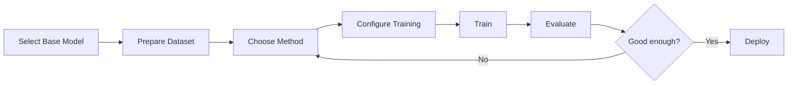

# Module 09: Fine-Tuning LLMs

> **Level**: Advanced  
> **Duration**: 3–4 weeks  
> **Prerequisites**: Modules 07 (Transformers), 08 (LLMs)  
> **Goal**: Master fine-tuning techniques for adapting LLMs

---

## Table of Contents

1. [Fine-Tuning Fundamentals](#1-fine-tuning-fundamentals)
2. [Full Fine-Tuning](#2-full-fine-tuning)
3. [Parameter-Efficient Fine-Tuning (PEFT)](#3-parameter-efficient-fine-tuning-peft)
4. [LoRA (Low-Rank Adaptation)](#4-lora-low-rank-adaptation)
5. [QLoRA (Quantized LoRA)](#5-qlora-quantized-lora)
6. [Instruction Tuning](#6-instruction-tuning)
7. [RLHF (Reinforcement Learning from Human Feedback)](#7-rlhf-reinforcement-learning-from-human-feedback)
8. [DPO (Direct Preference Optimization)](#8-dpo-direct-preference-optimization)
9. [Domain Adaptation](#9-domain-adaptation)
10. [Practical Fine-Tuning Pipeline](#10-practical-fine-tuning-pipeline)

---

## 1. Fine-Tuning Fundamentals

### 1.1 What is Fine-Tuning?

**Definition**: Adapt pretrained model to specific task with additional training.

**Pretraining**: Learn general language understanding (expensive)
```
Corpus: Books, Wikipedia, Web (trillions of tokens)
Task: Next-token prediction
Cost: $Millions
```

**Fine-tuning**: Specialize for downstream task (cheap)
```
Corpus: Task-specific data (thousands-millions of tokens)
Task: Classification, QA, etc.
Cost: $100s-$1000s
```

### 1.2 Why Fine-Tune?

| Approach | Pros | Cons |
|----------|------|------|
| **Zero-shot** | No data needed | Poor performance |
| **Few-shot** | Minimal data | Inconsistent, prompt-sensitive |
| **Fine-tuning** | Best performance | Needs labeled data, compute |
| **RAG** | No retraining | Doesn't adapt model behavior |

**When to fine-tune**:
- Need consistent behavior
- Have domain-specific knowledge
- Require specific output format
- Want better performance than prompting

### 1.3 Transfer Learning Spectrum

```
Pretraining → Fine-tuning → Inference

[Foundation Model] → [Task Model] → [Deployment]
```

**Feature extraction**: Freeze weights, add task head  
**Fine-tuning**: Update some/all weights  
**Full pretraining**: Train from scratch (rarely needed)

---

## 2. Full Fine-Tuning

### 2.1 Standard Supervised Fine-Tuning (SFT)

**Update all parameters**:
$$
\theta_{\text{new}} = \theta_{\text{pretrained}} - \eta \nabla_\theta \mathcal{L}(\theta)
$$

**Loss function** (causal LM):
$$
\mathcal{L} = -\sum_{t=1}^{T} \log P(x_t | x_{<t}; \theta)
$$

### 2.2 PyTorch Implementation

```python
from transformers import AutoModelForCausalLM, AutoTokenizer, Trainer, TrainingArguments

# Load pretrained model
model = AutoModelForCausalLM.from_pretrained("gpt2")
tokenizer = AutoTokenizer.from_pretrained("gpt2")

# Ensure all parameters are trainable
for param in model.parameters():
    param.requires_grad = True

# Training arguments
training_args = TrainingArguments(
    output_dir="./results",
    num_train_epochs=3,
    per_device_train_batch_size=4,
    gradient_accumulation_steps=4,  # Effective batch size = 16
    learning_rate=5e-5,  # Lower than pretraining
    weight_decay=0.01,
    warmup_steps=100,
    logging_steps=10,
    save_steps=500,
    fp16=True,  # Mixed precision
)

# Trainer
trainer = Trainer(
    model=model,
    args=training_args,
    train_dataset=train_dataset,
    eval_dataset=eval_dataset,
)

# Fine-tune
trainer.train()
```

### 2.3 Hyperparameters

| Parameter | Pretraining | Fine-tuning |
|-----------|-------------|-------------|
| **Learning Rate** | 1e-3 to 6e-4 | 1e-5 to 5e-5 |
| **Batch Size** | Large (3.2M tokens) | Smaller (16-64) |
| **Epochs** | 1 | 2-5 |
| **Warmup** | 5-10% of steps | 10% of steps |
| **Weight Decay** | 0.1 | 0.01-0.1 |

**Key principle**: Lower learning rate to avoid catastrophic forgetting.

### 2.4 Memory Requirements

**Example**: LLaMA-7B (FP32)
- **Model**: 7B params × 4 bytes = 28 GB
- **Gradients**: 28 GB
- **Optimizer states** (Adam): 56 GB (2× for momentum + variance)
- **Activations**: ~10 GB (batch-dependent)
- **Total**: ~122 GB

**Problem**: Doesn't fit on consumer GPU (A100 = 80 GB)!

**Solutions**:
1. Gradient checkpointing (trade compute for memory)
2. Mixed precision (FP16/BF16)
3. Parameter-efficient methods (LoRA, etc.)
4. DeepSpeed ZeRO optimizations

---

## 3. Parameter-Efficient Fine-Tuning (PEFT)

### 3.1 Motivation

**Problem**: Full fine-tuning is expensive
- Millions of dollars for large models
- Requires storing full model copy per task

**Idea**: Only update small subset of parameters.

### 3.2 PEFT Methods Comparison

| Method | Trainable Params | Memory | Inference Cost |
|--------|------------------|--------|----------------|
| **Full FT** | 100% | High | Same |
| **Adapter** | ~1% | Medium | +10% latency |
| **Prefix Tuning** | ~0.1% | Low | Same |
| **LoRA** | ~0.1-1% | Low | Same |
| **Prompt Tuning** | ~0.001% | Very Low | Same |

### 3.3 Adapter Layers

**Idea**: Insert small bottleneck layers between transformer blocks.

```python
class AdapterLayer(nn.Module):
    def __init__(self, hidden_size, adapter_size=64):
        super().__init__()
        self.down_project = nn.Linear(hidden_size, adapter_size)
        self.up_project = nn.Linear(adapter_size, hidden_size)
        self.activation = nn.ReLU()
    
    def forward(self, x):
        # Residual connection
        return x + self.up_project(self.activation(self.down_project(x)))

# Insert after each transformer layer
transformer_output = transformer_layer(x)
adapter_output = adapter(transformer_output)
```

### 3.4 Prefix Tuning

**Idea**: Prepend learnable "prefix" tokens to input.

```
Input: [Prefix_1, Prefix_2, ..., Prefix_k, Actual_tokens...]
```

Only optimize $\theta_{\text{prefix}}$, freeze transformer.

### 3.5 Prompt Tuning

**Even simpler**: Learn continuous prompt embedding.

```python
class PromptTuning(nn.Module):
    def __init__(self, n_tokens, embed_dim):
        super().__init__()
        self.prompt = nn.Parameter(torch.randn(n_tokens, embed_dim))
    
    def forward(self, input_embeds):
        # Prepend prompt
        prompt = self.prompt.unsqueeze(0).expand(input_embeds.size(0), -1, -1)
        return torch.cat([prompt, input_embeds], dim=1)
```

---

## 4. LoRA (Low-Rank Adaptation)

### 4.1 Core Idea

**Hypothesis**: Weight updates have low "intrinsic rank".

**Standard update**:
$$
W' = W + \Delta W \quad (\Delta W \in \mathbb{R}^{d \times k})
$$

**LoRA**: Decompose $\Delta W$ as low-rank product
$$
\Delta W = BA
$$

Where:
- $B \in \mathbb{R}^{d \times r}$
- $A \in \mathbb{R}^{r \times k}$
- $r \ll \min(d, k)$ (e.g., $r = 8$)

**Parameters**:
- Original: $d \times k$
- LoRA: $r \times (d + k)$

**Reduction**:
$$
\frac{r(d + k)}{dk} \approx \frac{2r}{d} \quad \text{(if } d \approx k \text{)}
$$

For $d=4096, r=8$: **0.4%** of parameters!

### 4.2 Mathematical Formulation

**Forward pass**:
$$
h = W_0 x + \Delta W x = W_0 x + BAx
$$

**Scaling factor**:
$$
h = W_0 x + \frac{\alpha}{r} BAx
$$

Where $\alpha$ is hyperparameter (typically $\alpha = r$).

### 4.3 Implementation (PyTorch)

```python
import torch
import torch.nn as nn

class LoRALayer(nn.Module):
    def __init__(self, in_features, out_features, rank=8, alpha=16):
        super().__init__()
        self.rank = rank
        self.alpha = alpha
        
        # LoRA matrices
        self.lora_A = nn.Parameter(torch.zeros(rank, in_features))
        self.lora_B = nn.Parameter(torch.zeros(out_features, rank))
        
        # Initialize A with Kaiming, B with zeros
        nn.init.kaiming_uniform_(self.lora_A, a=math.sqrt(5))
        nn.init.zeros_(self.lora_B)
        
        self.scaling = self.alpha / self.rank
    
    def forward(self, x):
        # x @ A^T @ B^T
        return (x @ self.lora_A.T @ self.lora_B.T) * self.scaling

class LinearWithLoRA(nn.Module):
    def __init__(self, linear_layer, rank=8, alpha=16):
        super().__init__()
        self.linear = linear_layer
        self.linear.weight.requires_grad = False  # Freeze original
        
        self.lora = LoRALayer(
            linear_layer.in_features,
            linear_layer.out_features,
            rank, alpha
        )
    
    def forward(self, x):
        return self.linear(x) + self.lora(x)

# Apply LoRA to attention layers
def apply_lora_to_model(model, rank=8):
    for name, module in model.named_modules():
        if isinstance(module, nn.Linear) and any(x in name for x in ['q_proj', 'v_proj']):
            # Replace with LoRA version
            parent_name = '.'.join(name.split('.')[:-1])
            child_name = name.split('.')[-1]
            parent = model.get_submodule(parent_name)
            setattr(parent, child_name, LinearWithLoRA(module, rank=rank))
```

### 4.4 Using HuggingFace PEFT

```python
from peft import LoraConfig, get_peft_model

# LoRA configuration
lora_config = LoraConfig(
    r=8,  # Rank
    lora_alpha=16,
    target_modules=["q_proj", "v_proj"],  # Which layers to apply LoRA
    lora_dropout=0.1,
    bias="none",
    task_type="CAUSAL_LM"
)

# Apply LoRA
model = AutoModelForCausalLM.from_pretrained("meta-llama/Llama-2-7b-hf")
model = get_peft_model(model, lora_config)

# Print trainable parameters
model.print_trainable_parameters()
# Output: trainable params: 4,194,304 || all params: 6,742,609,920 || trainable%: 0.062%

# Train as usual
trainer = Trainer(model=model, ...)
trainer.train()

# Save only LoRA weights (small!)
model.save_pretrained("./lora_weights")  # ~10 MB instead of ~14 GB
```

### 4.5 Merging LoRA Weights

At inference, merge LoRA into base model:
$$
W_{\text{merged}} = W_0 + BA
$$

```python
from peft import PeftModel

base_model = AutoModelForCausalLM.from_pretrained("meta-llama/Llama-2-7b-hf")
lora_model = PeftModel.from_pretrained(base_model, "./lora_weights")

# Merge and unload
merged_model = lora_model.merge_and_unload()

# Save merged model
merged_model.save_pretrained("./merged_model")
```

**Benefits**:
- No inference overhead
- Can deploy as standard model

---

## 5. QLoRA (Quantized LoRA)

### 5.1 Motivation

**LoRA reduces trainable params** but base model still needs GPU memory.

**Example**: LLaMA-65B in FP16 = 130 GB (doesn't fit on single GPU)

**Solution**: Quantize base model to 4-bit, train LoRA in FP16.

### 5.2 Key Techniques

**1. 4-bit NormalFloat (NF4)**:
- Custom data type optimized for normal distribution
- Information-theoretically optimal for weights from $\mathcal{N}(0, \sigma^2)$

**2. Double Quantization**:
- Quantize the quantization constants themselves

**3. Paged Optimizers**:
- Use CPU RAM when GPU OOM via unified memory

### 5.3 Memory Savings

| Model | FP16 | 8-bit | 4-bit (QLoRA) |
|-------|------|-------|---------------|
| **LLaMA-7B** | 14 GB | 7 GB | **3.5 GB** |
| **LLaMA-13B** | 26 GB | 13 GB | **6.5 GB** |
| **LLaMA-65B** | 130 GB | 65 GB | **32.5 GB** |

**Result**: Fine-tune 65B model on single A100!

### 5.4 Implementation

```python
import torch
from transformers import AutoModelForCausalLM, BitsAndBytesConfig
from peft import LoraConfig, get_peft_model, prepare_model_for_kbit_training

# Quantization config
bnb_config = BitsAndBytesConfig(
    load_in_4bit=True,
    bnb_4bit_use_double_quant=True,
    bnb_4bit_quant_type="nf4",
    bnb_4bit_compute_dtype=torch.bfloat16
)

# Load quantized model
model = AutoModelForCausalLM.from_pretrained(
    "meta-llama/Llama-2-7b-hf",
    quantization_config=bnb_config,
    device_map="auto"
)

# Prepare for training
model = prepare_model_for_kbit_training(model)

# Apply LoRA
lora_config = LoraConfig(
    r=64,
    lora_alpha=16,
    target_modules=["q_proj", "k_proj", "v_proj", "o_proj"],
    lora_dropout=0.1,
    bias="none",
    task_type="CAUSAL_LM"
)

model = get_peft_model(model, lora_config)

# Train
trainer = Trainer(model=model, ...)
trainer.train()
```

### 5.5 Performance

**Guanaco (LLaMA-65B with QLoRA)**:
- Trained on single 48GB GPU
- Matches ChatGPT on Vicuna benchmark
- Total cost: <$100

---

## 6. Instruction Tuning

### 6.1 What is Instruction Tuning?

**Goal**: Teach model to follow instructions.

**Format**:
```json
{
  "instruction": "Translate the following sentence to French",
  "input": "Hello, how are you?",
  "output": "Bonjour, comment allez-vous?"
}
```

### 6.2 Dataset Creation

**Existing datasets**:
- **FLAN**: 1800+ tasks, 15M examples
- **Alpaca**: 52K instruction-following examples
- **Dolly**: 15K human-generated examples
- **ShareGPT**: Conversations from ChatGPT

**Self-Instruct**: Generate synthetic data with GPT-4
```python
def generate_instruction_data(seed_examples, n=1000):
    instructions = []
    for _ in range(n):
        # Sample seed examples
        examples = random.sample(seed_examples, k=3)
        
        # Generate new instruction
        prompt = f"""
Generate a new instruction following this format:

{examples}

New instruction:
        """
        
        new_instruction = gpt4.complete(prompt)
        instructions.append(new_instruction)
    
    return instructions
```

### 6.3 Data Format

**Completion format**:
```
### Instruction:
{instruction}

### Input:
{input}

### Response:
{output}
```

**Chat format** (for conversation models):
```python
[
    {"role": "system", "content": "You are a helpful assistant."},
    {"role": "user", "content": "What is the capital of France?"},
    {"role": "assistant", "content": "The capital of France is Paris."}
]
```

### 6.4 Training Script

```python
from datasets import load_dataset
from transformers import AutoTokenizer, AutoModelForCausalLM, TrainingArguments
from trl import SFTTrainer

# Load dataset
dataset = load_dataset("timdettmers/openassistant-guanaco")

# Format function
def format_instruction(example):
    return f"""### Instruction:
{example['instruction']}

### Input:
{example['input']}

### Response:
{example['output']}"""

# Fine-tune with SFTTrainer
trainer = SFTTrainer(
    model=model,
    train_dataset=dataset['train'],
    formatting_func=format_instruction,
    max_seq_length=512,
    args=TrainingArguments(
        output_dir="./results",
        num_train_epochs=3,
        per_device_train_batch_size=4,
        learning_rate=2e-5,
    )
)

trainer.train()
```

---

## 7. RLHF (Reinforcement Learning from Human Feedback)

### 7.1 Three-Stage Pipeline

**Stage 1: Supervised Fine-Tuning (SFT)**
- Train on high-quality demonstrations
- Creates initial policy $\pi^{\text{SFT}}$

**Stage 2: Reward Model Training**
- Collect human preferences (A vs B)
- Train reward model $r_\phi(x, y)$

**Stage 3: RL Fine-Tuning (PPO)**
- Optimize policy to maximize reward
- Add KL penalty to prevent drift

### 7.2 Reward Model

**Objective**: Learn human preferences from comparisons.

**Data**: Triplets $(x, y_w, y_l)$
- $x$ = prompt
- $y_w$ = preferred completion (winner)
- $y_l$ = dispreferred completion (loser)

**Loss** (Bradley-Terry model):
$$
\mathcal{L}_r = -\mathbb{E}_{(x, y_w, y_l)} \left[ \log \sigma(r_\phi(x, y_w) - r_\phi(x, y_l)) \right]
$$

```python
class RewardModel(nn.Module):
    def __init__(self, base_model):
        super().__init__()
        self.base = base_model
        self.score_head = nn.Linear(hidden_size, 1)
    
    def forward(self, input_ids, attention_mask):
        outputs = self.base(input_ids, attention_mask=attention_mask)
        # Use last token's hidden state
        last_hidden = outputs.last_hidden_state[:, -1, :]
        score = self.score_head(last_hidden)
        return score

# Training
def reward_loss(model, batch):
    x, y_w, y_l = batch
    
    r_w = model(x + y_w)  # Reward for winner
    r_l = model(x + y_l)  # Reward for loser
    
    loss = -torch.log(torch.sigmoid(r_w - r_l)).mean()
    return loss
```

### 7.3 PPO (Proximal Policy Optimization)

**Objective**:
$$
\mathcal{L}_{\text{PPO}} = \mathbb{E}_{x, y \sim \pi_\theta} \left[ r_\phi(x, y) - \beta \log \frac{\pi_\theta(y|x)}{\pi_{\text{ref}}(y|x)} \right]
$$

Where:
- $r_\phi(x, y)$ = Reward model score
- $\beta$ = KL penalty coefficient (prevent drift)
- $\pi_{\text{ref}}$ = Initial SFT model (reference)

**KL penalty**: Prevents model from gaming reward by producing nonsense.

```python
from trl import PPOTrainer, PPOConfig

# Configure PPO
ppo_config = PPOConfig(
    model_name="meta-llama/Llama-2-7b-hf",
    learning_rate=1.41e-5,
    batch_size=16,
    mini_batch_size=4,
    optimize_cuda_cache=True,
)

# Initialize trainer
ppo_trainer = PPOTrainer(
    config=ppo_config,
    model=model,
    ref_model=ref_model,
    tokenizer=tokenizer,
    reward_model=reward_model,
)

# Training loop
for batch in dataloader:
    query_tensors = batch['input_ids']
    
    # Generate responses
    response_tensors = ppo_trainer.generate(query_tensors)
    
    # Get rewards
    rewards = reward_model(query_tensors, response_tensors)
    
    # PPO step
    stats = ppo_trainer.step(query_tensors, reponse_tensors, rewards)
```

---

## 8. DPO (Direct Preference Optimization)

### 8.1 Motivation

**RLHF is complex**:
- Train SFT model
- Train reward model
- Run PPO (unstable!)

**DPO simplifies**: Skip reward model, optimize preferences directly.

### 8.2 DPO Objective

**Reparameterization**: Reward as ratio of policies
$$
r(x, y) = \beta \log \frac{\pi_\theta(y|x)}{\pi_{\text{ref}}(y|x)} + Z(x)
$$

**DPO loss**:
$$
\mathcal{L}_{\text{DPO}} = -\mathbb{E}_{(x, y_w, y_l)} \left[ \log \sigma\left( \beta \log \frac{\pi_\theta(y_w|x)}{\pi_{\text{ref}}(y_w|x)} - \beta \log \frac{\pi_\theta(y_l|x)}{\pi_{\text{ref}}(y_l|x)} \right) \right]
$$

**Benefits**:
- No reward model
- No RL (stable training!)
- Simpler pipeline

### 8.3 Implementation

```python
from trl import DPOTrainer, DPOConfig

# Load reference model (frozen SFT model)
ref_model = AutoModelForCausalLM.from_pretrained("meta-llama/Llama-2-7b-hf")

# DPO config
dpo_config = DPOConfig(
    beta=0.1,  # KL penalty
    learning_rate=5e-7,
    per_device_train_batch_size=4,
    num_train_epochs=1,
)

# DPO trainer
dpo_trainer = DPOTrainer(
    model=model,
    ref_model=ref_model,
    args=dpo_config,
    train_dataset=preference_dataset,
    tokenizer=tokenizer,
)

# Train
dpo_trainer.train()
```

### 8.4 DPO vs RLHF

| Aspect | RLHF | DPO |
|--------|------|-----|
| **Complexity** | High (3 stages) | Low (1 stage) |
| **Stability** | PPO can be unstable | Stable supervised learning |
| **Performance** | Slightly better | Comparable |
| **Compute** | Higher | Lower |

**In practice**: DPO becoming more popular due to simplicity.

---

## 9. Domain Adaptation

### 9.1 Continued Pretraining

**Scenario**: Adapt to domain with unlabeled data (e.g., medical, legal).

**Approach**: Continue pretraining on domain corpus.

```python
# Load general model
model = AutoModelForCausalLM.from_pretrained("meta-llama/Llama-2-7b-hf")

# Continue pretraining on domain data
trainer = Trainer(
    model=model,
    train_dataset=medical_corpus,
    args=TrainingArguments(
        num_train_epochs=1,
        learning_rate=1e-5,  # Lower LR
        per_device_train_batch_size=4,
    )
)

trainer.train()
```

### 9.2 Task-Specific Fine-Tuning

After domain adaptation, fine-tune on task:
```
General Model → Domain Adapted → Task Fine-Tuned
```

Example: BioBERT
```
BERT → PubMed corpus → NER/QA tasks
```

---

## 10. Practical Fine-Tuning Pipeline

### 10.1 End-to-End Workflow



### 10.2 Complete Example (QLoRA on Custom Data)

```python
import torch
from transformers import AutoModelForCausalLM, AutoTokenizer, TrainingArguments, BitsAndBytesConfig
from peft import LoraConfig, get_peft_model, prepare_model_for_kbit_training
from trl import SFTTrainer
from datasets import load_dataset

# 1. Load quantized model
bnb_config = BitsAndBytesConfig(
    load_in_4bit=True,
    bnb_4bit_quant_type="nf4",
    bnb_4bit_compute_dtype=torch.bfloat16,
)

model = AutoModelForCausalLM.from_pretrained(
    "microsoft/phi-2",
    quantization_config=bnb_config,
    device_map="auto",
    trust_remote_code=True,
)

tokenizer = AutoTokenizer.from_pretrained("microsoft/phi-2")
tokenizer.pad_token = tokenizer.eos_token

# 2. Prepare for training
model = prepare_model_for_kbit_training(model)

# 3. LoRA config
lora_config = LoraConfig(
    r=16,
    lora_alpha=32,
    target_modules=["q_proj", "k_proj", "v_proj", "dense"],
    lora_dropout=0.05,
    bias="none",
    task_type="CAUSAL_LM"
)

model = get_peft_model(model, lora_config)

# 4. Load dataset
dataset = load_dataset("timdettmers/openassistant-guanaco", split="train")

# 5. Training arguments
training_args = TrainingArguments(
    output_dir="./results",
    num_train_epochs=1,
    per_device_train_batch_size=4,
    gradient_accumulation_steps=4,
    warmup_steps=10,
    logging_steps=1,
    save_strategy="epoch",
    learning_rate=2e-4,
    fp16=True,
    optim="paged_adamw_8bit",
)

# 6. Trainer
trainer = SFTTrainer(
    model=model,
    train_dataset=dataset,
    args=training_args,
    peft_config=lora_config,
    max_seq_length=512,
)

# 7. Train
trainer.train()

# 8. Save
model.save_pretrained("./fine_tuned_model")
```

### 10.3 Evaluation

```python
from transformers import pipeline

# Load fine-tuned model
model = AutoModelForCausalLM.from_pretrained("./fine_tuned_model")
tokenizer = AutoTokenizer.from_pretrained("./fine_tuned_model")

# Generate
generator = pipeline("text-generation", model=model, tokenizer=tokenizer)

prompt = "### Instruction: Explain quantum computing in simple terms.\n\n### Response:"
output = generator(prompt, max_length=200, num_return_sequences=1)

print(output[0]['generated_text'])
```

---

## Notebooks

| # | Notebook | Description |
|---|----------|-------------|
| 1 | [Full Fine-Tuning](notebooks/01_full_finetuning.ipynb) | Fine-tune GPT-2 on custom dataset |
| 2 | [LoRA Fine-Tuning](notebooks/02_lora_finetuning.ipynb) | Apply LoRA to LLaMA|
| 3 | [QLoRA](notebooks/03_qlora.ipynb) | 4-bit quantization + LoRA |
| 4 | [Instruction Tuning](notebooks/04_instruction_tuning.ipynb) | Create instruction-following model |
| 5 | [DPO](notebooks/05_dpo.ipynb) | Preference optimization |

---

## Projects

### Mini Project: Custom ChatBot
- Fine-tune Phi-2 on conversation data
- Use QLoRA for efficiency
- Deploy with Gradio interface
- Compare with base model

### Advanced Project: Domain-Specific Assistant
- Continued pretraining on domain corpus
- Instruction tuning on task data
- DPO for preference alignment
- Comprehensive evaluation (perplexity, human eval)
- Deploy API with FastAPI

---

## Interview Questions

1. Explain the difference between pretraining and fine-tuning.
2. Walk through LoRA and why it's parameter-efficient.
3. How does QLoRA achieve 4-bit quantization while maintaining quality?
4. Explain the 3 stages of RLHF.
5. How is DPO different from RLHF? What are the tradeoffs?
6. When would you use full fine-tuning vs LoRA?
7. Explain catastrophic forgetting and how to mitigate it.
8. What's the purpose of the KL penalty in RLHF?
9. How do you prepare data for instruction tuning?
10. Compare adapter layers, prefix tuning, and LoRA.
