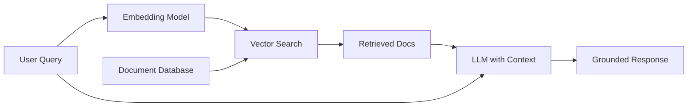
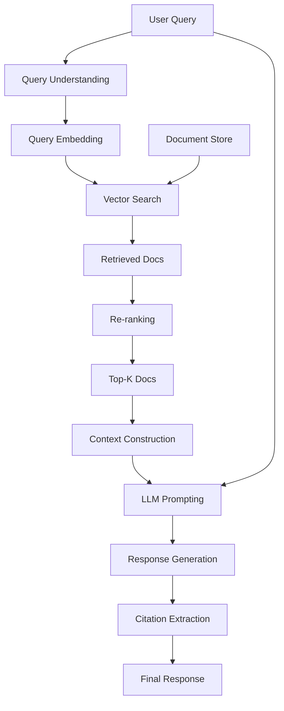
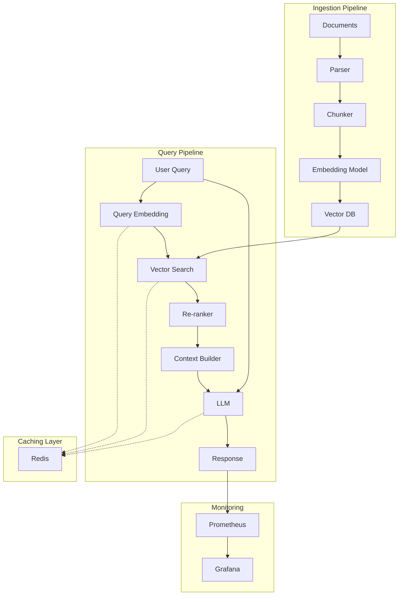

# Module 10: Retrieval-Augmented Generation (RAG)

> **Level**: Advanced  
> **Duration**: 4–6 weeks  
> **Prerequisites**: Modules 07-08 (Transformers, LLMs)  
> **Goal**: Build production-grade RAG systems that ground LLMs in external knowledge

---

## Table of Contents

1. [The RAG Paradigm](#1-the-rag-paradigm)
2. [Embeddings — The Foundation](#2-embeddings)
3. [Vector Databases](#3-vector-databases)
4. [Chunking Strategies](#4-chunking-strategies)
5. [Retrieval Algorithms](#5-retrieval-algorithms)
6. [Re-ranking](#6-re-ranking)
7. [Hybrid Search](#7-hybrid-search)
8. [RAG System Architecture](#8-rag-system-architecture)
9. [Evaluation Metrics](#9-evaluation-metrics)
10. [Advanced RAG Patterns](#10-advanced-rag-patterns)
11. [Production Considerations](#11-production-considerations)
12. [System Design](#12-system-design)

---

## 1. The RAG Paradigm

### 1.1 The Problem with Pure LLMs

**Issues**:
1. **Knowledge Cutoff**: Training data is static (GPT-4's cutoff: Apr 2023)
2. **Hallucinations**: LLMs confidently generate false information
3. **No Citations**: Can't verify sources
4. **Domain-Specific Knowledge**: LLMs lack internal company data, medical records, legal docs

**Example failure**:
```
User: "What was Acme Corp's revenue in Q4 2023?"
GPT-4: "I don't have access to real-time data..." [unhelpful]
```

### 1.2 RAG Solution

**Retrieval-Augmented Generation** = Retrieve relevant docs + Pass to LLM as context



**Benefits**:
1. **Up-to-date**: Index new docs without retraining
2. **Verifiable**: Cite sources
3. **Domain-specific**: Works with internal/proprietary data
4. **Cost-effective**: Cheaper than fine-tuning for every domain

### 1.3 RAG vs. Fine-Tuning

| Aspect | RAG | Fine-Tuning |
|--------|-----|-------------|
| **Knowledge Update** | Instant (add to DB) | Requires retraining |
| **Storage** | External DB | Model weights |
| **Verifiability** | High (cite sources) | Low (blackbox) |
| **Cost** | Per-query retrieval cost | One-time training cost |
| **Latency** | +50-200ms for retrieval | No overhead |
| **Best For** | Dynamic, changing knowledge | Behavioral changes, style, format |

**Modern best practice**: Use both! RAG for knowledge, fine-tuning for behavior.

---

## 2. Embeddings — The Foundation

### 2.1 What Are Embeddings?

Dense vector representations of text where semantic similarity = cosine similarity.

$$\text{similarity}(\mathbf{v}_1, \mathbf{v}_2) = \frac{\mathbf{v}_1 \cdot \mathbf{v}_2}{\|\mathbf{v}_1\| \|\mathbf{v}_2\|}$$

**Example**:
```python
embed("king") ≈ [0.2, 0.8, -0.1, ...]
embed("queen") ≈ [0.3, 0.7, 0.1, ...]
embed("car") ≈ [-0.5, 0.1, 0.9, ...]

cosine_sim(king, queen) = 0.92  # high similarity
cosine_sim(king, car) = 0.15     # low similarity
```

### 2.2 Embedding Models

| Model | Dimensions | Max Length | Use Case |
|-------|-----------|------------|----------|
| **OpenAI text-embedding-ada-002** | 1536 | 8191 | General-purpose (commercial) |
| **OpenAI text-embedding-3-small** | 512/1536 | 8191 | Cost-effective |
| **Cohere embed-english-v3.0** | 1024 | 512 | High-quality, compression option |
| **sentence-transformers/all-MiniLM-L6-v2** | 384 | 512 | Fast, lightweight (open) |
| **BAAI/bge-large-en-v1.5** | 1024 | 512 | SOTA open-source |
| **intfloat/e5-mistral-7b-instruct** | 4096 | 32768 | Long context, instruction-aware |

**Choosing an embedding model**:
- **Domain-specific**: Fine-tune on your data or use domain-specific model
- **Multilingual**: `multilingual-e5-large` or Cohere's multilingual
- **Long documents**: `jina-embeddings-v2-base-en` (8192 tokens)

### 2.3 How Embeddings Are Trained

**Contrastive Learning** (e.g., SBERT, BGE):

Given query $q$ and positive document $d^+$ (relevant) and negative $d^-$ (irrelevant):

$$\mathcal{L} = -\log \frac{\exp(\text{sim}(q, d^+) / \tau)}{\exp(\text{sim}(q, d^+) / \tau) + \sum_{d^- \in \mathcal{N}} \exp(\text{sim}(q, d^-) / \tau)}$$

This is **InfoNCE loss** (used in contrastive learning).

**Training data**:
- Question-answer pairs (Natural Questions, MS MARCO)
- Title-passage pairs (Wikipedia)
- Search query-clicked document pairs

### 2.4 Embedding Quality Metrics

**MTEB (Massive Text Embedding Benchmark)**: 56 datasets across 7 tasks
1. Classification
2. Clustering
3. Pair classification
4. Reranking
5. Retrieval
6. Semantic textual similarity (STS)
7. Summarization

**Top models (MTEB leaderboard, 2024)**:
1. `gte-Qwen2-7B-instruct` — 74.54
2. `e5-mistral-7b-instruct` — 73.49
3. `bge-en-icl` — 72.36

---

## 3. Vector Databases

### 3.1 Why Not Regular Databases?

**Challenge**: Finding nearest neighbors in high-dimensional space is $O(n)$ with exact search.

For 1M documents, 1024-dim embeddings:
- Exact search: ~1s per query (unacceptable)
- ANN search: ~10ms per query (acceptable)

### 3.2 Approximate Nearest Neighbor (ANN) Algorithms

**HNSW (Hierarchical Navigable Small World)**:
- Graph-based
- Fast queries ($O(\log n)$)
- High recall
- High memory usage
- **Used by**: FAISS, Qdrant, Weaviate

**Inverted File Index (IVF)**:
- Cluster vectors, search only relevant clusters
- Fast, memory-efficient
- Lower recall than HNSW
- **Used by**: FAISS, Milvus

**Product Quantization (PQ)**:
- Compress vectors for compact storage
- Trade accuracy for memory
- **Used by**: FAISS (IVF-PQ)

### 3.3 Vector Database Comparison

| Database | Type | ANN Algorithm | Features |
|----------|------|---------------|----------|
| **FAISS** | Library | HNSW, IVF, PQ | Fastest, no DB features |
| **Pinecone** | Cloud | Proprietary | Managed, easy setup, expensive |
| **Weaviate** | Self-hosted | HNSW | Hybrid search, GraphQL |
| **Qdrant** | Self-hosted/Cloud | HNSW | Rust-based, fast, filtering |
| **Chroma** | Embedded | Custom | Easy to use, good for prototyping |
| **Milvus** | Self-hosted/Cloud | IVF | Scalable, Kubernetes-native |
| **Pgvector** | Postgres extension | IVF | SQL + vectors, easy integration |

**For prototyping**: Chroma, FAISS  
**For production (small-medium scale)**: Qdrant, Weaviate  
**For production (large scale)**: Pinecone, Milvus  
**For existing Postgres users**: Pgvector

### 3.4 FAISS Example

```python
import faiss
import numpy as np

# Create embeddings
embeddings = np.random.randn(100000, 768).astype('float32')
faiss.normalize_L2(embeddings)  # Cosine sim = dot product after normalization

# Build index
index = faiss.IndexFlatIP(768)  # Inner Product (= cosine after normalization)
index.add(embeddings)

# Or use HNSW for speed
index = faiss.IndexHNSWFlat(768, 32)  # 32 = M (connectivity)
index.hnsw.efConstruction = 40  # Higher = better quality, slower build
index.add(embeddings)

# Search
query = np.random.randn(1, 768).astype('float32')
faiss.normalize_L2(query)
k = 5
distances, indices = index.search(query, k)
# distances: similarity scores
# indices: indices of top-k most similar vectors
```

---

## 4. Chunking Strategies

### 4.1 The Chunking Problem

**Issue**: Documents are long; LLMs have context limits.

**Example**: 50-page PDF = ~100k tokens. Can't embed the whole thing as one vector.

**Solution**: Split into chunks, embed each chunk.

### 4.2 Fixed-Size Chunking

```python
def chunk_fixed_size(text, chunk_size=512, overlap=50):
    words = text.split()
    chunks = []
    for i in range(0, len(words), chunk_size - overlap):
        chunk = ' '.join(words[i:i + chunk_size])
        chunks.append(chunk)
    return chunks
```

**Pros**: Simple, consistent chunk sizes  
**Cons**: Can split mid-sentence, mid-thought

### 4.3 Sentence-Based Chunking

```python
import nltk
nltk.download('punkt')

def chunk_by_sentences(text, max_sentences=5):
    sentences = nltk.sent_tokenize(text)
    chunks = []
    for i in range(0, len(sentences), max_sentences):
        chunk = ' '.join(sentences[i:i + max_sentences])
        chunks.append(chunk)
    return chunks
```

**Pros**: Maintains sentence boundaries  
**Cons**: Variable chunk sizes

### 4.4 Semantic Chunking

Group sentences by semantic similarity:

1. Embed each sentence
2. Compute similarity between consecutive sentences
3. Split where similarity drops below threshold

```python
from sentence_transformers import SentenceTransformer

model = SentenceTransformer('all-MiniLM-L6-v2')

def semantic_chunking(sentences, threshold=0.5):
    embeddings = model.encode(sentences)
    chunks = [[sentences[0]]]
    
    for i in range(1, len(sentences)):
        similarity = cosine_similarity(embeddings[i-1], embeddings[i])
        if similarity > threshold:
            chunks[-1].append(sentences[i])
        else:
            chunks.append([sentences[i]])
    
    return [' '.join(chunk) for chunk in chunks]
```

**Pros**: Preserves semantic coherence  
**Cons**: Computationally expensive

### 4.5 Hierarchical Chunking

Create multi-level chunks:
- **Level 1**: Sections (embeddings for coarse retrieval)
- **Level 2**: Paragraphs (embeddings for fine-grained retrieval)
- **Level 3**: Sentences (for precise extraction)

**Use case**: Retrieve section, then search within for specific paragraph.

### 4.6 Chunking Best Practices

1. **Overlap**: 10-20% overlap prevents loss of context at boundaries
2. **Size**: 256-512 tokens typical (balance between context and granularity)
3. **Metadata**: Store chunk IDs, document IDs, page numbers for traceability
4. **Markdown-aware**: Respect headers, lists, code blocks

---

## 5. Retrieval Algorithms

### 5.1 Dense Retrieval (Embedding-Based)

**Algorithm**:
1. Embed query: $\mathbf{q} = \text{embed}(\text{query})$
2. Find top-k most similar embeddings: $\arg\max_{\mathbf{d} \in \mathcal{D}} \text{sim}(\mathbf{q}, \mathbf{d})$
3. Return corresponding documents

**Pros**: Captures semantic similarity  
**Cons**: Misses exact keyword matches

### 5.2 Sparse Retrieval (BM25)

**BM25 (Best Match 25)**: TF-IDF-based ranking function

$$\text{score}(q, d) = \sum_{i=1}^n \text{IDF}(q_i) \cdot \frac{f(q_i, d) \cdot (k_1 + 1)}{f(q_i, d) + k_1 \cdot (1 - b + b \cdot \frac{|d|}{\text{avgdl}})}$$

where:
- $f(q_i, d)$ = frequency of term $q_i$ in doc $d$
- $|d|$ = document length
- $\text{avgdl}$ = average document length
- $k_1 \approx 1.5$, $b \approx 0.75$ (hyperparameters)

**Pros**: Exact keyword matching, fast  
**Cons**: No semantic understanding

**Implementation**:
```python
from rank_bm25 import BM25Okapi

corpus = ["document 1 text", "document 2 text", ...]
tokenized_corpus = [doc.split() for doc in corpus]
bm25 = BM25Okapi(tokenized_corpus)

query = "search query"
tokenized_query = query.split()
scores = bm25.get_scores(tokenized_query)
top_docs = np.argsort(scores)[::-1][:k]
```

### 5.3 Hybrid Search (Dense + Sparse)

Combine both:

$$\text{score}_{\text{hybrid}} = \alpha \cdot \text{score}_{\text{dense}} + (1 - \alpha) \cdot \text{score}_{\text{sparse}}$$

Typical $\alpha = 0.5$ to $0.7$.

**Reciprocal Rank Fusion** (RRF):

$$\text{RRF\_score}(d) = \sum_{r \in R} \frac{1}{k + r(d)}$$

where $r(d)$ is the rank of document $d$ in ranking $r$, and $k = 60$ typically.

**Why it works**: Dense retrieval for "What's the capital of France?" (semantic), sparse for "What is model number XYZ-123?" (keyword).

---

## 6. Re-ranking

### 6.1 The Two-Stage Pipeline

1. **Retrieval**: Fast, return top-100 candidates (~10ms)
2. **Re-ranking**: Slow but accurate, re-score top-100 → top-5 (~100ms)

### 6.2 Cross-Encoder Re-rankers

Unlike bi-encoders (embed query and doc separately), cross-encoders process them jointly:

$$\text{score} = \text{CrossEncoder}([q; d])$$

**Models**:
- `cross-encoder/ms-marco-MiniLM-L-6-v2` (fast)
- `cross-encoder/ms-marco-TinyBERT-L-6` (faster)
- `BAAI/bge-reranker-large` (SOTA)

**Example**:
```python
from sentence_transformers import CrossEncoder

reranker = CrossEncoder('cross-encoder/ms-marco-MiniLM-L-6-v2')

query = "What is machine learning?"
candidates = [...] # Retrieved docs
pairs = [[query, doc] for doc in candidates]
scores = reranker.predict(pairs)
reranked = sorted(zip(candidates, scores), key=lambda x: x[1], reverse=True)
```

### 6.3 LLM-based Re-ranking

Use LLM to score relevance:

```python
prompt = f"""
On a scale of 1-10, how relevant is this document to the query?

Query: {query}
Document: {doc}

Relevance score:
"""
score = llm.generate(prompt)  # Parse output
```

**Pros**: Most accurate  
**Cons**: Expensive, slow (~1s per doc)

**Use case**: Final re-ranking of top-10 before showing to user.

---

## 7. Hybrid Search

### 7.1 Elasticsearch + Dense Vectors

Elasticsearch supports dense vectors (since v7.3):

```json
PUT /documents
{
  "mappings": {
    "properties": {
      "text": {"type": "text"},
      "embedding": {"type": "dense_vector", "dims": 768}
    }
  }
}
```

Query:
```json
{
  "query": {
    "script_score": {
      "query": {"match": {"text": "machine learning"}},
      "script": {
        "source": "cosineSimilarity(params.query_vector, 'embedding') + 1.0",
        "params": {"query_vector": [0.1, 0.2, ...]}
      }
    }
  }
}
```

### 7.2 Weaviate Hybrid Search

```python
import weaviate

client = weaviate.Client("http://localhost:8080")

result = client.query.get("Document", ["text", "title"]).with_hybrid(
    query="machine learning",
    alpha=0.75  # 0=BM25 only, 1=vector only
).with_limit(10).do()
```

---

## 8. RAG System Architecture

### 8.1 End-to-End Pipeline



### 8.2 Context Construction

**Prompt template**:
```python
prompt = f"""
You are a helpful assistant. Answer the question based on the context below.

Context:
{context}

Question: {query}

Answer:
"""
```

**Context formatting**:
```
Document 1 (source: doc1.pdf, page 3):
"Machine learning is a subset of AI..."

Document 2 (source: blog.com/ml):
"ML algorithms learn from data..."

Document 3 (source: wiki.org):
"Supervised learning requires labeled data..."
```

### 8.3 Citation Extraction

After LLM generates response, extract which docs were used:

```python
# Method 1: Ask LLM to cite
prompt += "\n\nCite your sources using [1], [2], [3] format."

# Method 2: String matching
response = llm.generate(prompt)
citations = []
for i, doc in enumerate(context_docs):
    if doc['text'][:50] in response:  # Check if snippet appears
        citations.append(i)
```

---

## 9. Evaluation Metrics

### 9.1 Retrieval Metrics

**Recall@K**: Fraction of relevant docs in top-K

$$\text{Recall@K} = \frac{|\text{relevant} \cap \text{top-K}|}{|\text{relevant}|}$$

**Precision@K**:

$$\text{Precision@K} = \frac{|\text{relevant} \cap \text{top-K}|}{K}$$

**MRR (Mean Reciprocal Rank)**:

$$\text{MRR} = \frac{1}{|Q|} \sum_{i=1}^{|Q|} \frac{1}{\text{rank}_i}$$

where $\text{rank}_i$ is the position of the first relevant doc.

**NDCG (Normalized Discounted Cumulative Gain)**:

$$\text{DCG@K} = \sum_{i=1}^K \frac{\text{rel}_i}{\log_2(i+1)}$$

$$\text{NDCG@K} = \frac{\text{DCG@K}}{\text{IDCG@K}}$$

### 9.2 End-to-End RAG Metrics

**Faithfulness**: Is response grounded in context?

**Relevancy**: Does context answer the question?

**RAGAS** (RAG Assessment):
- Context relevancy
- Context recall
- Faithfulness
- Answer relevancy

**Example evaluation**:
```python
from ragas import evaluate
from ragas.metrics import faithfulness, answer_relevancy

result = evaluate(
    dataset,
    metrics=[faithfulness, answer_relevancy]
)
```

---

## 10. Advanced RAG Patterns

### 10.1 Multi-Query RAG

Generate multiple queries for same user intent:

```
User: "How does climate change affect agriculture?"

Generated queries:
1. "Impact of global warming on crop yields"
2. "Effects of temperature rise on farming"
3. "Climate change consequences for food production"
```

Retrieve for each, merge results → better coverage.

### 10.2 HyDE (Hypothetical Document Embeddings)

Instead of embedding query directly, generate hypothetical answer and embed it:

```python
hypothetical_answer = llm.generate(f"Answer this question: {query}")
query_embedding = embed(hypothetical_answer)
# Now retrieve using this embedding
```

**Why it works**: Hypothetical answer is closer in embedding space to actual documents than the query.

### 10.3 Self-RAG (Self-Reflective RAG)

LLM decides when to retrieve:

```
Query: "What's 2+2?"
→ LLM: "I know this, no retrieval needed. Answer: 4"

Query: "What was Acme Corp's Q3 revenue?"
→ LLM: "I need external data. [RETRIEVE]"
→ System: Retrieves docs
→ LLM: "Based on the documents, ..."
```

### 10.4 Corrective RAG (CRAG)

Evaluate retrieved docs, re-retrieve if quality is low:

```python
docs = retrieve(query)
relevance_scores = reranker.score(query, docs)

if max(relevance_scores) < threshold:
    # Retrieved docs are not relevant, reformulate query
    new_query = llm.reformulate(query, feedback="No relevant docs found")
    docs = retrieve(new_query)
```

---

## 11. Production Considerations

### 11.1 Latency Budget

| Component | Latency |
|-----------|---------|
| Embedding query | 10-50ms |
| Vector search (ANN) | 10-100ms |
| Re-ranking (top-100) | 50-200ms |
| LLM generation (50 tokens) | 500-2000ms |
| **Total** | ~600-2400ms |

**Optimization targets**:
- < 1s for simple queries
- < 3s for complex queries

### 11.2 Caching Strategy

**Query cache**: Cache (query → response) for identical queries

**Embedding cache**: Cache (text → embedding) for common texts

**Retrieval cache**: Cache (query → retrieved docs) for similar queries

**Example**:
```python
from functools import lru_cache

@lru_cache(maxsize=10000)
def embed_cached(text):
    return embedding_model.encode(text)
```

### 11.3 Incremental Indexing

For continuously updated docs:

```python
# Add new document
new_doc_id = db.add(
    documents=[new_doc_text],
    embeddings=[embedding],
    metadatas=[{"source": "..."}]
)

# Update existing document
db.update(
    ids=[doc_id],
    documents=[updated_text],
    embeddings=[new_embedding]
)

# Delete document
db.delete(ids=[doc_id])
```

### 11.4 Monitoring

**Key metrics**:
- **Retrieval accuracy**: Log queries where no relevant docs found
- **LLM hallucination rate**: Sample responses, check faithfulness
- **Citation accuracy**: Verify citations match retrieved docs
- **Latency percentiles**: p50, p95, p99
- **Cache hit rate**: Query, embedding, retrieval caches

---

## 12. System Design

### 12.1 Production RAG Architecture



### 12.2 Scaling Strategies

**Horizontal scaling**:
- Shard vector DB by document category
- Load balance LLM requests across replicas
- Distribute embedding computation

**Vertical scaling**:
- Use larger HNSW index (better recall, more memory)
- GPU for embedding (10x faster)
- More powerful LLM inference server

---

## Notebooks

| # | Notebook | Description |
|---|----------|-------------|
| 1 | [RAG from Scratch](notebooks/01_rag_from_scratch.ipynb) | Build RAG with FAISS + OpenAI |
| 2 | [Chunking Strategies](notebooks/02_chunking_strategies.ipynb) | Compare fixed, semantic, hierarchical |
| 3 | [Embedding Evaluation](notebooks/03_embedding_evaluation.ipynb) | Benchmark models on MTEB |
| 4 | [Advanced RAG](notebooks/04_advanced_rag.ipynb) | Multi-query, HyDE, Self-RAG |

---

## Projects

### Mini Project: Document Q&A System
Build RAG system over 100 PDFs:
- Ingest, chunk, embed
- FAISS index
- Gradio UI
- Evaluate on synthetic Q&A pairs

### Advanced Project: Production RAG Service
Full-stack RAG with:
- FastAPI backend
- Qdrant vector DB
- Cohere embeddings + re-ranker
- Streaming LLM responses
- Redis caching
- Prometheus monitoring
- Docker Compose deployment
- Load testing (Locust)
