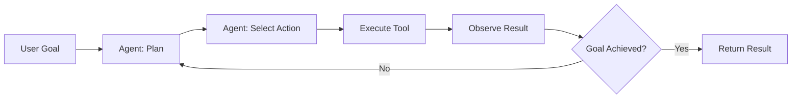
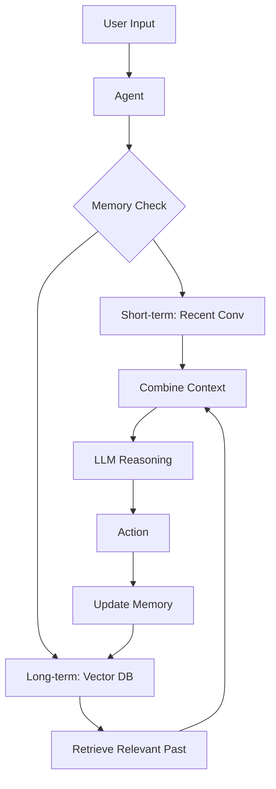
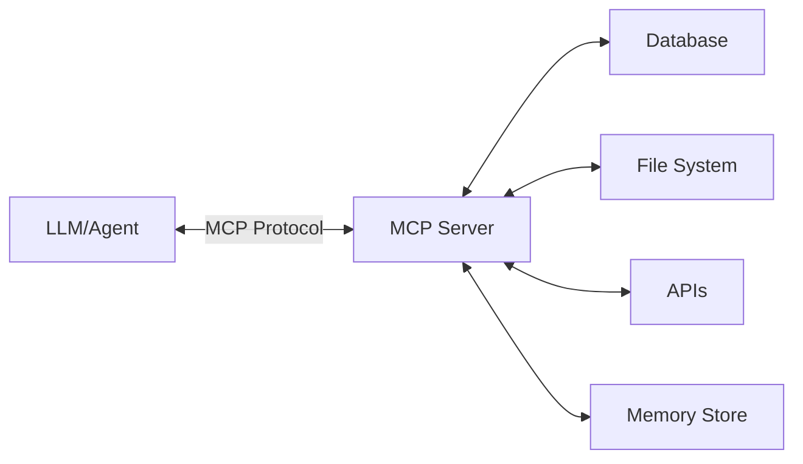
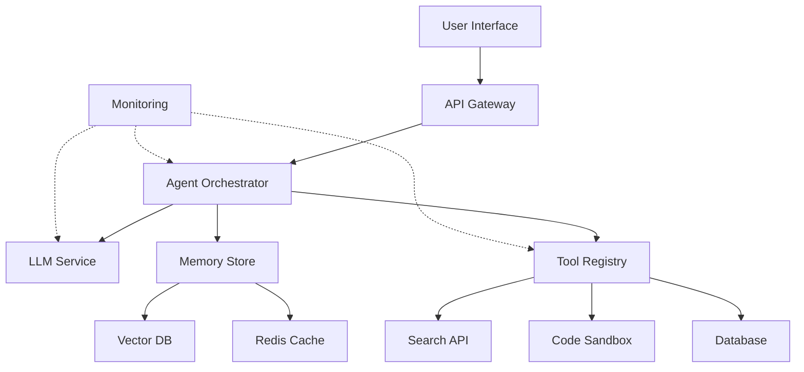

# Module 11: Agents & MCP (Model Context Protocol)

> **Level**: Advanced  
> **Duration**: 4–6 weeks  
> **Prerequisites**: Modules 08 (LLMs), 10 (RAG)  
> **Goal**: Build autonomous AI agents that can use tools and interact with external systems

---

## Table of Contents

1. [From Static LLMs to Autonomous Agents](#1-from-static-llms-to-autonomous-agents)
2. [Agent Architecture Patterns](#2-agent-architecture-patterns)
3. [Tool Calling & Function Calling](#3-tool-calling--function-calling)
4. [ReAct (Reasoning + Acting)](#4-react)
5. [Memory Systems](#5-memory-systems)
6. [Planning & Task Decomposition](#6-planning--task-decomposition)
7. [Model Context Protocol (MCP)](#7-model-context-protocol-mcp)
8. [Multi-Agent Systems](#8-multi-agent-systems)
9. [Agent Evaluation](#9-agent-evaluation)
10. [Production Deployment](#10-production-deployment)

---

## 1. From Static LLMs to Autonomous Agents

### 1.1 The Limitation of Pure LLMs

**LLMs are stateless question-answering systems**:
```
User: "What's the weather in SF?"
LLM: "I don't have access to real-time data..."
```

**What we want**: Agent that can check weather API and respond.

### 1.2 Agent Definition

An **agent** is an LLM that can:
1. **Perceive**: Observe environment (user input, tool results)
2. **Reason**: Decide what to do next
3. **Act**: Execute actions (call APIs, search web, run code)
4. **Learn**: Update memory/strategy based on feedback
5. **Iterate**: Repeat until task complete

### 1.3 Agent Loop



### 1.4 Milestone Papers & Projects

| Year | Project/Paper | Key Contribution |
|------|---------------|------------------|
| 2022 | WebGPT (OpenAI) | LLM browses web to answer questions |
| 2022 | Toolformer (Meta) | Teach LLMs to use tools via self-supervision |
| 2023 | AutoGPT | Autonomous agent with long-term memory |
| 2023 | BabyAGI | Task-driven autonomous agent |
| 2023 | Agents (LangChain) | Framework for building agents |
| 2023 | Function Calling (OpenAI) | Native function calling API |
| 2023 | ChatGPT Code Interpreter | Execute Python in sandbox |
| 2024 | Model Context Protocol (Anthropic) | Standardized tool/resource interface |
| 2024 | OpenAI Swarm | Multi-agent orchestration framework |

---

## 2. Agent Architecture Patterns

### 2.1 Zero-Shot Agent (ReAct)

No training, just prompting:

```
You run in a loop of Thought, Action, Observation.

Thought: Reason about what to do
Action: Choose tool and input
Observation: Observe tool result

Repeat until you have the answer.

Available tools:
- search(query): Search the web
- calculate(expression): Evaluate math
- finish(answer): Return final answer

Question: What is the population of the capital of France?
```

### 2.2 Structured Agent (Function Calling)

LLM outputs structured tool calls:

```python
# OpenAI function calling format
{
  "role": "assistant",
  "content": null,
  "function_call": {
    "name": "search",
    "arguments": "{\"query\": \"capital of France population\"}"
  }
}
```

### 2.3 Code-Based Agent (Code Interpreter)

Agent writes and executes Python code:

```
User: "Plot a sine wave from 0 to 2π"

Agent generates:
```python
import numpy as np
import matplotlib.pyplot as plt

x = np.linspace(0, 2*np.pi, 100)
y = np.sin(x)
plt.plot(x, y)
plt.show()
```
```

System executes and returns plot.

### 2.4 Autonomous Agent (AutoGPT-style)

Full autonomy with self-delegation:

```
User Goal: "Research the top 3 AI startups in 2024 and summarize their products"

Agent Plan:
1. Task: Search for "top AI startups 2024"
2. Task: For each startup, search their website
3. Task: Extract product info
4. Task: Summarize findings
5. Task: Return report

Agent executes each task, spawning subtasks as needed.
```

---

## 3. Tool Calling & Function Calling

### 3.1 Tool Schema Definition

JSON Schema for tools:

```json
{
  "name": "get_weather",
  "description": "Get current weather for a location",
  "parameters": {
    "type": "object",
    "properties": {
      "location": {
        "type": "string",
        "description": "City name, e.g., 'San Francisco'"
      },
      "unit": {
        "type": "string",
        "enum": ["celsius", "fahrenheit"],
        "description": "Temperature unit"
      }
    },
    "required": ["location"]
  }
}
```

### 3.2 OpenAI Function Calling

```python
import openai

tools = [
    {
        "type": "function",
        "function": {
            "name": "get_weather",
            "description": "Get current weather",
            "parameters": {
                "type": "object",
                "properties": {
                    "location": {"type": "string"}
                },
                "required": ["location"]
            }
        }
    }
]

response = openai.chat.completions.create(
    model="gpt-4-turbo",
    messages=[{"role": "user", "content": "What's the weather in NYC?"}],
    tools=tools,
    tool_choice="auto"
)

# If LLM decides to call tool:
if response.choices[0].message.tool_calls:
    tool_call = response.choices[0].message.tool_calls[0]
    function_name = tool_call.function.name
    function_args = json.loads(tool_call.function.arguments)
    
    # Execute function
    result = get_weather(**function_args)
    
    # Send result back to LLM
    messages.append(response.choices[0].message)
    messages.append({
        "role": "tool",
        "tool_call_id": tool_call.id,
        "content": str(result)
    })
    
    final_response = openai.chat.completions.create(
        model="gpt-4-turbo",
        messages=messages
    )
```

### 3.3 Tool Catalog

Essential tools for agents:

| Tool | Purpose | Example |
|------|---------|---------|
| **search** | Web search | DuckDuckGo, Google, Bing |
| **calculator** | Math evaluation | Python `eval`, Wolfram Alpha |
| **code_interpreter** | Execute code | Sandbox (E2B, Modal) |
| **database_query** | Query SQL | SQL executor |
| **file_read/write** | File operations | Local/S3 access |
| **api_call** | HTTP requests | `requests` library |
| **browser** | Web scraping | Playwright, Selenium |
| **image_generation** | Create images | DALL-E, Midjourney API |
| **embeddings** | Semantic search | OpenAI, Cohere |

### 3.4 Tool Safety

**Sandboxing**:
- Run code in isolated container
- Limit network access
- Timeout execution (e.g., 30s)
- Restrict file system access

**Example with E2B**:
```python
from e2b import Sandbox

sandbox = Sandbox(timeout=30)
result = sandbox.run_code("print(2+2)")
sandbox.close()
```

---

## 4. ReAct (Reasoning + Acting)

### 4.1 The ReAct Pattern

**Interleave reasoning and action**:

```
Thought 1: I need to find the capital of France
Action 1: search("capital of France")
Observation 1: Paris is the capital of France

Thought 2: Now I need the population of Paris
Action 2: search("population of Paris")
Observation 2: Paris has a population of ~2.2 million

Thought 3: I have the answer
Action 3: finish("2.2 million")
```

### 4.2 Implementation

```python
class ReActAgent:
    def __init__(self, llm, tools):
        self.llm = llm
        self.tools = {tool.name: tool for tool in tools}
    
    def run(self, question, max_steps=10):
        prompt = self.build_prompt(question)
        history = []
        
        for step in range(max_steps):
            # LLM generates thought + action
            response = self.llm.generate(prompt + "\n".join(history))
            
            # Parse response
            thought = self.extract_thought(response)
            action = self.extract_action(response)
            
            history.append(f"Thought {step+1}: {thought}")
            history.append(f"Action {step+1}: {action}")
            
            # Execute action
            if action.startswith("finish"):
                return self.extract_answer(action)
            
            tool_name, tool_input = self.parse_action(action)
            result = self.tools[tool_name].run(tool_input)
            
            history.append(f"Observation {step+1}: {result}")
        
        return "Max steps reached"
```

### 4.3 ReAct Variants

**ReAct-JSON**: Structured output
```json
{
  "thought": "I need to search for the capital",
  "action": "search",
  "action_input": "capital of France"
}
```

**Tree-of-Thought ReAct**: Explore multiple reasoning paths in parallel.

---

## 5. Memory Systems

### 5.1 Types of Memory

**Short-term (working) memory**:
- Within-conversation context
- Limited by context window (e.g., 8k tokens)

**Long-term (episodic) memory**:
- Across conversations
- Stored in vector DB
- Retrieved when relevant

**Semantic memory**:
- General knowledge (baked into LLM weights)
- Updated via fine-tuning

### 5.2 Memory Architecture



### 5.3 Implementing Long-Term Memory

```python
class MemoryAgent:
    def __init__(self, llm, vector_db):
        self.llm = llm
        self.memory = vector_db
        self.conversation_history = []
    
    def remember(self, text, metadata=None):
        """Store in long-term memory"""
        embedding = self.embed(text)
        self.memory.add(
            documents=[text],
            embeddings=[embedding],
            metadatas=[metadata or {}]
        )
    
    def recall(self, query, k=3):
        """Retrieve relevant memories"""
        embedding = self.embed(query)
        results = self.memory.query(
            query_embeddings=[embedding],
            n_results=k
        )
        return results['documents'][0]
    
    def run(self, user_input):
        # Retrieve relevant past interactions
        relevant_memories = self.recall(user_input)
        
        # Combine with short-term context
        context = self.conversation_history[-5:]  # Last 5 turns
        context_str = "\\n".join(context + relevant_memories)
        
        # Generate response
        prompt = f"{context_str}\\n\\nUser: {user_input}\\nAgent:"
        response = self.llm.generate(prompt)
        
        # Update memories
        self.conversation_history.append(f"User: {user_input}")
        self.conversation_history.append(f"Agent: {response}")
        self.remember(f"User: {user_input}\\nAgent: {response}")
        
        return response
```

### 5.4 Memory Compression

For long conversations, compress older context:

```python
def compress_memory(old_context):
    """Summarize old context to save tokens"""
    prompt = f"Summarize this conversation concisely:\\n{old_context}"
    summary = llm.generate(prompt)
    return summary
```

---

## 6. Planning & Task Decomposition

### 6.1 Hierarchical Planning

**Top-down decomposition**:

```
Goal: "Plan a 3-day trip to Paris"

High-level plan:
1. Book flights
2. Book hotel
3. Plan daily itinerary

Subtask for (1):
1.1 Search flights
1.2 Compare prices
1.3 Book ticket

Subtask for (3 - Day 1):
3.1.1 Visit Eiffel Tower
3.1.2 Lunch at cafe
3.1.3 Louvre Museum
...
```

### 6.2 LLM Planner

```python
def plan_task(task):
    prompt = f"""
    Break down this task into subtasks:
    
    Task: {task}
    
    Subtasks (as numbered list):
    """
    subtasks = llm.generate(prompt).strip().split("\\n")
    return [s.strip() for s in subtasks if s.strip()]

def recursive_plan(task, depth=0, max_depth=3):
    if depth >= max_depth:
        return [task]
    
    subtasks = plan_task(task)
    if len(subtasks) <= 1:
        return [task]
    
    plan = []
    for subtask in subtasks:
        plan.extend(recursive_plan(subtask, depth+1, max_depth))
    return plan
```

### 6.3 BabyAGI Architecture

```python
class BabyAGI:
    def __init__(self, llm, vector_db):
        self.llm = llm
        self.task_list = []
        self.memory = vector_db
    
    def run(self, objective):
        # Initial task creation
        self.task_list = self.create_tasks(objective)
        
        while self.task_list:
            # Execute first task
            task = self.task_list.pop(0)
            result = self.execute_task(task, objective)
            
            # Store result
            self.memory.add(result)
            
            # Create new tasks based on result
            new_tasks = self.create_tasks_from_result(result, objective)
            self.task_list.extend(new_tasks)
            
            # Prioritize tasks
            self.task_list = self.prioritize_tasks(self.task_list, objective)
    
    def execute_task(self, task, objective):
        # Retrieve relevant context
        context = self.memory.query(task)
        
        # Execute with LLM
        prompt = f"Objective: {objective}\\nTask: {task}\\nContext: {context}\\n\\nResult:"
        return self.llm.generate(prompt)
```

---

## 7. Model Context Protocol (MCP)

### 7.1 What is MCP?

**Anthropic's Model Context Protocol**: Standardized way for LLMs to interact with external systems.

**Problem solved**: Every agent framework has custom tool format. MCP provides universal interface.

### 7.2 MCP Architecture



**MCP Server** exposes:
1. **Resources**: Data sources (files, DB tables, API endpoints)
2. **Tools**: Functions LLM can call
3. **Prompts**: Reusable prompt templates

### 7.3 MCP Server Example

```python
from mcp import MCPServer, Tool, Resource

server = MCPServer()

@server.tool()
def search_web(query: str) -> str:
    """Search the web and return results"""
    # Implementation
    return search_api(query)

@server.tool()
def read_file(path: str) -> str:
    """Read file contents"""
    with open(path) as f:
        return f.read()

@server.resource()
def database_schema():
    """Provide DB schema as context"""
    return get_db_schema()

# Start server
server.run(host="localhost", port=8080)
```

### 7.4 MCP Client (Agent Side)

```python
from mcp import MCPClient

client = MCPClient("http://localhost:8080")

# Discover available tools
tools = client.list_tools()

# Call tool
result = client.call_tool("search_web", {"query": "AI news"})

# Access resource
schema = client.get_resource("database_schema")
```

### 7.5 MCP Use Cases

1. **IDE Integration**: Claude in VS Code uses MCP to read files, run tests
2. **Database Agents**: SQL agent with read-only access via MCP
3. **Enterprise Systems**: Connect LLM to internal APIs (Salesforce, Slack, etc.)
4. **Multi-Agent**: Agents communicate via MCP protocol

---

## 8. Multi-Agent Systems

### 8.1 Why Multiple Agents?

**Division of labor**:
- Research Agent: Gathers information
- Planning Agent: Creates strategy
- Writing Agent: Produces content
- Critic Agent: Reviews and provides feedback

### 8.2 Agent Collaboration Patterns

**Sequential**:
```
User → Agent 1 → Agent 2 → Agent 3 → User
```

**Parallel**:
```
        ┌→ Agent 1 ┐
User →  ├→ Agent 2 ├→ Synthesizer → User
        └→ Agent 3 ┘
```

**Hierarchical**:
```
Orchestrator Agent
    ├→ Research Agent
    ├→ Analysis Agent
    └→ Writing Agent
```

**Debate**:
```
Agent 1 ⇄ Agent 2  (argue back and forth)
    ↓
Judge Agent (decides)
```

### 8.3 OpenAI Swarm Framework

```python
from swarm import Swarm, Agent

client = Swarm()

# Define specialized agents
research_agent = Agent(
    name="Researcher",
    instructions="You research topics and gather information.",
    tools=[search_web, read_article]
)

writing_agent = Agent(
    name="Writer",
    instructions="You write polished content based on research.",
    tools=[save_to_file]
)

# Orchestrator delegates
def transfer_to_writer():
    return writing_agent

orchestrator = Agent(
    name="Orchestrator",
    instructions="You coordinate research and writing.",
    tools=[transfer_to_writer]
)

# Run
response = client.run(
    agent=orchestrator,
    messages=[{"role": "user", "content": "Write article on quantum computing"}]
)
```

### 8.4 Agent Communication

**Message passing**:
```python
class Message:
    from_agent: str
    to_agent: str
    content: str
    metadata: dict

message_bus = []
message_bus.append(Message(
    from_agent="Researcher",
    to_agent="Writer",
    content="Here's data on quantum computing...",
    metadata={"priority": "high"}
))
```

### 8.5 Multi-Agent Challenges

1. **Coordination overhead**: More agents = more communication
2. **Conflicting outputs**: Agents disagree, need consensus mechanism
3. **Infinite loops**: Agent A waits for B, B waits for A
4. **Cost**: Each agent call costs $$$

---

## 9. Agent Evaluation

### 9.1 Success Metrics

| Metric | Description |
|--------|-------------|
| **Task Completion Rate** | % of goals achieved |
| **Steps to Completion** | Efficiency (fewer steps = better) |
| **Cost** | Total LLM API cost |
| **Accuracy** | Correctness of final answer |
| **Tool Usage Accuracy** | % of tool calls that are valid |

### 9.2 Benchmarks

**WebShop** (Zhou et al., 2022):
- Agent browses e-commerce site to purchase items
- Measures multi-step decision making

**ALFWorld** (Shridhar et al., 2020):
- Text-based home environment
- Tasks like "put apple in fridge"

**AgentBench** (Liu et al., 2023):
- 8 diverse environments
- Code, DB, OS, Web, Games

**GAIA** (Meta, 2023):
- General AI Assistant benchmark
- Real-world tasks requiring tools

### 9.3 Human Evaluation

```python
def evaluate_agent(agent, test_cases):
    results = []
    for test in test_cases:
        result = agent.run(test["input"])
        score = human_evaluator.rate(
            task=test["input"],
            output=result,
            reference=test["expected_output"]
        )
        results.append({
            "task": test["input"],
            "output": result,
            "score": score
        })
    return results
```

---

## 10. Production Deployment

### 10.1 Agent Deployment Architecture



### 10.2 Error Handling

```python
class RobustAgent:
    def run(self, task, max_retries=3):
        for attempt in range(max_retries):
            try:
                return self._execute(task)
            except ToolExecutionError as e:
                logger.error(f"Tool error: {e}, retrying...")
                continue
            except LLMError as e:
                logger.error(f"LLM error: {e}, retrying with backup model...")
                self.llm = self.backup_llm
                continue
            except Exception as e:
                logger.error(f"Unexpected error: {e}")
                return f"Failed after {max_retries} attempts: {str(e)}"
        
        return "Max retries exceeded"
```

### 10.3 Rate Limiting & Cost Control

```python
from functools import wraps
import time

class RateLimiter:
    def __init__(self, max_calls, period):
        self.max_calls = max_calls
        self.period = period
        self.calls = []
    
    def __call__(self, func):
        @wraps(func)
        def wrapper(*args, **kwargs):
            now = time.time()
            self.calls = [c for c in self.calls if c > now - self.period]
            
            if len(self.calls) >= self.max_calls:
                raise Exception("Rate limit exceeded")
            
            self.calls.append(now)
            return func(*args, **kwargs)
        return wrapper

@rate_limiter(max_calls=100, period=60)  # 100 calls per minute
def call_llm(prompt):
    return llm.generate(prompt)
```

### 10.4 Monitoring & Observability

```python
from dataclasses import dataclass
from datetime import datetime

@dataclass
class AgentTrace:
    timestamp: datetime
    user_id: str
    task: str
    steps: list
    tools_used: list
    tokens_used: int
    cost: float
    success: bool
    duration_ms: float

def log_agent_run(agent_run):
    # Log to DB
    db.insert("agent_traces", agent_run)
    
    # Send metrics
    metrics.gauge("agent.tokens_used", agent_run.tokens_used)
    metrics.gauge("agent.cost", agent_run.cost)
    metrics.counter("agent.runs", tags={"success": agent_run.success})
```

---

## Notebooks

| # | Notebook | Description |
|---|----------|-------------|
| 1 | [ReAct Agent from Scratch](notebooks/01_react_agent.ipynb) | Implement ReAct with custom tools |
| 2 | [Function Calling Agent](notebooks/02_function_calling.ipynb) | OpenAI function calling API |
| 3 | [Memory-Augmented Agent](notebooks/03_memory_agent.ipynb) | Agent with long-term memory |
| 4 | [Multi-Agent System](notebooks/04_multi_agent.ipynb) | Debate between multiple agents |

---

## Projects

### Mini Project: Research Assistant Agent
Build agent that:
- Searches web for topic
- Reads top 5 articles
- Summarizes findings
- Generates report with citations

### Advanced Project: Autonomous Code Agent
Build agent that:
- Takes software requirement
- Generates plan
- Writes code
- Runs tests
- Debugs failures
- Iterates until tests pass
- Uses MCP for file system access
- Sandboxed code execution
