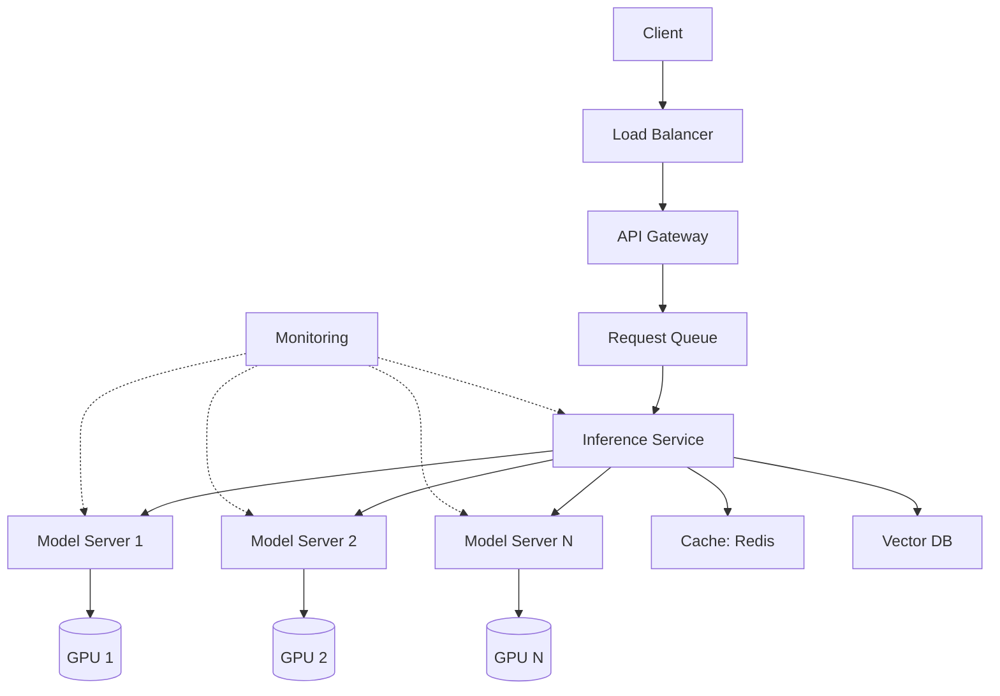
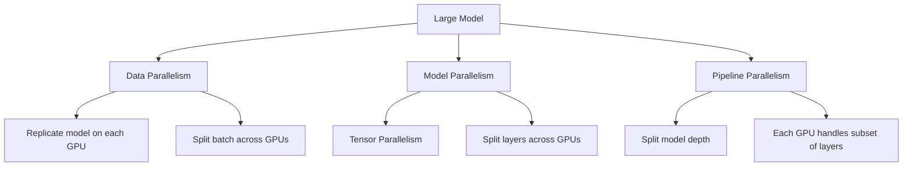
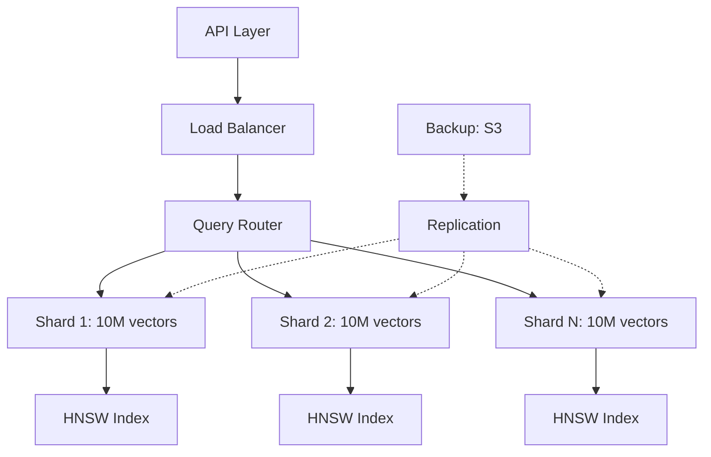

# Module 15: LLM Systems Design

> **Level**: Advanced  
> **Duration**: 3–4 weeks  
> **Prerequisites**: Modules 07, 08, 10  
> **Goal**: Design production-grade LLM systems at scale

---

## Table of Contents

1. [System Design Fundamentals for LLMs](#1-system-design-fundamentals-for-llms)
2. [Model Serving Architectures](#2-model-serving-architectures)
3. [GPU Utilization & Optimization](#3-gpu-utilization--optimization)
4. [Distributed Inference](#4-distributed-inference)
5. [Batching Strategies](#5-batching-strategies)
6. [KV Cache Optimization](#6-kv-cache-optimization)
7. [Vector Database at Scale](#7-vector-database-at-scale)
8. [Latency & Throughput Optimization](#8-latency--throughput-optimization)
9. [Observability](#9-observability)
10. [Cost Optimization](#10-cost-optimization)

---

## 1. System Design Fundamentals for LLMs

### 1.1 LLM Service Requirements

**Functional Requirements**:
- Handle user queries with low latency (<2s for first token)
- Support streaming responses
- Scale to thousands of concurrent requests
- Maintain conversation context

**Non-Functional Requirements**:
- **Latency**: P50 < 500ms, P99 < 2s (time to first token)
- **Throughput**: 1000+ requests/second
- **Availability**: 99.9% uptime
- **Cost**: <$0.01 per request

### 1.2 High-Level Architecture



### 1.3 Key Design Challenges

| Challenge | Impact | Solution |
|-----------|--------|----------|
| **Large Model Size** | 175B params = 350GB @ FP16 | Model parallelism, quantization |
| **Memory Bandwidth** | GPU compute underutilized | Batch processing, FlashAttention |
| **Variable Input Length** | Wasted compute on padding | Dynamic batching |
| **KV Cache Growth** | Memory grows with sequence length | PagedAttention, prefix caching |
| **Cold Start** | Model loading takes minutes | Keep models warm, multi-tenancy |

---

## 2. Model Serving Architectures

### 2.1 Serving Frameworks

| Framework | Developer | Key Features |
|-----------|-----------|--------------|
| **vLLM** | Berkeley | PagedAttention, continuous batching |
| **TGI** | HuggingFace | Streaming, dynamic batching, tensor parallelism |
| **TensorRT-LLM** | NVIDIA | Highly optimized, quantization, MoE support |
| **DeepSpeed-MII** | Microsoft | ZeRO inference, pipeline parallelism |
| **Ray Serve** | Anyscale | General-purpose, autoscaling |
| **Triton Inference Server** | NVIDIA | Multi-framework, model ensembles |

### 2.2 vLLM Architecture

**PagedAttention**: Inspired by OS virtual memory

```python
# Traditional KV cache: contiguous allocation
kv_cache = torch.zeros(batch_size, num_heads, max_seq_len, head_dim)

# vLLM PagedAttention: block-based allocation
kv_cache_blocks = [
    torch.zeros(num_heads, block_size, head_dim)
    for _ in range(num_blocks)
]

# Map sequence to blocks (like virtual memory pages)
block_table = {
    seq_id: [block_0, block_5, block_12, ...]
}
```

**Benefits**:
- **Near-zero waste**: Allocate memory in small blocks (e.g., 16 tokens)
- **Sharing**: Different sequences can share KV cache blocks (for prefixes)
- **24x higher throughput** than naive implementation

### 2.3 TGI (Text Generation Inference)

**Key Features**:

1. **Continuous Batching**: Add/remove requests dynamically
2. **Flash Attention**: Fused attention kernel
3. **Tensor Parallelism**: Split model across GPUs
4. **BitsAndBytes Quantization**: 8-bit/4-bit inference

**Launching TGI**:
```bash
docker run --gpus all --shm-size 1g -p 8080:80 \
  -v $PWD/data:/data \
  ghcr.io/huggingface/text-generation-inference:latest \
  --model-id meta-llama/Llama-2-70b-chat-hf \
  --num-shard 4 \
  --max-batch-total-tokens 32768
```

### 2.4 TensorRT-LLM

**NVIDIA's highly optimized framework**:

```python
import tensorrt_llm
from tensorrt_llm import LLM

# Build optimized engine
llm = LLM(model="meta-llama/Llama-2-7b-hf")

# Configurations
llm.optimize(
    use_fp16=True,
    use_gpt_attention_plugin=True,
    use_gemm_plugin=True,
    max_batch_size=128,
    max_input_len=2048,
    max_output_len=512
)

# Generate
outputs = llm.generate(prompts, max_new_tokens=100)
```

**Performance**: 2-3x faster than PyTorch for LLaMA-70B.

---

## 3. GPU Utilization & Optimization

### 3.1 GPU Memory Hierarchy

```
                    Latency     Size
Registers           ~1 cycle    ~256 KB per SM
Shared Memory       ~20 cycles  ~100 KB per SM
L1 Cache            ~30 cycles  ~128 KB per SM
L2 Cache            ~200 cycles ~40 MB
Global Memory (HBM) ~400 cycles 40-80 GB
```

### 3.2 Memory Bandwidth Bound

**Problem**: LLM inference is memory-bound, not compute-bound.

**Example (LLaMA-13B on A100)**:
- **Model size**: 26 GB (FP16)
- **A100 memory bandwidth**: 2 TB/s
- **Time to load model**: 26 GB / 2 TB/s = 13 ms

For batch size 1, each token generation:
- **Compute**: ~13B FLOPs × 2 (forward pass) = 26 GFLOPs
- **Time (compute-bound)**: 26 GFLOP / 312 TFLOP/s = 0.08 ms
- **Time (memory-bound)**: 13 ms

**Memory bandwidth limits throughput, not compute!**

### 3.3 FlashAttention

**Standard Attention** (inefficient):
```python
Q, K, V = compute_qkv(x)  # (batch, seq_len, d_model)
scores = Q @ K.T / sqrt(d_k)  # Load Q, K from HBM
attn = softmax(scores)  # Load scores, write attn
out = attn @ V  # Load attn, V
```

**Reads/Writes**: $O(N^2)$ where $N$ is sequence length.

**FlashAttention** (fused kernel):
- Compute attention in blocks that fit in SRAM (shared memory)
- Reduce HBM reads/writes from $O(N^2)$ to $O(N)$
- **2-4x speedup**, enables longer sequences

```python
import torch.nn.functional as F
from flash_attn import flash_attn_func

# Standard
out = F.scaled_dot_product_attention(Q, K, V)

# FlashAttention
out = flash_attn_func(Q, K, V)
```

### 3.4 Quantization

| Precision | Size (7B model) | Speedup | Quality |
|-----------|----------------|---------|---------|
| FP32 | 28 GB | 1x | Baseline |
| FP16 | 14 GB | 1.8x | ~Same |
| INT8 | 7 GB | 2-3x | Minor degradation |
| INT4 | 3.5 GB | 3-4x | Acceptable for many tasks |

**GPTQ** (Post-Training Quantization):
```python
from transformers import AutoModelForCausalLM
from auto_gptq import AutoGPTQForCausalLM

# Load quantized model
model = AutoGPTQForCausalLM.from_quantized(
    "TheBloke/Llama-2-7B-GPTQ",
    use_safetensors=True,
    device_map="auto"
)
```

**AWQ** (Activation-aware Weight Quantization):
- Protects 1% of salient weights
- Better quality than GPTQ at INT4

---

## 4. Distributed Inference

### 4.1 Parallelism Strategies



### 4.2 Tensor Parallelism

**Split weight matrices across GPUs**:

```
Standard (single GPU):
    X @ W = Y
    (batch, seq, hidden) @ (hidden, hidden) = (batch, seq, hidden)

Tensor Parallel (2 GPUs):
    W_split = [W_1, W_2]  # Split along column
    
    GPU 0: Y_1 = X @ W_1
    GPU 1: Y_2 = X @ W_2
    
    Y = concat([Y_1, Y_2])
```

**Megatron-LM Pattern**:
```python
class ColumnParallelLinear(nn.Module):
    """Linear layer split across GPUs (column-wise)"""
    def forward(self, x):
        # All-gather input
        x = all_gather(x)
        
        # Local matmul with partial weight
        out = F.linear(x, self.weight_shard)
        return out

class RowParallelLinear(nn.Module):
    """Linear layer split across GPUs (row-wise)"""
    def forward(self, x):
        # Local matmul
        out = F.linear(x, self.weight_shard)
        
        # All-reduce
        out = all_reduce(out)
        return out
```

**Communication Overhead**:
- **QKV projection**: Column parallel (no comm)
- **Output projection**: Row parallel (all-reduce)
- **FFN**: Column → Row (one all-reduce per layer)

### 4.3 Pipeline Parallelism

**Split model into stages**:

```
GPU 0: Layers 0-7
GPU 1: Layers 8-15
GPU 2: Layers 16-23
GPU 3: Layers 24-31

Micro-batch pipelining:
    Time →
    GPU 0: [B1] [B2] [B3] [B4]
    GPU 1:      [B1] [B2] [B3] [B4]
    GPU 2:           [B1] [B2] [B3] [B4]
    GPU 3:                [B1] [B2] [B3] [B4]
```

**Bubble overhead**: GPUs idle during pipeline fill/drain.

### 4.4 Choosing Parallelism Strategy

| Scenario | Strategy | Example |
|----------|----------|---------|
| Model fits on 1 GPU | None | LLaMA-7B on A100 |
| Model too large | Tensor Parallel | LLaMA-70B on 4x A100 |
| High throughput | Data Parallel | Serve many users |
| Many GPUs | Pipeline + Tensor | GPT-3 175B on 16+ GPUs |

---

## 5. Batching Strategies

### 5.1 Static Batching

**Simple**: Wait until batch is full, process together.

```python
batch_size = 32
batch = []

while len(batch) < batch_size:
    request = queue.get()
    batch.append(request)

outputs = model.generate(batch)
```

**Problem**: High latency for first request in batch.

### 5.2 Dynamic Batching

**Better**: Start processing as soon as there's work.

```python
max_batch_size = 32
max_wait_time = 50  # ms

batch = []
start = time.time()

while len(batch) < max_batch_size:
    if time.time() - start > max_wait_time:
        break
    if queue.has_request():
        batch.append(queue.get())

outputs = model.generate(batch)
```

### 5.3 Continuous Batching (Iteration-Level)

**Best**: Add/remove sequences dynamically at each decoding step.

```
Initial batch: [Seq1, Seq2, Seq3]

After step 1:
    Seq1 → continues (not done)
    Seq2 → finished (EOS token)
    Seq3 → continues
    Seq4 → new request arrives
    
New batch: [Seq1, Seq3, Seq4]
```

**vLLM implements continuous batching**:
- Handles variable sequence lengths efficiently
- No wasted compute on padding
- Higher throughput

### 5.4 Prefix Caching

**Optimize repeated prompts**:

```
User 1: "You are a helpful assistant. [user query]"
User 2: "You are a helpful assistant. [different query]"

Cache KV for "You are a helpful assistant" (system prompt)
Reuse across users!
```

**vLLM Automatic Prefix Caching**:
```python
llm = LLM(
    model="meta-llama/Llama-2-7b-chat-hf",
    enable_prefix_caching=True
)

# First request: compute full KV cache
response1 = llm.generate("You are helpful.\n\nWhat is AI?")

# Second request: reuse cached prefix
response2 = llm.generate("You are helpful.\n\nWhat is ML?")
```

**Speedup**: 2-10x for repeated prompts.

---

## 6. KV Cache Optimization

### 6.1 KV Cache Growth

In autoregressive generation:
```python
for i in range(max_new_tokens):
    # Cache grows by 1 token per layer
    kv_cache[:, :, :i+1, :] = ...
```

**Memory usage**:
$$
\text{KV cache} = 2 \times \text{batch} \times \text{num\_layers} \times \text{seq\_len} \times \text{hidden\_dim}
$$

For **LLaMA-70B**, batch 100, seq 2048:
$$
2 \times 100 \times 80 \times 2048 \times 8192 \times 2 \text{ bytes} = 536 \text{ GB}
$$

**Cannot fit in GPU memory!**

### 6.2 Multi-Query Attention (MQA)

**Standard Multi-Head Attention**:
```python
Q = x @ W_Q  # (batch, seq, num_heads * head_dim)
K = x @ W_K  # (batch, seq, num_heads * head_dim)
V = x @ W_V  # (batch, seq, num_heads * head_dim)
```

**Multi-Query Attention** (used in PaLM):
```python
Q = x @ W_Q  # (batch, seq, num_heads * head_dim)
K = x @ W_K  # (batch, seq, head_dim)  ← Single KV head
V = x @ W_V  # (batch, seq, head_dim)
```

**KV cache reduction**: $H \times$ smaller (where $H$ = number of heads).

### 6.3 Grouped-Query Attention (GQA)

**Middle ground** (used in LLaMA-2):
- 32 Q heads
- 8 KV heads
- Each KV head shared by 4 Q heads

**Memory**: $4 \times$ reduction vs MHA, better quality than MQA.

### 6.4 PagedAttention (vLLM)

**Paged memory management**:
```python
# KV cache organized into blocks
block_size = 16  # tokens per block
kv_blocks = allocate_blocks()

# Map sequence to blocks
block_table[seq_id] = [block_7, block_15, block_22, ...]

# Attention operates on non-contiguous blocks
out = paged_attention(Q, block_table, kv_blocks)
```

**Benefits**:
- **No fragmentation**: Allocate exact memory needed
- **Sharing**: Multiple sequences can share same prefix blocks
- **Swapping**: Move cold blocks to CPU

---

## 7. Vector Database at Scale

### 7.1 Production Vector DB Architecture



### 7.2 Sharding Strategies

**Horizontal Sharding** (by document):
```
Shard 1: Documents 0 - 1M
Shard 2: Documents 1M - 2M
Shard N: Documents (N-1)M - NM

Query: Search all shards in parallel, merge results
```

**Feature Hashing** (by vector):
```python
def get_shard(vector):
    """Route vector to shard based on hash"""
    return hash(vector) % num_shards
```

**Semantic Sharding** (by topic):
```
Shard 1: Legal documents
Shard 2: Medical documents
Shard 3: Technical documents

Query: Route based on detected topic
```

### 7.3 Replication & Availability

```python
# Qdrant cluster configuration
{
  "replication_factor": 3,  # 3 copies of each shard
  "write_consistency_factor": 2  # Wait for 2 replicas to confirm
}
```

**Read strategy**: Round-robin across replicas.

### 7.4 Indexing Performance

| DB | Index Build Time (1M vectors) | Query Latency (P99) | Memory Overhead |
|----|-------------------------------|---------------------|-----------------|
| FAISS (HNSW) | 2 min | 5 ms | 1.5x |
| Qdrant | 3 min | 8 ms | 1.3x |
| Pinecone | - (managed) | 10 ms | - |
| Weaviate | 4 min | 12 ms | 1.4x |

### 7.5 Hybrid Search at Scale

```python
class HybridSearchEngine:
    def __init__(self, vector_db, text_index):
        self.vector_db = vector_db
        self.text_index = text_index  # Elasticsearch
    
    async def search(self, query, k=10, alpha=0.5):
        # Parallel search
        vector_results, text_results = await asyncio.gather(
            self.vector_db.search(query, k=k*2),
            self.text_index.search(query, k=k*2)
        )
        
        # Reciprocal Rank Fusion
        return self.rrf(vector_results, text_results, k, alpha)
    
    def rrf(self, vec_results, text_results, k, alpha, c=60):
        scores = {}
        for rank, doc in enumerate(vec_results):
            scores[doc.id] = scores.get(doc.id, 0) + alpha / (rank + c)
        
        for rank, doc in enumerate(text_results):
            scores[doc.id] = scores.get(doc.id, 0) + (1-alpha) / (rank + c)
        
        return sorted(scores.items(), key=lambda x: -x[1])[:k]
```

---

## 8. Latency & Throughput Optimization

### 8.1 Latency Breakdown

**Typical LLM API call** (Claude-3 Sonnet, 2000 input tokens, 500 output tokens):

```
Network (client → server):       50 ms
Auth + Routing:                  10 ms
Queue wait:                      20 ms
Prompt processing (prefill):    150 ms  ← Batch well
Token generation (decode):      450 ms  ← Serial, harder to optimize
Network (server → client):       30 ms
────────────────────────────────────
Total:                          710 ms
```

### 8.2 Prefill vs Decode

**Prefill** (process prompt):
- Compute is parallel across tokens
- Memory bandwidth bound
- Can batch efficiently

**Decode** (generate tokens):
- Serial (each token depends on previous)
- Latency sensitive
- Batching helps, but limited by slowest sequence

**Optimization**:
- Separate prefill and decode clusters
- Use larger batches for prefill
- Speculative decoding for decode

### 8.3 Speculative Decoding

**Idea**: Use small "draft" model to predict next $k$ tokens, verify with large model.

```python
draft_model = load_model("LLaMA-1B")
target_model = load_model("LLaMA-70B")

def speculative_generate(prompt, k=4):
    context = prompt
    
    while not done:
        # Draft model generates k tokens (fast)
        draft_tokens = draft_model.generate(context, max_new_tokens=k)
        
        # Target model verifies in parallel
        logits = target_model(context + draft_tokens)
        
        # Accept prefix of draft tokens that match
        accepted = []
        for i, token in enumerate(draft_tokens):
            if sample(logits[i]) == token:
                accepted.append(token)
            else:
                accepted.append(sample(logits[i]))
                break
        
        context += accepted
    
    return context
```

**Speedup**: 2-3x for small draft models.

### 8.4 Parallel Sampling

**Generate multiple completions in one forward pass**:

```python
# Instead of 4 sequential calls
for _ in range(4):
    output = model.generate(prompt, num_tokens=100)

# Do one call with batch size 4
outputs = model.generate(
    prompts=[prompt] * 4,
    num_tokens=100
)
```

**Use case**: Best-of-N sampling, diverse outputs.

---

## 9. Observability

### 9.1 Key Metrics

**Request-level**:
```python
@dataclass
class RequestMetrics:
    request_id: str
    timestamp: float
    user_id: str
    model: str
    
    # Input
    input_tokens: int
    
    # Output
    output_tokens: int
    
    # Latency (ms)
    queue_time: float
    prefill_time: float
    decode_time: float
    total_time: float
    
    # Throughput
    tokens_per_second: float
    
    # Cost
    cost_usd: float
    
    # GPU
    gpu_utilization: float
    gpu_memory_used: float
```

**System-level**:
```python
# Prometheus metrics
gpu_utilization = Gauge("gpu_utilization_percent", "GPU utilization")
kv_cache_usage = Gauge("kv_cache_mb", "KV cache memory")
requests_per_second = Counter("requests_total", "Total requests")
latency_p50 = Histogram("latency_ms", "Request latency", buckets=[10, 50, 100, 500, 1000, 5000])
```

### 9.2 Distributed Tracing

**OpenTelemetry for LLM calls**:

```python
from opentelemetry import trace

tracer = trace.get_tracer(__name__)

@tracer.start_as_current_span("llm_request")
def call_llm(prompt):
    span = trace.get_current_span()
    span.set_attribute("model", "gpt-4")
    span.set_attribute("input_tokens", len(prompt))
    
    with tracer.start_as_current_span("prefill"):
        # Process prompt
        pass
    
    with tracer.start_as_current_span("decode"):
        # Generate tokens
        pass
    
    span.set_attribute("output_tokens", generated_tokens)
```

**Trace example**:
```
llm_request [710ms]
  ├─ prefill [150ms]
  │   ├─ embedding [10ms]
  │   ├─ transformer_forward [130ms]
  │   └─ sample [10ms]
  └─ decode [450ms]
      ├─ token_0 [15ms]
      ├─ token_1 [14ms]
      ...
      └─ token_29 [15ms]
```

### 9.3 Logging Best Practices

```python
import structlog

logger = structlog.get_logger()

logger.info(
    "llm_request_completed",
    request_id=request_id,
    user_id=user_id,
    model="gpt-4",
    input_tokens=1500,
    output_tokens=500,
    latency_ms=710,
    cost_usd=0.042,
    gpu_id=0,
    batch_size=8,
    queue_time_ms=20
)
```

### 9.4 Alerting

```yaml
# Prometheus alert rules
groups:
  - name: llm_service
    rules:
      - alert: HighLatency
        expr: histogram_quantile(0.99, latency_ms) > 2000
        for: 5m
        annotations:
          summary: "P99 latency above 2s"
      
      - alert: GPUOOMRisk
        expr: gpu_memory_used_percent > 90
        for: 2m
        annotations:
          summary: "GPU memory usage critical"
      
      - alert: LowThroughput
        expr: rate(requests_total[5m]) < 10
        for: 5m
        annotations:
          summary: "Request rate dropped"
```

---

## 10. Cost Optimization

### 10.1 Cost Breakdown

**Example: LLaMA-70B on 4x A100 (40GB)**

| Component | Cost/hour | Monthly (730 hrs) |
|-----------|-----------|-------------------|
| 4x A100 GPU | $12 | $8,760 |
| Compute instance | $2 | $1,460 |
| Storage (1TB SSD) | $0.10 | $73 |
| Network egress | $0.05/GB | Variable |
| **Total** | **~$14/hr** | **~$10,293/mo** |

**Cost per 1M tokens**:
- Throughput: 50 tokens/second = 180K tokens/hour
- Cost per 1M tokens: $14 / 0.18M = **$77.78**

### 10.2 Optimization Strategies

| Strategy | Savings | Tradeoff |
|----------|---------|----------|
| **Quantization (INT8)** | 50% memory → 50% fewer GPUs | Minor quality loss |
| **Continuous batching** | 2-3x throughput | Complexity |
| **Speculative decoding** | 2x faster decode | Needs draft model |
| **Prefix caching** | 3-10x for repeated prompts | Cache memory |
| **Spot instances** | 60-80% discount | Interruptions |
| **Smaller model** | Linear with size | Quality |

### 10.3 Cost-Aware Routing

```python
class CostRouter:
    models = {
        "small": {"cost_per_1m": 0.50, "max_tokens": 4096},
        "medium": {"cost_per_1m": 2.00, "max_tokens": 16384},
        "large": {"cost_per_1m": 30.00, "max_tokens": 32768}
    }
    
    def route(self, query, complexity_score):
        if complexity_score < 0.3:
            return "small"
        elif complexity_score < 0.7:
            return "medium"
        else:
            return "large"
```

### 10.4 Autoscaling

```python
# Kubernetes HPA for LLM service
apiVersion: autoscaling/v2
kind: HorizontalPodAutoscaler
metadata:
  name: llm-service
spec:
  scaleTargetRef:
    apiVersion: apps/v1
    kind: Deployment
    name: llm-service
  minReplicas: 2
  maxReplicas: 20
  metrics:
  - type: Resource
    resource:
      name: gpu
      target:
        type: Utilization
        averageUtilization: 75
  - type: Pods
    pods:
      metric:
        name: queue_length
      target:
        type: AverageValue
        averageValue: "10"
```

**Scaling decisions**:
- Queue length > 10: Scale up
- GPU utilization < 50%: Scale down
- Min 2 replicas (availability)
- Max 20 (cost limit)

---

## Interview Questions

### System Design
1. Design a production LLM service for 10K concurrent users. Walk through the architecture.
2. How would you reduce P99 latency from 3s to 1s?
3. Design a RAG system that handles 1 billion documents.

### Optimization
4. Explain PagedAttention and why it improves throughput.
5. Compare tensor parallelism vs pipeline parallelism. When to use each?
6. How does speculative decoding work? What are the tradeoffs?

### Debugging
7. Your GPU utilization is 30%. What could be the bottleneck?
8. KV cache is growing out of control. How do you fix it?
9. Requests are queuing up during peak. What do you do?

---

## Projects

### Mini Project: Build Multi-GPU Inference Service
- Load LLaMA-13B with tensor parallelism
- Implement continuous batching
- Add monitoring (Prometheus)
- Compare latency vs batch size

### Advanced Project: Production LLM Platform
- Multi-model serving (small, medium, large)
- Cost-aware routing
- Prefix caching
- Autoscaling based on queue length
- Distributed tracing
- Grafana dashboards
- Load testing with Locust
