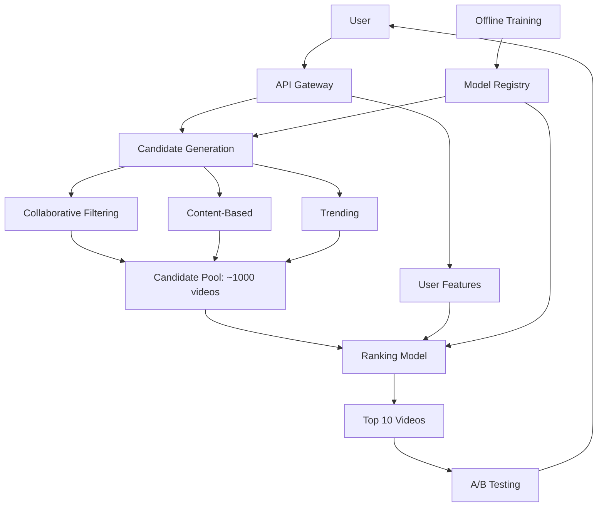
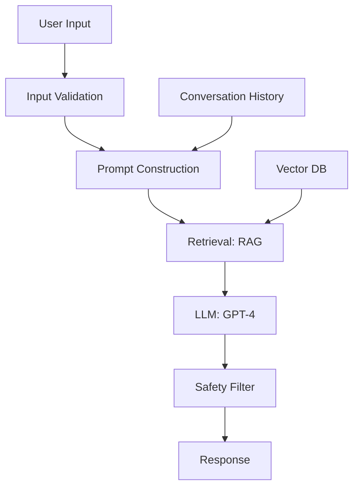

# Module 19: Interview Prep

> **Level**: Intermediate to Advanced  
> **Duration**: 4–6 weeks (ongoing throughout journey)  
> **Prerequisites**: Modules 00-16  
> **Goal**: Ace ML/AI interviews at top tech companies

---

## Table of Contents

1. [Interview Landscape](#1-interview-landscape)
2. [Coding Interviews (ML Focus)](#2-coding-interviews-ml-focus)
3. [ML System Design](#3-ml-system-design)
4. [ML Theory & Fundamentals](#4-ml-theory--fundamentals)
5. [Deep Learning Questions](#5-deep-learning-questions)
6. [LLM & NLP Questions](#6-llm--nlp-questions)
7. [Behavioral & Leadership](#7-behavioral--leadership)
8. [Take-Home Assignments](#8-take-home-assignments)
9. [Company-Specific Prep](#9-company-specific-prep)
10. [Negotiation & Offers](#10-negotiation--offers)

---

## 1. Interview Landscape

### 1.1 Types of AI/ML Roles

| Role | Focus | Expectations |
|------|-------|--------------|
| **ML Engineer** | Production systems, infrastructure | System design, coding, MLOps |
| **Research Scientist** | Novel algorithms, papers | Deep theory, math, research experience |
| **Applied Scientist** | Apply ML to products | Strong ML + engineering |
| **Data Scientist** | Analytics, modeling | Statistics, SQL, visualization |
| **AI Researcher** | Cutting-edge research | PhD-level knowledge, publications |
| **LLM Engineer** | Build LLM applications | Prompt engineering, RAG, fine-tuning |
| **ML Platform Engineer** | Serving infrastructure | Distributed systems, GPU optimization |

### 1.2 Interview Stages

**Stage 1: Phone Screen** (30-60 min)
- Lightweight coding + ML fundamentals
- HR/cultural fit

**Stage 2: Technical Rounds** (4-6 hours)
- Coding (2 rounds)
- ML System Design (1-2 rounds)
- ML Theory (1 round)
- Behavioral (1 round)

**Stage 3: Onsite/Virtual**
- Deep dives
- Team matching
- Executive interview

**Stage 4: Offer & Negotiation**

### 1.3 Top Companies

**Tier 1** (Most competitive):
- Google DeepMind
- OpenAI
- Anthropic
- Meta AI (FAIR)
- Microsoft Research

**Tier 2** (Highly competitive):
- Google (non-research)
- Meta (product)
- Apple ML
- Amazon Science
- NVIDIA

**Tier 3** (Competitive):
- Startups (Scale AI, Hugging Face, Cohere, etc.)
- Traditional tech (Adobe, Salesforce, etc.)

---

## 2. Coding Interviews (ML Focus)

### 2.1 Core Topics

**Data Structures**:
- Arrays, Hash Tables, Trees, Graphs
- Focus: Efficient data processing

**Algorithms**:
- Sorting, Searching, Dynamic Programming
- Graph algorithms (BFS, DFS, Dijkstra)

**ML-Specific**:
- Matrix operations
- Probability & statistics
- Optimization algorithms

### 2.2 Example: Implement K-Means

```python
"""
Implement K-Means clustering from scratch.

Input: points (N x D array), k (number of clusters)
Output: cluster assignments, centroids
"""

import numpy as np

def kmeans(points, k, max_iters=100, tol=1e-4):
    """
    K-Means clustering
    
    Args:
        points: (N, D) array of N points in D dimensions
        k: number of clusters
        max_iters: maximum iterations
        tol: convergence tolerance
    
    Returns:
        assignments: (N,) array of cluster assignments
        centroids: (k, D) array of cluster centroids
    """
    N, D = points.shape
    
    # Initialize centroids randomly
    indices = np.random.choice(N, k, replace=False)
    centroids = points[indices]
    
    for iteration in range(max_iters):
        # Assignment step: assign points to nearest centroid
        # Compute distances: (N, k) = ||points - centroids||
        distances = np.linalg.norm(
            points[:, np.newaxis, :] - centroids[np.newaxis, :, :],
            axis=2
        )
        assignments = np.argmin(distances, axis=1)
        
        # Update step: recompute centroids
        new_centroids = np.array([
            points[assignments == i].mean(axis=0) if np.any(assignments == i)
            else centroids[i]
            for i in range(k)
        ])
        
        # Check convergence
        if np.allclose(centroids, new_centroids, atol=tol):
            break
        
        centroids = new_centroids
    
    return assignments, centroids

# Test
points = np.random.randn(100, 2)
assignments, centroids = kmeans(points, k=3)
print(f"Centroids: {centroids}")
```

**Follow-up questions**:
- What's the time complexity? **O(N × k × D × iterations)**
- How to handle empty clusters? **Reinitialize or merge**
- K-Means++ initialization? **Sample proportional to distance from existing centroids**

### 2.3 Example: Softmax with Numerical Stability

```python
"""
Implement numerically stable softmax.
"""

import numpy as np

def softmax(logits):
    """
    Numerically stable softmax
    
    Args:
        logits: (N, C) array of logits
    
    Returns:
        probs: (N, C) array of probabilities
    """
    # Shift logits for numerical stability
    # max(logits) → 0, so exp(x) ≤ 1
    logits_shifted = logits - np.max(logits, axis=-1, keepdims=True)
    
    # Compute exp
    exp_logits = np.exp(logits_shifted)
    
    # Normalize
    probs = exp_logits / np.sum(exp_logits, axis=-1, keepdims=True)
    
    return probs

# Test
logits = np.array([[1000, 2000, 3000], [1, 2, 3]])
probs = softmax(logits)
print(probs)  # Should sum to 1
```

**Why numerical stability matters**:
```python
# Without shift:
np.exp(3000)  # inf (overflow!)

# With shift:
np.exp(3000 - 3000)  # 1.0 ✓
```

### 2.4 Example: Implement Gradient Descent

```python
"""
Implement gradient descent for linear regression.
"""

def gradient_descent(X, y, lr=0.01, epochs=1000):
    """
    Linear regression via gradient descent
    
    Args:
        X: (N, D) features
        y: (N,) targets
        lr: learning rate
        epochs: number of iterations
    
    Returns:
        w: (D,) learned weights
        b: scalar bias
    """
    N, D = X.shape
    w = np.zeros(D)
    b = 0.0
    
    losses = []
    
    for epoch in range(epochs):
        # Forward pass
        y_pred = X @ w + b
        
        # Loss (MSE)
        loss = np.mean((y_pred - y) ** 2)
        losses.append(loss)
        
        # Backward pass
        grad_y_pred = 2 * (y_pred - y) / N
        grad_w = X.T @ grad_y_pred
        grad_b = np.sum(grad_y_pred)
        
        # Update
        w -= lr * grad_w
        b -= lr * grad_b
    
    return w, b, losses

# Test
X = np.random.randn(100, 5)
w_true = np.array([1, 2, 3, 4, 5])
y = X @ w_true + 0.5 + np.random.randn(100) * 0.1

w, b, losses = gradient_descent(X, y, lr=0.1, epochs=1000)
print(f"Learned weights: {w}")
print(f"True weights: {w_true}")
```

### 2.5 Common Patterns

**Matrix operations**:
- Broadcasting: Understand how NumPy shapes align
- Vectorization: Avoid loops
- Memory efficiency: In-place operations

**Probability**:
- Sampling from distributions
- Log-sum-exp trick
- Bayes' theorem applications

---

## 3. ML System Design

### 3.1 Framework: SNAKE

**S**cope: Clarify requirements  
**N**ails: Define metrics  
**A**rchitecture: High-level design  
**K**ey components: Deep dive  
**E**valuate: Trade-offs, scaling

### 3.2 Example: Design YouTube Recommendation System

**Step 1: Scope**
- **Use case**: Recommend next video to watch
- **Scale**: 2B users, 800M videos
- **Constraints**: <100ms latency, personalized

**Step 2: Nails (Metrics)**
- **Online**: CTR, watch time, engagement
- **Offline**: Precision@K, Recall@K, mAP
- **Business**: Revenue, retention

**Step 3: Architecture**



**Step 4: Key Components**

**Candidate Generation** (Recall):
```python
# Two-tower model
class CandidateGenerator(nn.Module):
    def __init__(self, user_dim, video_dim, embed_dim):
        super().__init__()
        self.user_encoder = nn.Sequential(
            nn.Linear(user_dim, 512),
            nn.ReLU(),
            nn.Linear(512, embed_dim)
        )
        self.video_encoder = nn.Sequential(
            nn.Linear(video_dim, 512),
            nn.ReLU(),
            nn.Linear(512, embed_dim)
        )
    
    def forward(self, user_features, video_features):
        user_embed = self.user_encoder(user_features)
        video_embed = self.video_encoder(video_features)
        
        # Cosine similarity
        return F.cosine_similarity(user_embed, video_embed)
```

**Ranking Model** (Precision):
```python
class RankingModel(nn.Module):
    def __init__(self, feature_dim):
        super().__init__()
        self.network = nn.Sequential(
            nn.Linear(feature_dim, 512),
            nn.ReLU(),
            nn.Dropout(0.3),
            nn.Linear(512, 256),
            nn.ReLU(),
            nn.Linear(256, 1),
            nn.Sigmoid()
        )
    
    def forward(self, features):
        # Features: user + video + context (time, device, etc.)
        return self.network(features)
```

**Features**:
- **User**: Watch history, likes, demographics, location
- **Video**: Title, tags, view count, upload time, channel
- **Context**: Time of day, device, current session

**Step 5: Evaluate**

**Trade-offs**:
- **Freshness vs Personalization**: New videos vs user history
- **Diversity vs Relevance**: Avoid filter bubble
- **Latency vs Accuracy**: Complex model vs real-time

**Scaling**:
- **Data**: Sharded by user_id
- **Model Serving**: Replicated across regions
- **Candidate retrieval**: ANN index (FAISS, ScaNN)

### 3.3 Example: Design LLM-Powered Chatbot

**Requirements**:
- 10M users, conversational support
- Context from past messages
- Factual, safe responses

**Architecture**:



**Components**:

1. **Retrieval (RAG)**:
   - Embed user query
   - Search knowledge base (FAISS)
   - Top-K relevant docs

2. **Prompt Construction**:
```python
def build_prompt(user_query, conversation_history, retrieved_docs):
    system = "You area helpful customer support agent."
    
    context = "\n".join([doc['content'] for doc in retrieved_docs])
    
    history = "\n".join([
        f"User: {turn['user']}\nAgent: {turn['agent']}"
        for turn in conversation_history[-5:]  # Last 5 turns
    ])
    
    prompt = f"""
{system}

Relevant information:
{context}

Conversation history:
{history}

User: {user_query}
Agent:
    """
    return prompt
```

3. **Safety**:
   - Content filter (toxicity, PII)
   - Jailbreak detection
   - Fact-checking (for critical info)

4. **Caching**:
   - Cache embeddings for common queries
   - Cache LLM responses for FAQ

**Metrics**:
- **Latency**: P50/P95/P99
- **Quality**: Human eval, thumbs up/down
- **Cost**: $ per conversation
- **Safety**: Toxicity rate, PII leakage

### 3.4 Common Design Questions

1. **Feed ranking** (Facebook, Instagram, TikTok)
2. **Search ranking** (Google, Bing)
3. **Recommendation** (Netflix, Spotify, Amazon)
4. **Fraud detection** (PayPal, Stripe)
5. **Ad targeting** (Google Ads, Facebook Ads)
6. **Image classification service** (Pinterest, Snapchat)
7. **LLM application** (ChatGPT, Claude)
8. **Autonomous driving** (Waymo, Tesla)

---

## 4. ML Theory & Fundamentals

### 4.1 Probability & Statistics

**Q: Explain bias-variance tradeoff.**

**A**: 
$$
\mathbb{E}[(y - \hat{f}(x))^2] = \text{Bias}^2 + \text{Variance} + \text{Irreducible Error}
$$

- **Bias**: Error from wrong assumptions (underfitting)
- **Variance**: Error from sensitivity to training data (overfitting)
- **Trade-off**: Increase model complexity → ↓ bias, ↑ variance

**Q: Derive Bayes' theorem.**

$$
P(A|B) = \frac{P(B|A) P(A)}{P(B)}
$$

**Derivation**:
$$
P(A \cap B) = P(A|B) P(B) = P(B|A) P(A)
$$
$$
\Rightarrow P(A|B) = \frac{P(B|A) P(A)}{P(B)}
$$

**Q: Central Limit Theorem?**

**A**: Sum of i.i.d. random variables approaches normal distribution.
$$
\frac{\bar{X}_n - \mu}{\sigma / \sqrt{n}} \xrightarrow{d} \mathcal{N}(0, 1)
$$

### 4.2 Optimization

**Q: Explain gradient descent variants.**

| Variant | Batch Size | Update |
|---------|-----------|--------|
| **Batch GD** | Full dataset | Stable, slow |
| **Stochastic GD** | 1 | Noisy, fast |
| **Mini-batch GD** | 32-256 | Best of both |

**Q: Why does Adam work well?**

**A**: Combines momentum + adaptive learning rates.
- **Momentum**: Accelerates in consistent directions
- **RMSProp**: Adapts per-parameter learning rates
- **Bias correction**: Accounts for initialization

**Q: When does gradient descent fail?**

**A**:
- Non-convex (local minima)
- Saddle points
- Poor conditioning (large eigenvalue spread)
- Vanishing/exploding gradients

---

## 5. Deep Learning Questions

### 5.1 Architectures

**Q: Why ReLU instead of sigmoid?**

**A**:
- **No vanishing gradient**: $\frac{d}{dx} \text{ReLU}(x) \in \{0, 1\}$
- **Computationally efficient**: Just thresholding
- **Sparse activations**: ~50% neurons zero

**Q: Explain batch normalization.**

**A**: Normalize activations per batch.
$$
\hat{x} = \frac{x - \mu_B}{\sqrt{\sigma_B^2 + \epsilon}}, \quad y = \gamma \hat{x} + \beta
$$

**Benefits**:
- Reduces internal covariate shift
- Allows higher learning rates
- Acts as regularization

**Q: ResNet: Why do skip connections help?**

**A**:
- **Gradient flow**: Shortcuts for backprop
- **Identity mapping**: Easier to learn residual $F(x)$ than full mapping
- **Ensemble**: Network is ensemble of shallow paths

### 5.2 Training

**Q: What causes overfitting? How to prevent?**

**A**: Model memorizes training data.

**Prevention**:
- More data
- Regularization (L2, dropout)
- Early stopping
- Data augmentation
- Simpler model

**Q: Explain learning rate scheduling.**

**A**: Decrease LR during training for better convergence.

**Strategies**:
- **Step decay**: Divide by 10 every N epochs
- **Exponential**: $\text{LR} = \text{LR}_0 \cdot \gamma^{\text{epoch}}$
- **Cosine annealing**: $\text{LR} = \text{LR}_{min} + \frac{1}{2}(\text{LR}_{max} - \text{LR}_{min})(1 + \cos(\frac{\pi \cdot t}{T}))$

**Q: How to initialize weights?**

**A**:
- **Xavier (Glorot)**: $\mathcal{N}(0, \frac{1}{n_{in}})$ for sigmoid/tanh
- **He**: $\mathcal{N}(0, \frac{2}{n_{in}})$ for ReLU

---

## 6. LLM & NLP Questions

### 6.1 Transformers

**Q: Why attention is better than RNN?**

**A**:
- **Parallelization**: Process all tokens simultaneously
- **Long-range dependencies**: Direct connections
- **No vanishing gradients**: No recurrence

**Q: Explain positional encoding.**

**A**: Inject position information via sinusoids.
$$
PE_{(pos, 2i)} = \sin(pos / 10000^{2i/d})
$$
$$
PE_{(pos, 2i+1)} = \cos(pos / 10000^{2i/d})
$$

**Why sinusoids?** Relative positions are linear transformations.

**Q: What is the computational complexity of attention?**

**A**: $O(n^2 d)$ where $n$ = sequence length, $d$ = dimension.

**Why?** $QK^T$ is $(n \times d) \times (d \times n) = (n \times n)$.

### 6.2 LLMs

**Q: Explain RLHF.**

**A**: Three-step alignment process.
1. **SFT**: Fine-tune on human demonstrations
2. **Reward Model**: Train on preference comparisons
3. **PPO**: Optimize policy to maximize reward

**Q: What is temperature in sampling?**

**A**: Controls randomness.
$$
P(x_i) = \frac{\exp(z_i / T)}{\sum_j \exp(z_j / T)}
$$

- $T \to 0$: Greedy (deterministic)
- $T = 1$: Standard softmax
- $T > 1$: More random

**Q: Explain top-k and nucleus (top-p) sampling.**

**A**:
- **Top-k**: Sample from top k most likely tokens
- **Nucleus**: Sample from smallest set with cumulative probability ≥ p

---

## 7. Behavioral & Leadership

### 7.1 STAR Framework

**S**ituation: Context  
**T**ask: Your responsibility  
**A**ction: What you did  
**R**esult: Outcome (quantify!)

### 7.2 Common Questions

**"Tell me about a time you failed."**

**Example**:
- **S**: Built recommender system, launched to 10% traffic
- **T**: Increase engagement
- **A**: Used collaborative filtering without cold-start handling
- **R**: New users had poor experience, CTR dropped 20%
- **Learning**: Implemented hybrid approach (content-based fallback), CTR recovered and exceeded baseline by 5%

**"Describe a technical challenge you overcame."**

**Example**:
- **S**: Training large transformer crashed with OOM errors
- **T**: Enable training on available hardware
- **A**: Implemented gradient checkpointing + mixed precision
- **R**: Reduced memory by 60%, trained 2× larger model

**"How do you handle disagreements?"**

**Framework**:
1. Listen to understand their perspective
2. Find common ground (shared goal)
3. Present data/evidence
4. Compromise if needed
5. Escalate if critical

### 7.3 Leadership Principles (Amazon)

- **Customer Obsession**: Focus on user impact
- **Ownership**: Take responsibility
- **Invent and Simplify**: Innovate, avoid complexity
- **Learn and Be Curious**: Stay updated
- **Dive Deep**: Understand details

**Tip**: Prepare 8-10 stories covering different principles.

---

## 8. Take-Home Assignments

### 8.1 Common Types

1. **Build ML model**: Given dataset, predict target
2. **Implement algorithm**: Code paper from scratch
3. **System design doc**: Design production ML system
4. **Debug model**: Fix underperforming model

### 8.2 Best Practices

**Code quality**:
- Clean, modular code
- Type hints, docstrings
- Unit tests
- README with setup instructions

**Notebook**:
- Clear narrative
- EDA with visualizations
- Ablation studies
- Document decisions

**Modeling**:
- Baseline model first
- Iterate with motivation
- Show what didn't work
- Compare multiple approaches

**Deliverables**:
- Trained model
- Evaluation results
- Code + documentation
- (Optional) Demo

### 8.3 Example: Build Text Classifier

**Task**: Classify movie reviews (positive/negative)

**Approach**:

1. **EDA**:
   - Class distribution
   - Review length distribution
   - Word clouds

2. **Baseline**:
   - Bag-of-words + Logistic Regression
   - Accuracy: 82%

3. **Improved**:
   - Fine-tune DistilBERT
   - Accuracy: 94%

4. **Ablation**:
   - Without fine-tuning: 88%
   - Frozen embeddings: 90%
   - Full fine-tuning: 94%

5. **Error analysis**:
   - Sarcasm detection fails
   - Mixed reviews ambiguous

6. **Deployment considerations**:
   - Model size: 256MB
   - Latency: 50ms (batch size 32)
   - Cost: $0.0001 per inference

---

## 9. Company-Specific Prep

### 9.1 Google

**Focus**:
- Strong coding (LeetCode medium/hard)
- ML theory depth
- System design for scale

**Resources**:
- ML Design Primer
- Google Research papers

### 9.2 Meta

**Focus**:
- Product sense
- Impact stories
- Collaborative projects

**Questions**:
- How would you improve [Meta product]?
- Design ranking for Instagram feed

### 9.3 OpenAI / Anthropic

**Focus**:
- LLM expertise
- Research background
- Alignment & safety

**Topics**:
- RLHF, Constitutional AI
- Prompt engineering
- Scaling laws

### 9.4 Startups (Scale, Hugging Face, etc.)

**Focus**:
- Hands-on building
- Full-stack capabilities
- Rapid prototyping

**Prep**:
- GitHub portfolio
- Side projects
- Open source contributions

---

## 10. Negotiation & Offers

### 10.1 Compensation Components

**Total Comp = Base + Bonus + Equity + Perks**

| Component | Details |
|-----------|---------|
| **Base Salary** | Annual cash |
| **Bonus** | Performance-based (10-20% of base) |
| **Equity** | RSUs (4-year vest, typical) |
| **Sign-on Bonus** | First-year cash (offset equity cliff) |
| **Relocation** | Moving costs, temporary housing |

### 10.2 Leveling

**Google**:
- L3: Entry-level
- L4: Mid-level
- L5: Senior
- L6: Staff
- L7+: Senior Staff, Principal

**Typical ML Engineer Comp (2026, Bay Area)**:
- L4: $200k-$300k TC
- L5: $300k-$450k TC
- L6: $450k-$700k TC

### 10.3 Negotiation Tips

**Before offer**:
- Know your worth (levels.fyi)
- Have competing offers
- Build rapport with recruiter

**When offer comes**:
- Thank them, ask for time (1 week)
- Don't accept immediately
- Evaluate total comp, not just base

**Negotiating**:
- Be respectful but firm
- Anchor high (but realistic)
- Focus on total comp
- Use competing offers as leverage
- Ask what's negotiable (sign-on, equity, relocation)

**Script**:
> "Thank you for the offer. I'm excited about [company]. Based on my research and conversations with [competing company], I was expecting total compensation in the $X-Y range. Is there flexibility to increase the offer?"

**Items to negotiate**:
- Base salary (hardest to change)
- Equity (most flexible)
- Sign-on bonus (easy to negotiate)
- Relocation (usually flexible)
- Start date
- Remote work policy

---

## Resources

### Books
- **Cracking the Coding Interview** (McDowell)
- **Machine Learning Interviews** (Huyen)
- **Designing Machine Learning Systems** (Huyen)

### Websites
- **LeetCode**: Coding practice
- **Pramp**: Mock interviews
- **Exponent**: PM + ML system design
- **levels.fyi**: Compensation data

### Practice
- Do 100+ LeetCode problems (focus on ML-relevant)
- 20+ mock interviews
- 10+ system design problems
- Write 10 project summaries (STAR format)

---

## Final Tips

1. **Start early**: 3-6 months before applying
2. **Practice consistently**: 1-2 hours daily
3. **Mock interviews**: Get feedback
4. **Be authentic**: Show genuine interest
5. **Follow up**: Thank-you notes
6. **Learn from rejections**: Every interview is practice
7. **Network**: Referrals increase success rate 5-10×
8. **Portfolio**: GitHub + blog posts
9. **Stay current**: Read papers, try new tools
10. **Take care of yourself**: Sleep, exercise, manage stress

**You've got this!** 🚀 The AI field needs talented, passionate engineers. Go show them what you can do!
