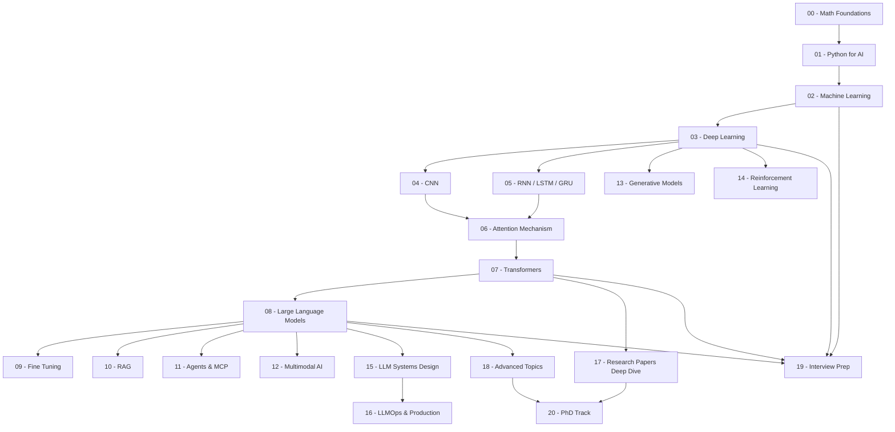

# 🧠 AI Mastery — Complete End-to-End Artificial Intelligence Curriculum

> **From Software Engineer to AI Researcher: A 1–2 Year Deep Mastery Program**

[](LICENSE)
[](CONTRIBUTING.md)

---

## Overview

This repository is a **self-contained AI University Degree** — structured for software engineers who already understand backend systems, system design, and production software. Every concept is presented with:

- **Deep mathematical foundations** (LaTeX derivations)
- **From-scratch Python implementations** (NumPy)
- **Framework implementations** (PyTorch)
- **System design perspective** (scaling, deployment, observability)
- **Research context** (papers, open problems)
- **Industry readiness** (interview prep, production patterns)

---

## Target Audience

| Trait | Expected Level |
|---|---|
| Programming | Proficient in Python, familiar with OOP |
| Backend Systems | Understands REST APIs, databases, microservices |
| System Design | Familiar with load balancing, caching, queues |
| Math | High school level (we build from here) |
| ML/AI | Beginner (we start from zero) |

---

## Curriculum Architecture



---

## Module Map

| # | Module | Level | Est. Duration |
|---|--------|-------|---------------|
| 00 | [Math Foundations](00_Math_Foundations/) | Beginner | 4–6 weeks |
| 01 | [Python for AI](01_Python_for_AI/) | Beginner | 2–3 weeks |
| 02 | [Machine Learning](02_Machine_Learning/) | Beginner → Intermediate | 6–8 weeks |
| 03 | [Deep Learning](03_Deep_Learning/) | Intermediate | 6–8 weeks |
| 04 | [CNN](04_CNN/) | Intermediate | 4–5 weeks |
| 05 | [RNN / LSTM / GRU](05_RNN_LSTM_GRU/) | Intermediate | 4–5 weeks |
| 06 | [Attention Mechanism](06_Attention_Mechanism/) | Intermediate → Advanced | 3–4 weeks |
| 07 | [Transformers](07_Transformers/) | Advanced | 6–8 weeks |
| 08 | [Large Language Models](08_Large_Language_Models/) | Advanced | 6–8 weeks |
| 09 | [Fine Tuning](09_Fine_Tuning/) | Advanced | 4–5 weeks |
| 10 | [RAG](10_RAG/) | Advanced | 4–6 weeks |
| 11 | [Agents & MCP](11_Agents_MCP/) | Advanced | 4–6 weeks |
| 12 | [Multimodal AI](12_Multimodal_AI/) | Advanced | 3–4 weeks |
| 13 | [Generative Models](13_Generative_Models/) | Advanced | 4–6 weeks |
| 14 | [Reinforcement Learning](14_Reinforcement_Learning/) | Advanced | 6–8 weeks |
| 15 | [LLM Systems Design](15_LLM_Systems_Design/) | Advanced → Expert | 4–6 weeks |
| 16 | [LLMOps & Production](16_LLMOps_Production/) | Expert | 4–6 weeks |
| 17 | [Research Papers Deep Dive](17_Research_Papers_Deep_Dive/) | Research | 6–8 weeks |
| 18 | [Advanced Topics](18_Advanced_Topics/) | Research | 6–8 weeks |
| 19 | [Interview Prep](19_Interview_Prep/) | All Levels | Ongoing |
| 20 | [PhD Track](20_PHD_TRACK/) | Research → PhD | 12+ weeks |

**Total estimated duration: 18–24 months** (full-time study: 9–12 months)

---

## Each Module Contains

```
XX_Module_Name/
├── README.md              # Deep theory, math, intuition, diagrams
├── notebooks/
│   ├── 01_from_scratch.ipynb    # NumPy implementation
│   └── 02_pytorch_impl.ipynb    # PyTorch implementation
├── projects/
│   ├── mini_project/      # Guided hands-on project
│   └── advanced_project/  # Production-grade project
└── diagrams/
    ├── architecture.md    # Mermaid diagrams
    └── sequence.md        # UML sequence diagrams
```

---

## Prerequisites & Setup

### Environment Setup

```bash
# Clone the repository
git clone https://github.com/your-username/AI-Mastery.git
cd AI-Mastery

# Create virtual environment
python -m venv .venv
source .venv/bin/activate  # Linux/Mac
# .venv\Scripts\activate   # Windows

# Install dependencies
pip install -r requirements.txt
```

### Core Dependencies

```
numpy>=1.24
pandas>=2.0
matplotlib>=3.7
seaborn>=0.12
scikit-learn>=1.3
torch>=2.1
torchvision>=0.16
transformers>=4.35
datasets>=2.14
accelerate>=0.24
bitsandbytes>=0.41
peft>=0.6
langchain>=0.1
faiss-cpu>=1.7
chromadb>=0.4
openai>=1.0
wandb>=0.16
jupyter>=1.0
```

---

## How to Use This Repository

### Learning Path for Software Engineers

1. **Weeks 1–6**: Complete Module 00 (Math). Don't skip this — everything else depends on it.
2. **Weeks 7–9**: Module 01 (Python for AI). Quick if you know Python; focus on NumPy/pandas.
3. **Weeks 10–17**: Module 02 (ML). Implement everything from scratch FIRST, then use sklearn.
4. **Weeks 18–25**: Module 03 (Deep Learning). This is the most critical module. Master backprop.
5. **Weeks 26–35**: Modules 04–06 (CNN, RNN, Attention). Build intuition for sequence + spatial.
6. **Weeks 36–43**: Module 07 (Transformers). Read the "Attention Is All You Need" paper.
7. **Weeks 44–51**: Module 08 (LLMs). Understand GPT, BERT, scaling laws.
8. **Weeks 52–60**: Modules 09–11 (Fine-tuning, RAG, Agents). Production AI skills.
9. **Weeks 61–72**: Modules 12–16 (Multimodal, Genertic, RL, Systems, Ops). Specialize.
10. **Weeks 73–96**: Modules 17–20 (Research, Advanced, Interview, PhD). Go deep.

### For Each Module

1. Read the README.md completely — understand the theory and math
2. Work through Notebook 01 (from scratch) — implement everything yourself
3. Work through Notebook 02 (PyTorch) — learn the framework patterns
4. Complete the mini project — apply what you learned
5. Attempt the advanced project — push your limits
6. Review the interview questions — test your understanding

---

## Contribution Guidelines

See [CONTRIBUTING.md](CONTRIBUTING.md) for details on how to contribute.

---

## License

This project is licensed under the MIT License — see [LICENSE](LICENSE) for details.

---

## Acknowledgments

This curriculum draws from:
- Stanford CS229, CS231n, CS224n, CS224w
- MIT 6.S191, 6.036
- UC Berkeley CS 285
- DeepLearning.AI specializations
- Fast.ai courses
- Original research papers (cited in each module)
- Industry best practices from Google, Meta, OpenAI, Anthropic

---

> *"The only way to learn AI is to implement AI."* — This repository's philosophy
